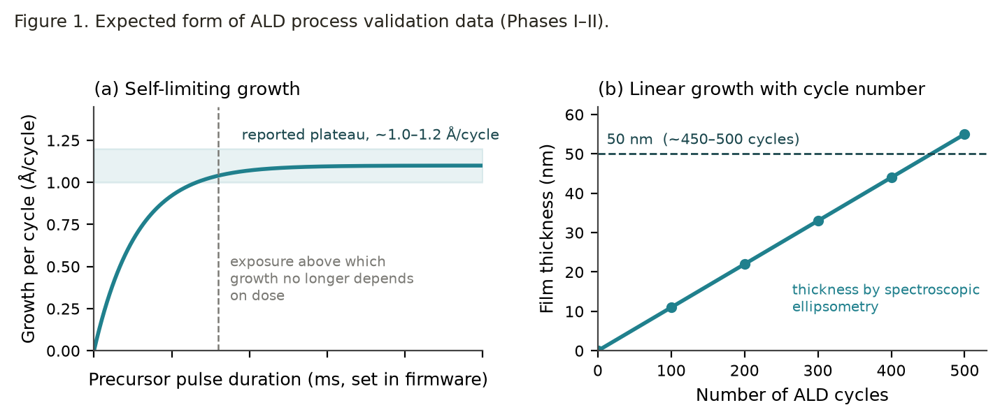
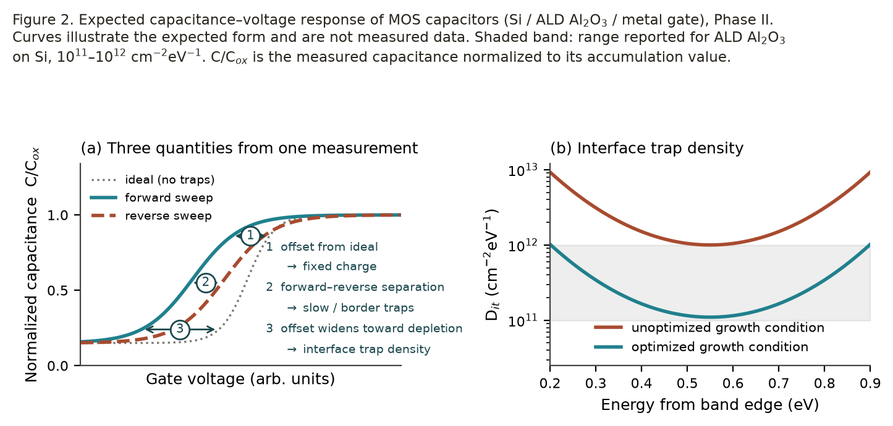
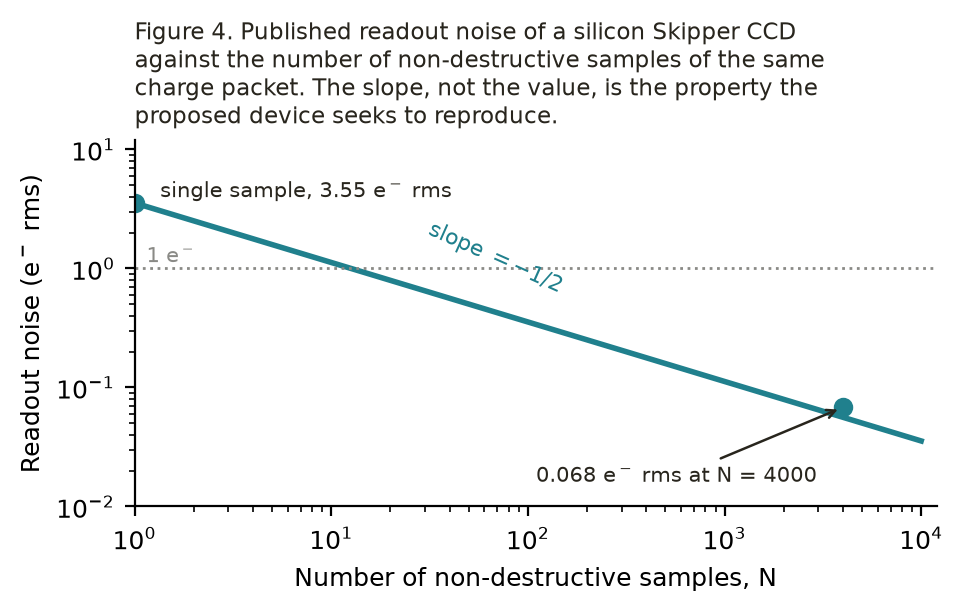
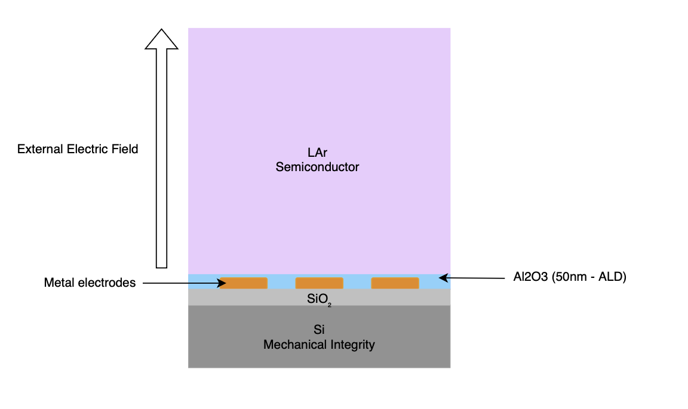
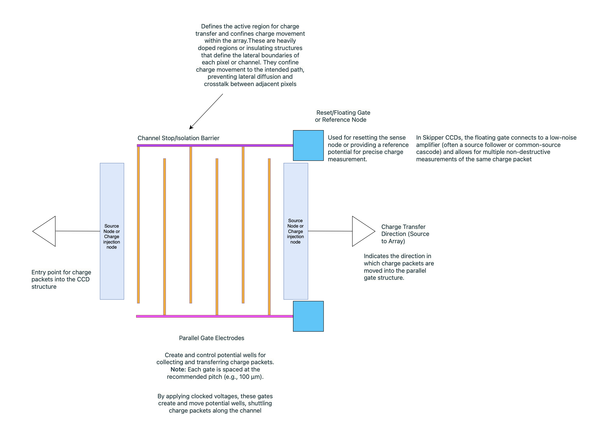
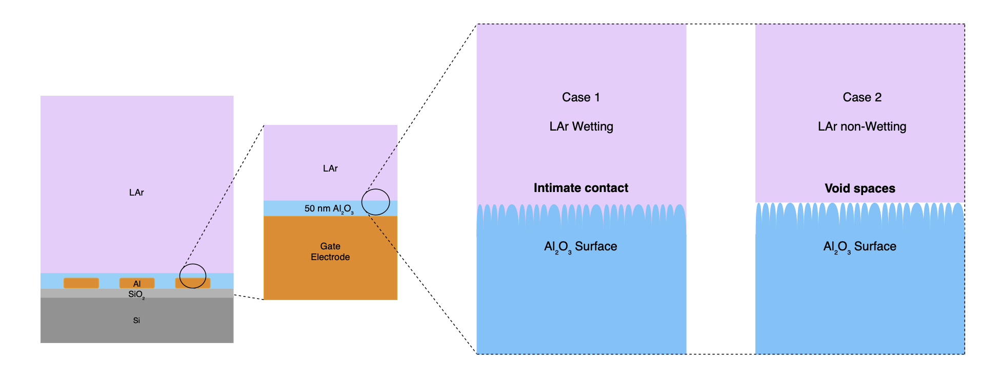

# Comprehensive Exam Proposal

## An In-House ALD Platform for Al2O3 and the Demonstration of Skipper CCD-Like Charge Sensing in LAr: A Quest for New and Viable Sensing Mechanisms

- Student: Gumaro Garcia Gonzalez
- Advisor: Dr. Yuan Mei
- Program: Materials Science and Engineering, University of Texas at Arlington

- Key words: ALD, dielectrics, MOS, charge sensor, skipper CCDs, LAr, cryogenic interfaces

---

## Table of contents

| Section | Page |
| --- | --- |
| Abstract | 2 |
| Introduction / motivations | |
| (1.1) ALD and thin film growth | 4 |
| (1.2) LAr and skipper CCD-like devices | 4 |
| Literature review | |
| (2.1) ALD and Al2O3 | 5 |
| (2.2) LAr/Al2O3 wetting and contact considerations | 5-6 |
| (2.3) CCD, skipper and charge packet measurement concepts | 6-8 |
| Objectives | |
| (3.1) Phase I-IV and current status | 8 |
| Methodology | |
| (4.1) Al2O3 thin film optimization and CV measurements | 9 |
| (4.2) LAr/Al2O3 interface studies and characterization | 9-10 |
| (4.3) Skipper CCD-like charge packet measurement strategy | 10 |
| Preliminary results | |
| (5.1) Defect concentration of Al2O3 films and CV measurements | 10-11 |
| (5.2) LAr/Al2O3 interface behaviors | 12 |
| (5.3) Device fabrication and charge packet measurements | 12-13 |
| Plans and tasks | |
| (6.1) Timeline for phases I-IV | 13 |

---

## Abstract

Charge-readout architectures set the sensitivity limit of detectors used to search for rare, low-energy events, and the material interfaces within those architectures determine how small a signal can be measured \[\]. In a charge-coupled device (CCD), that measurement is made in silicon: a potential well beneath a gate dielectric holds the charge packet, and the surrounding material sets how efficiently it can be read. This work proposes an inverted device geometry in which liquid argon occupies the position of the active medium and the potential well is formed in the liquid above a dielectric rather than within a semiconductor beneath it. Realizing such a device requires knowing what it demands of its materials, and those demands are presently unknown. The research therefore asks what electrical quality an atomic layer deposited (ALD) aluminum oxide (Al2O3) dielectric must reach, what contact condition the liquid-argon boundary must satisfy, whether a charge packet can be held at that boundary long enough to be sampled repeatedly, and what minimum requirements must be met for a charge measurement to be obtained at all. The work proceeds in four phases: validation of an in-house ALD system against published growth-per-cycle and saturation behavior; growth of Al2O3 films and their electrical characterization through metal oxide semiconductor (MOS) capacitor test structures; extension of qualified films to cryogenic and liquid-argon interface conditions; and fabrication of a proof-of-concept device from which a charge measurement is sought. The objective is not to improve on existing readout noise performance but to establish whether the proposed sensing mechanism is viable and what it requires.

---

## Introduction / motivations

(1.1) Atomic layer deposition (ALD) is a vapor-phase thin-film technique based on sequential, self-limiting surface reactions, which allows thickness control at the angstrom-per-cycle level together with excellent conformality and reproducibility on complex surfaces \[\]. Because each precursor exposure is intended to saturate the surface before the next reactant is introduced, ALD provides unusually strong control over film thickness, interfacial chemistry, and process repeatability compared with many conventional deposition methods \[1\]. These attributes make ALD especially attractive for dielectric materials such as Al2O3, where nanometer-scale variations in thickness, stoichiometry, contamination, or defect density can strongly influence electrical behavior \[2\].

(1.2) LAr is an attractive detection medium because ionizing radiation in LAr produces mobile charge that can, in principle, be drifted, collected, and measured with excellent sensitivity in large, low-background detector systems \[5\]. For highly sensitive detectors, the limiting factor is often not whether charge can be generated, but whether very small charge signals can be collected, transferred, and measured without being lost to noise or trapping. At the same time, conventional LAr detectors do not automatically provide the kind of repeated, ultra-low-noise charge measurement that has made skipper CCDs so powerful in low-threshold experiments. In a skipper CCD, charge packets are transferred to a floating-gate sense node and measured non-destructively many times, allowing the averaged readout noise to be pushed into the sub-electron regime \[6, 7\]. The motivating idea of the present work is to adapt the skipper readout logic to a LAr compatible CCD-like device in hopes of finding and pushing the boundaries of fundamental sensing mechanisms. Designing a skipper CCD-like device for detecting low energy processes by exploring these ideas to fabricate a working device and obtain a charge measurement is the aim.

---

## Literature review

(2.1) Among ALD dielectrics, the thermal TMA/H2O process is often treated as the canonical ALD chemistry because it reliably produces Al2O3 films through alternating surface termination by methyl and hydroxyl species, and its behavior has been studied in detail over a broad temperature range \[8, 9\]. The widespread use of Al2O3 in gate stacks, passivation layers, and microelectronic structures comes from its combination of dielectric strength, chemical stability, conformal growth, and relative process simplicity \[10\]. At the same time, "good Al2O3" does not automatically imply "good electrical performance," since pulse time, purge time, temperature, and post-growth treatment can all affect trap density, leakage behavior, and interfacial quality \[3, 4\]. In addition, a dielectric that appears structurally uniform may still be electrically unsuitable if its interface-state density, border-trap density, or trapped-charge response is too large for low-noise operation \[11, 12\]. Therefore, the low-noise requirement also motivates why interface quality cannot be discussed only in abstract materials terms (i.e. composition alone or bulk/macroscopic properties). Al2O3 films that appear smooth and continuous can still contain interface traps, border traps, fixed charge, or chemically induced defects that degrade capacitance-voltage response, increase hysteresis, elevate leakage, and reduce reliability under bias stress \[13\]. This distinction is central to the present work because the dissertation is not concerned only with whether Al2O3 can be deposited, but with whether process conditions can be tuned to produce Al2O3 that is electrically suitable for low-noise charge-readout structures \[14\].

(2.2) The behavior of a liquid at a solid surface is described by the contact angle, which reflects the balance of interfacial energies and is modified by surface roughness and chemical heterogeneity \[\]. For cryogenic liquids the relevant regime is unusual: liquid argon at 87 K has a surface tension roughly five times lower than water, and such liquids generally spread readily on solid surfaces \[\]. Contact-angle data for cryogenic liquids are correspondingly sparse, and measurements on liquid argon in contact with ALD-grown Al2O3 have not been reported. Within this architecture, the LAr/Al2O3 interface becomes scientifically important rather than merely geometric. If LAr wets the Al2O3 surface well, then the interface is more likely to provide intimate contact, stable field penetration, and a more uniform electrostatic environment for charge transfer; if it is non-wetting, interfacial voids, contact-line discontinuities, and dielectric inhomogeneity may distort the field \[15, 16\]. The literature on LAr specifically at ALD-grown Al2O3 interfaces is limited, and that gap is part of what makes the proposed work worth pursuing. In detector-relevant terms, the practical importance of wetting is that it can influence interfacial continuity, effective contact area, and the stability of electric-field penetration into the liquid region near the surface and possibly reduce pathways for charge loss \[17, 18\]. Whether a wetted or partially non-wetting boundary is preferable for charge storage has not been established. Direct liquid contact with the dielectric and the presence of an intervening void/vapor layer would be expected to affect the interface differently. The contact condition is therefore treated here as a property to be measured and correlated with electrical behavior.

(2.3) Charge-coupled devices (CCD) have long been important for low-noise imaging and scientific detection because they store and transfer charge packets in localized potential wells under controlled electrode biasing \[\]. The charge packet refers to a discrete localized collection of electrons that is generated, stored, transferred, and ultimately measured at the output stage \[\]. The skipper CCD represents a particularly important development because it modifies the CCD output stage so that the same charge packet can be measured non-destructively many times before final conversion to a digital value \[\]. Instead of accepting a single destructive read, the skipper architecture uses a floating-gate sensing approach that allows repeated sampling of the same stored charge, and the average of many samples can reduce the effective readout noise into the sub-electron regime \[\]. This capability is what made the first demonstrations of single-electron and single-photon sensitivity so significant, and it is the key conceptual feature that motivates borrowing skipper logic for other ultra low threshold sensor ideas \[ , \]. Recent work shows that skipper CCD technology is no longer a niche proof of principle but a growing platform for low-energy neutrino and dark-matter related experiments \[\]. Reviews of current applications report sub-electron RMS noise, electron-counting performance, and multi-kilogram experimental roadmaps, all of which reinforce the value of repeated non-destructive measurement when the signals of interest are extremely small \[\]. Literature also makes clear that the important innovation is not simply "a quiet CCD," but a readout architecture in which repeated measurement of the same charge packet fundamentally changes the attainable threshold \[\].

On the LAr side the relevant physics is mature: ionization yield, electron mobility, attachment, purity, and recombination are established \[ , \], recombination has been measured directly in operating time projection chambers \[ , \], and the charge-readout noise environment of large LAr detectors has been characterized in detail \[\]. Separately, studies of high-voltage breakdown in LAr and of breakdown along insulator surfaces show that the insulator boundary, rather than the bulk liquid, frequently sets the achievable field \[ , \], and reviews of low-energy backgrounds in solid-state charge detectors identify interface and insulating-layer effects as leading and incompletely understood \[11\]. Charge can therefore be generated and drifted in LAr with well-understood yields; what is not established is whether a localized packet can be confined and repeatedly sampled at a solid dielectric boundary, a gap we wish to target.

The proposed device inverts the conventional MOS/CCD stack. In a silicon CCD the semiconductor lies beneath the gate dielectric and the potential well forms in the silicon; here the roles are exchanged, with the liquid argon occupying the position of the active medium above the dielectric, the silicon serving only as a mechanical substrate. The working principle is unchanged; what changes is where the potential well is formed.

---

## Objectives

The following is a broad overview for the intended flow of major objectives:

ALD tool construction/validation → TMA/H2O → defect/CV measurements → LAr/Al2O3 interface and electrical behavior studies → LAr skipper CCD-like device → charge measurement

Phase I → Phase II → Phase III → Phase IV. Current state of progress: Phase I.

(3.1) Phase one is the validation of the tool through the capture of temperature and pressure data that allow us to show controllability and reproducibility as well as provide evidence that ALD cycles are happening inside the chamber. Also, includes optimizations to the tool needed to safely and fully adapt for the two precursor systems for growing Al2O3. Phase two consists of formulating recipes to grow the most promising films, which will be characterized for their defects using CV measurements through the fabrication of MOS devices. Phase three includes the testing of wetting or non-wetting between ALD Al2O3 grown films and LAr interface studies to identify a candidate that meets the objectives. Phase four will consist of the LAr skipper-like CCD detector fabrication and obtaining a charge measurement.

---

## Methodology

(4.1) Al2O3 films are grown on silicon substrates by thermal ALD using trimethylaluminum and water. Deposition temperature, precursor pulse duration, and purge duration are varied, and film thickness is determined by ellipsometry. Growth is confirmed to be self-limiting when growth per cycle becomes independent of precursor exposure above a threshold dose and film thickness remains linear with cycle number. Films from the most reproducible conditions are used to fabricate MOS capacitors consisting of the silicon substrate, the ALD Al2O3 layer, and a metal gate. Capacitance-voltage measurements under forward and reverse bias sweeps yield the interface trap density, the flatband voltage shift, and the hysteresis width. Comparing results across growth conditions identifies which parameters govern the electrical quality of the film. A growth condition is accepted when the measured interface trap density and hysteresis width are reproducible across separate deposition runs and respond systematically to the growth parameters varied.

(4.2) Films grown using the conditions identified in Section 4.1 are characterized at cryogenic temperature by sessile-drop contact-angle measurement. Each sample is held horizontally with the dielectric surface facing upward (the orientation that surface has in the device) inside a custom chamber that maintains an argon environment at operating temperature and provides optical access through viewports. A liquid argon droplet is dispensed onto the surface, imaged in silhouette, and the contact angle obtained by fitting the droplet profile \[\]. The electrical behavior of the interface is measured separately, with the chamber reconfigured so that the sample is fully covered by liquid argon. Leakage current is recorded as a function of the field applied between an electrode buried beneath the dielectric and a counter-electrode in the liquid, establishing whether the film holds off the bias required to form a potential well while in contact with the liquid \[\]. The capacitors fabricated in Section 4.1 are also re-measured at 87 K, so that interface trap density, flatband shift, and hysteresis width at operating temperature can be compared against their room-temperature values.

(4.3) Fabrication begins with a thermally oxidized silicon wafer, the SiO2 providing electrical isolation. Metal electrodes are deposited and patterned on the oxide to define the gate array and the sense node. The qualified Al2O3 recipe from Section 4.1 is then deposited over the patterned electrodes at the thickness established in Phase II, so that the dielectric is the final layer formed and its exposed surface is the surface that meets the liquid. The completed structure is mounted horizontally in the cryostat with the dielectric facing upward and the chamber is filled until the device is covered. The electrodes are then biased to establish a potential well in the liquid above the sense node. Charge is first introduced electrically through an injection electrode, so that a packet of known size can be delivered and the readout chain calibrated independently of any uncertainty in the ionization physics. A sealed radiation source of known energy is then used to generate ionization in the liquid directly, providing the signal the device is intended to measure. The packet is sampled repeatedly and non-destructively, and the readout noise is recorded against the number of samples. The phase is complete when a charge measurement is obtained.

---

## Preliminary results

(5.1) Phase II produces two datasets as seen in Figure 1. The first establishes that growth is self-limiting: growth per cycle is measured against precursor exposure and film thickness against cycle number, with saturation expected as a dose-independent plateau. Reported growth per cycle for thermal TMA/H2O within the ALD window is approximately 1.0-1.2 A per cycle, placing the 50 nm target near 450-500 cycles. This thickness is chosen because it lies well beyond the nucleation regime and within the range in which ALD reliably produces conformal, uniform films, which is the regime this class of tool is expected to serve.

The second dataset is electrical: capacitance-voltage sweeps on MOS capacitors give the interface trap density and the hysteresis width. Reported interface trap densities for ALD Al2O3 on silicon commonly fall between 10^11 and 10^12 cm^-2 eV^-1, which provides a reference scale for the values measured here. The objective of Phase II is not to reach a particular value. It is met when the interface trap density and hysteresis width can be measured reproducibly on films grown in this reactor, and when they are shown to respond systematically to a controlled growth parameter. Establishing that the defect population responds to the process is what qualifies the reactor as a research tool, independent of where the absolute values fall. Post-deposition thermal treatment is one additional parameter that may be used to alter the defect population, and would appear in this measurement as a shift of the same kind as seen in Figure 2(b).

(5.2) No contact-angle measurement has been reported for liquid argon on ALD-grown Al2O3, which is the gap Phase III addresses. Liquid argon has a surface tension near 12.5 mN/m at 87 K, roughly five times lower than water and far below the surface energy of a clean oxide, so the interface is expected to wet and the measured angle is expected to be small. A small angle is the outcome the device wants, because it corresponds to a continuous liquid boundary with no vapor at the dielectric surface. The measurement establishes the value, whether it depends on growth condition, and whether the boundary remains continuous when the film is cold and under bias. Interface trap density and hysteresis width measured at 87 K are expected to fall near their room-temperature values. The leakage measurement provides the electrical criterion: a film that holds off the bias required to form a potential well while covered by liquid argon meets the requirement the device places on the dielectric \[\].

(5.3) In silicon, a single-sample readout noise of 3.55 e- rms was reduced to 0.068 e- rms by averaging 4000 non-destructive samples, following sigma_N = sigma_1 / sqrt(N). The proposed device is expected to begin at a considerably higher single-sample noise. 

The result that establishes the mechanism is not the value of that noise but its dependence on sample count: noise falling as N^(-1/2) demonstrates that the same charge packet is being measured repeatedly without being destroyed, which is the behavior the device is built to test. The size of the signal makes this a tractable first measurement. Ionization in liquid argon requires 23.6 eV per electron-ion pair, so a deposit of one MeV liberates roughly 4.2 x 10^4 electrons, of which approximately 70% survive recombination for a minimum-ionizing track at a 500 V/cm drift field. A packet of this size is detectable at a readout noise far above the state of the art, so the first demonstration of the mechanism does not require a low noise floor (i.e. a charge-sensitive preamplifier with an equivalent noise charge of a few hundred electrons is commercially available).

---

## Plans and tasks

(6.1) Work is organized into four phases listed in the following table:

| Phase | Focus | Months |
| --- | --- | --- |
| I | Reactor construction and process validation | < 3 |
| II | Al2O3 growth optimization and MOS characterization | 4-6 |
| III | Cryogenic interface characterization | 6-8 |
| IV | Device fabrication and charge packet measurement | 6-8 |

Phases overlap where cryostat integration proceeds in parallel with film growth/characterization and hardware procurement and fabrication. Phase III carries the greatest schedule uncertainty.

---

## References (WIP)

\[1\] Wang, Y.; Chen, Y.; Zhang, Y.; Zhu, Z.; Wu, T.; Kou, X.; Ding, P.; Corcolle, R.; Kim, J. Experimental Characterization of ALD Grown Al2O3 Film for Microelectronic Applications. *Advances in Materials Physics and Chemistry* 2021, 11, 7-19. https://doi.org/10.4236/ampc.2021.111002

\[2\] Seweryn, A.; Lawniczak-Jablonska, K.; Kuzmiuk, P.; Gieraltowska, S.; Godlewski, M.; Mroczynski, R. Investigations of Structural and Electrical Properties of ALD Films Formed with the Ozone Precursor. *Materials* 2021, 14, 5395. https://doi.org/10.3390/ma14185395

\[3\] Pan, D.; Lei, Y. Investigation and Optimization of Process Parameters on Growth Rate in Al2O3 Atomic Layer Deposition (ALD) Using Statistical Approach. *Materials* 2025, 18, 1918. https://doi.org/10.3390/ma18091918

\[4\] Qiao, L.; et al. Interface Optimization of Passivated Er2O3/Al2O3/InP MOS Capacitors and Modulation of Leakage Current Conduction Mechanism. *IEEE Transactions on Electron Devices* 2021, 68 (6), 2899-2905. https://doi.org/10.1109/TED.2021.3072928

\[5\] Bonivento, W.; Terranova, F. The Science and Technology of Liquid Argon Detectors. *Reviews of Modern Physics* 2024, 96 (4), 045001. https://doi.org/10.1103/RevModPhys.96.045001

\[6\] Tiffenberg, J.; Sofo Haro, M.; Drlica-Wagner, A.; Estrada, J.; Bertou, X.; Cancelo, G.; Chavarria, A. E.; deJongh, P.; Holland, S.; Lopez-Lloreda, A.; et al. Single-Electron and Single-Photon Sensitivity with a Silicon Skipper CCD. *Physical Review Letters* 2017, 119, 131802. https://doi.org/10.1103/PhysRevLett.119.131802

\[7\] Fernandez Moroni, G.; Chierchie, F.; Tiffenberg, J.; Botti, A.; Cababie, M.; Cancelo, G.; Depaoli, E. L.; Estrada, J.; Holland, S. E.; Rodrigues, D.; Sidelnik, I.; Sofo Haro, M.; Stefanazzi, L.; Uemura, S. Skipper Charge-Coupled Device for Low-Energy-Threshold Particle Experiments above Ground. *Physical Review Applied* 2022, 17 (4), 044050. https://doi.org/10.1103/PhysRevApplied.17.044050

\[8\] Sperling, B. A.; Kalanyan, B.; Maslar, J. E. Atomic Layer Deposition of Al2O3 Using Trimethylaluminum and H2O: The Kinetics of the H2O Half-Cycle. *Journal of Physical Chemistry C* 2020, 124 (5), 3410-3420. https://doi.org/10.1021/acs.jpcc.9b11291

\[9\] Bielinski, A. R.; Kamphaus, E. P.; Cheng, L.; Martinson, A. B. F. Resolving the Heat of Trimethylaluminum and Water Atomic Layer Deposition Half-Reactions. *Journal of the American Chemical Society* 2022, 144 (33), 15203-15210. https://doi.org/10.1021/jacs.2c05460

\[10\] Karnopp, J.; Azevedo Neto, N.; Vieira, T.; Fraga, M.; da Silva Sobrinho, A.; Sagas, J.; Pessoa, R. Exploring TMA and H2O Flow Rate Effects on Al2O3 Thin Film Deposition by Thermal ALD: Insights from Zero-Dimensional Modeling. *Coatings* 2024, 14, 578. https://doi.org/10.3390/coatings14050578

\[11\] Baxter, D.; Essig, R.; Hochberg, Y.; Kaznacheeva, M.; von Krosigk, B.; Reindl, F.; Romani, R. K.; Wagner, F. Low-Energy Backgrounds in Solid-State Phonon and Charge Detectors. *Annual Review of Nuclear and Particle Science* 2025, 75 (1), 301-326. https://doi.org/10.1146/annurev-nucl-121423-100849

\[12\] Massai, L.; Hetenyi, B.; Mergenthaler, M.; et al. Impact of Interface Traps on Charge Noise and Low-Density Transport Properties in Ge/SiGe Heterostructures. *Communications Materials* 2024, 5, 151. https://doi.org/10.1038/s43246-024-00563-8

\[13\] Rahman, M. M.; Shin, K.-Y.; Kim, T.-W. Characterization of Electrical Traps Formed in Al2O3 under Various ALD Conditions. *Materials* 2020, 13, 5809. https://doi.org/10.3390/ma13245809

\[14\] Rocha-Aguilera, D.; Mendez-Jeronimo, G.; Molina-Reyes, J. Impact of Interface Properties on Direct Tunneling in Al/ALD-Al2O3/Al Capacitors for Josephson Junction Applications. *IEEE Transactions on Quantum Engineering* 2026, 7, 5500212. https://doi.org/10.1109/TQE.2026.3700568

\[15\] Kim, J. W.; Yoo, S. H.; Kong, Y. B.; Cho, S. O.; Lee, E. J. Wetting Property Modification of Al2O3 by Helium Ion Irradiation: Effects of Beam Energy and Fluence on Contact Angle. *Langmuir* 2021, 37 (38), 11301-11308. https://doi.org/10.1021/acs.langmuir.1c01859

---

## Appendix

The proposed detector layered architecture consists of a silicon substrate base, metal gate electrodes, a 50 nm aluminum oxide (Al2O3) layer deposited via atomic layer deposition (ALD), and liquid argon as the detection medium. There is an external electric field being applied to this detector so if ionization in LAr creates free electrons they will drift towards the Al2O3 surface/interface. CCD readout parallel shift register with three phase device with parallel gate electrodes to move charge packets simultaneously along defined channels.

Close up of the LAr/Al2O3 interface with two different possible cases for interface behavior. Although ALD is considered the gold standard for producing high quality thin films, especially in thickness control and uniformity, we can expect there to be some surface roughness resulting in void spaces.

