# Engineered Interfaces for CCD-Like Charge Storage and Transfer in Liquid Noble Gases

**Comprehensive Exam**
The Materials Science and Engineering Department at The University of Texas at Arlington

**By**
Gumaro Garcia Gonzalez

**Principal Investigator**
Dr. Yuan Mei

## Abstract

Liquid argon (LAr) and liquid xenon (LXe) are major active media for neutrino, rare-event, and dark-matter detectors, where ionization charge is generally drifted to an electrode or extracted to a gas phase. This proposal will investigate whether an engineered solid–liquid noble gas interface can add local charge storage and gate controlled transport functions after bulk drift. Electron-on-helium devices provide a functional precedent for electrostatic confinement, CCD-like clocking, and transport of small charge packets, but they do not establish an equivalent near-solid state in dense LAr or LXe, nor do they demonstrate skipper-style repetitive nondestructive sensing. The initial experimental platform will be LAr. The work will test three linked hypotheses: that a candidate surface can support a mobile or reversibly localized electron population; that patterned gates can localize and directionally transfer that population; and that controlled surface processing can alter retention, recovery, transfer, and eventual repeated sensing behavior. The proposed program defines electrostatic and signal modeling tasks, controlled charge generation and calibration methods, charge accounting measurements, artifact rejection controls, material comparisons, and provisional pass, fail, or redirect criteria. LXe will be evaluated as a conditional extension or redirection path if its modeled and measured interface behavior warrants further development. The dissertation goal is to establish whether this enabling interface mechanism exists and can be engineered toward a CMOS-compatible detector readout architecture.

**Keywords:** liquid noble gases, charge manipulation, charge coupled device, engineered surfaces, CMOS, sensors

## Table of Contents

**Introduction and Motivation** — p. 3

1. Scientific vision: charge manipulation in liquid noble gases
2. Importance of LAr and LXe particle detectors
3. Electron on helium CCDs as a functional precedent

**Literature Review** — p. 4

4. Electron transport in liquid noble gases
5. Difference between the helium mechanism and the proposed LAr/LXe interface
6. Central research question
7. Established physical basis
8. Central unresolved hypotheses
9. Candidate surface materials
10. Al₂O₃ as the initial test material
11. Role, mandatory qualification, and present status of the in-house ALD system
12. Electrostatic and interfacial model

**Objectives** — p. 14

**Methodology** — p. 15

13. Stage 0: controlled electron-generation and calibration method
14. Stage 1: charge arrival, sticking, retention, and recovery
15. Stage 2: two-region transfer
16. Stage 3: multi-gate CCD-like transport
17. Stage 4: repeated sensing
18. Stage 5: detector-generated charge
19. LXe extension or redirection path
20. Readout electronics and noise
21. Materials characterization
22. Controls and systematic errors
23. Quantitative stage gates

**Preliminary Results** — p. 24

**Plans and Tasks to Complete the Dissertation Research** — p. 25

24. Failure modes and redirection paths
25. Potential detector impact
26. Timeline

**References** — p. 30

**Appendix** — p. 38

---

## Introduction and Motivation

(1) The conventional liquid noble gas time projection chamber (TPC) readout collects a drifting charge packet at an electrode or extracts it into a gas phase; the packet is then not ordinarily available for local storage, lateral routing, or repeated measurement [1,2]. This proposal will test whether a deliberately engineered solid surface can support a recoverable near-interface electron population rather than immediate collection or irreversible trapping. If such a state is demonstrated, patterned buried gates could be evaluated for local storage, directional transfer, and presentation of the packet to a sensing region. These functions are hypotheses to be tested through calibrated charge accounting and converging controls; they are not assumed properties of the proposed interface.

(2) LAr is the initial platform because it supports comparatively accessible experimental iteration and benefits from extensive detector knowledge in purification, high voltage, charge drift, and cryogenic operation. It is used in collider calorimetry, large neutrino TPCs, and rare-event experiments [1]. LXe is an important detector medium for dark-matter, gamma-ray, neutrino, and double-beta-decay research, but it is retained here as a conditional extension or redirection path rather than a parallel first-generation program [2,26]. An unfavorable LAr result would constrain the tested combination of liquid, surface, geometry, and field conditions, but it would not by itself exclude all noble liquid implementations. Any transition to LXe would require a disciplined comparison of the limiting mechanism, relevant liquid properties, available infrastructure, and expected experimental benefit. This proposal does not promise detector applications. It argues that demonstrating controlled interfacial retention and gate controlled transfer would establish a new mechanism that could later be evaluated for incorporation into existing detector architectures.

(3) Developing clocked charge manipulation inside dense noble liquids is grounded around three key experimental milestones:

- **Clocked Micro-CCD Transport:** Sabouret et al. (2008) measured few-electron packets clocked through a microscopic CCD-like structure, reporting a charge-transfer efficiency (CTE) of 0.99999992 at an 800 kHz clock frequency [3].
- **Parallel 2D Channel Routing:** Bradbury et al. (2011) demonstrated two-dimensional transfer in 120 parallel helium-filled channels using packets containing up to about 20 electrons and extending down to singly occupied pixels, recording no detectable transfer failures after more than one billion clock operations [4].
- **CMOS-Integrated Shuttling:** Castoria et al. (2026) extended this control to an integrated CMOS platform, achieving selective two dimensional shuttling across 128 transport microchannels in both the few electron and single electron regimes with no detectable loss over more than one billion operations [5].

These demonstrations motivate the proposed device functions of small packet confinement, clocked transfer, routing, and charge detection, but not the microscopic mechanism proposed for LAr or LXe. In the helium devices, the electrons remain outside the liquid and are supported above a liquid helium/vacuum interface. These studies do not demonstrate Skipper-style repetitive nondestructive sensing of the same packet; that capability is a later integrated objective that will require independent packet conservation measurements.

---

## Literature Review

(4) In sufficiently pure LAr and LXe, excess electrons can thermalize and drift through the bulk liquid under an applied field. Their quasi-free energy states, mobility, drift velocity, diffusion, recombination, attachment, and purity dependence are established bulk detector quantities [12-18,53]. These results provide model inputs and experimental constraints, but they do not establish the behavior of charge in the near-surface field region of an immersed solid [12-18,53]. The relevant literature therefore falls into three categories. First, bulk quantities such as mobility, diffusion, attachment, electron lifetime, and recombination are treated as established within their stated temperature and field ranges [19-25]. Second, dielectric charging in noble liquid detectors, cryogenic electron trapping above condensed noble surfaces, and oxide fixed-charge and trap measurements provide the nearest experimental analogs [7-9,38,45-47,50]. Third, the electronic structure, trap spectrum, retention time, and lateral mobility of excess electrons at LAr/oxide and LXe/oxide interfaces remain genuine gaps. No bulk-transport result is assumed to predict interfacial retention or gate-controlled transfer.

(5) The helium precedent must not be read as evidence that LAr or LXe will behave the same way. An electron above superfluid helium floats in vacuum: a surface barrier prevents it from entering the liquid, its wave function resides almost entirely outside, and vertical confinement is supplied by the image interaction and applied fields. Lateral transport proceeds over a clean liquid vacuum interface, and interaction with any traps in a solid can be minimized by design [54,55]. The proposed device inverts nearly every one of those conditions. The electrons are generated and transported inside a dense liquid and must be driven toward a solid surface. That surface may present localized electronic states; electrons may enter the dielectric, attach to it, or become trapped by it. Any adsorbed water, hydrocarbons, hydroxyl groups, defects, and process-dependent surface termination may dominate the outcome [7-9,38,45-47,50]. Neither vertical confinement nor reversible localization near a solid has been established in these liquids, and lateral mobility immediately adjacent to a solid is unknown.

(6) The proposal centers on a single question: can an engineered solid surface in contact with a detector relevant liquid noble gas support a mobile or reversibly localized population of excess electrons, rather than trapping them irreversibly? Here "reversibly localized" has an operational meaning: the charge can be recovered as free, measurable charge on command within a useful time, and "repeatedly sensed" means the same packet is measured more than once with its charge shown to be conserved. Creating these functions inside mature detector media will come with different confinement and trapping mechanisms from those of the helium works. Despite these differences, can comparable charge storage and clocked transfer functions be observed in a dense liquid noble gas at an engineered solid surface?

(7) Four elements of the program rest on established facts or conventional engineering and are not research hypotheses. First, ionization electrons can be generated and drifted through sufficiently pure LAr and LXe [1,2,16,18,21,26,53]. Second, patterned electrodes beneath a dielectric produce controlled fields and lateral potential variation; whether a specific geometry produces sufficient confinement in a specific liquid is a quantitative design question, not a conceptual one [39,62]. Third, CCD-like storage and transfer of small electron packets using buried gate arrays has been demonstrated for electrons held above liquid helium [3-5]. Fourth, dielectric surfaces carry process-dependent fixed charge, defects, adsorbates, terminations, and trapping states [41,42,45-47,50].

(8) **Hypothesis 1: Interfacial state.** A selected liquid–solid surface can support a mobile or reversibly localized electron population long enough to be recovered. Stage 1 will compare calibrated injected charge, prompt collection, delayed recovery, drain collection, and bulk-lifetime-corrected loss under field and surface controls. **Hypothesis 2: Gate-controlled transfer.** If Stage 1 identifies a recoverable population, a modeled gate geometry can create a lateral potential energy landscape that yields directional transfer between regions. Stage 2 will require a direction-reversing response, disappearance after intentional draining, agreement with independently calibrated charge accounting, and subtraction of a no-injection feedthrough template. **Hypothesis 3: Surface dependence.** Surface material, processing, and treatment may alter the probability and timescale of sticking, trapping, recovery, and transfer [8,22]. The materials program will compare a limited candidate set against trap rich and collection dominated controls, relate the results to independently measured surface properties, and redirect the program if no reproducible relationship is found. Repeated sensing is not a fourth foundational hypothesis. It is a conditional capstone to be attempted only after retention and directional transfer meet their advancement criteria.

(9) The material set will be organized by experimental role. The baseline test stack will use in-house ALD aluminum oxide (Al₂O₃) after reactor qualification. Thermal SiO₂ and externally deposited Al₂O₃ will serve as insulating comparison surfaces. Annealed, unannealed, dehydrated, hydroxylated, and passivated variants will test process sensitivity. One alternative dielectric will provide a material-redirection path, while deliberately trap-rich and conductive surfaces will serve as behavioral controls. Insulating gate-stack candidates will be assessed for leakage, breakdown margin, thickness, uniformity, exposed-surface chemistry, and compatibility with the selected test geometry. Conductive and trap-rich controls are not required to satisfy the insulating-gate-stack criteria; their purpose is to bound direct collection and strong-trapping responses. Film thickness will be treated as an independently measured variable, with cycle count used as a predictor only after growth-per-cycle calibration [41,44,49].

(10) ALD of trimethylaluminum (TMA) and water is a thoroughly established chemistry; thickness and process conditions can be varied systematically; the film is insulating, conformally covers patterned metal electrodes, and accepts post-treatments that modify its surface chemistry [41–44,49]. Al₂O₃ may not work because fixed charge, process-dependent surface chemistry, and electronic trapping behavior could preclude recoverable charge; these possibilities will be measured rather than assumed [41,42,45,46,50]. ALD-grown Al₂O₃ is selected as the first controlled test surface, not as the material presumed to work. Its initial purpose is to establish the experimental method and to determine how a tunable oxide surface affects electron sticking, retention, recovery, and transfer.

(11) **Role and mandatory qualification of the in-house ALD system.** The in-house ALD system is enabling infrastructure, but its successful qualification is also a formal experimental training milestone and rite of passage in this Ph.D. program. The purpose is not indefinite experience with reactor construction. Completion requires demonstrating that the system can be brought from construction into reproducible scientific use through controlled gas delivery, vacuum operation, heating, timing, instrumentation, software control, systematic troubleshooting, quantitative characterization, contamination control, and independent verification of the deposited film. The CuO/Cu₂O experiments are system development and training work. They demonstrate operation of the water and air delivery paths, automated sequencing, temperature and pressure logging, run-to-run comparison, and XRD and Raman characterization. They do not demonstrate self-limiting ALD, do not qualify the reactor for Al₂O₃ growth, and are not themselves a dissertation science objective. Their value is that the capabilities developed through those experiments must now be translated into reproducible TMA/H₂O Al₂O₃ growth and timely transition to the liquid-argon interface measurements. TMA/H₂O activity will begin on September 8, 2026, following completion of the written pyrophoric-precursor procedure, cylinder connection and isolation checks, inert-gas leak testing, exhaust verification, and approval of the sample-handling traveler. The qualification deadline is October 16, 2026. The qualification packet must contain: (1) Successful TMA/H₂O Al₂O₃ deposition on smooth silicon witness samples. (2) Independent thickness measurements rather than inference from cycle count. (3) Separate TMA-dose and H₂O-dose saturation experiments with at least four dose settings per precursor. (4) A calibrated growth-per-cycle measurement using at least three cycle counts. (5) Five consecutive nominally identical deposition runs without intervening changes to the recipe or configuration, with independent thickness measurements yielding a coefficient of variation of no more than five percent. (6) Within-sample uniformity documented on a defined witness pattern. (7) Documented sample handling, contamination control, and instrument logs. Commercial or university facility Al₂O₃ may be used only as an external benchmark; it does not substitute for successful in-house qualification. If the in-house ALD system cannot be brought into qualified, reproducible operation by October 16, 2026, this dissertation research program fails: reactor construction will not be redefined as the dissertation contribution, the critical capability will not be outsourced to bypass this milestone, and the result will not be treated as a scientific negative result.

### 12. Liquid-argon/dielectric interface physics and the testable buried-channel analogue

The central unresolved physics of this proposal is the fate of an excess electron after established bulk transport brings it into the near-interface region of liquid argon adjacent to an engineered dielectric. Measurements in sufficiently pure LAr constrain the quasi-free electron energy, drift velocity, diffusion, recombination, attachment, and lifetime in the bulk [12–25,53]. They do not determine whether an electron approaching a real LAr/oxide boundary is reflected, reversibly localized, injected into the dielectric, deeply trapped, or ultimately collected. The electronic structure, trap spectrum, retention time, and lateral mobility of excess electrons at a LAr/oxide interface remain experimental unknowns.

The model separates three questions that must not be conflated. First, can bulk LAr deliver a calibrated electron population to the interface? Second, can the microscopic LAr/solid boundary support a recoverable near-interface population rather than irreversible capture? Third, if such a population exists, can patterned buried electrodes impose sufficient lateral potential modulation to store and directionally transfer it? The first rests on established bulk-transport physics, the second is the central materials and interface hypothesis, and the third is an electrostatic design problem conditional on the second.

#### 12.1 The buried-channel CCD reference model and the Laplace limitation

The device functions tested here — local charge storage and directional packet transfer — are the defining functions of a charge-coupled device [65]. Repeated nondestructive sensing is a later Skipper-CCD extension and is not assumed from ordinary CCD operation; it remains the conditional capstone of the methodology [36]. The silicon buried-channel CCD (BCCD) is the relevant reference model because it solved the same generic failure mode confronted here: signal charge residing too near a defect-rich solid boundary.

In the original surface-channel CCD, minority-carrier charge was stored directly at the Si/SiO₂ interface and transferred by translating gate-defined potential wells; fast interface-state capture was recognized early as the dominant limitation [65]. The BCCD corrected this with a depleted n-type implant whose ionized donors provide immobile positive space charge. Governed by Poisson's equation, $$\nabla^{2}\phi = -\rho_{\mathrm{dop}}/\varepsilon_{\mathrm{Si}},$$ this space charge produces a subsurface maximum of electrostatic potential — equivalently a minimum of electron potential energy $U_e = -e\phi$ at $x_{\mathrm{max}} \approx 0.5\ \mu\mathrm{m}$ — so the signal packet propagates within crystalline silicon, spatially separated from the defective boundary. Walden et al. identified reduced surface-state trapping, stronger fringing-field-assisted transfer, and higher bulk mobility as the direct advantages of this geometry [63,64].

The approximately 3.1 eV Si/SiO₂ electron barrier suppresses injection of channel electrons into the oxide, but it is not the mechanism that creates the buried channel [66,67]. The BCCD principle adopted here is therefore **spatial separation of signal charge from interface states while retaining strong electrostatic gate control**.

The proposed LAr device cannot reproduce this microscopic mechanism directly. Detector-grade LAr is a pristine, carrier-free dielectric with no engineered immobile space charge, so away from injected charge and surfaces Laplace's equation applies, $$\nabla^{2}\phi \approx 0,$$ and static buried electrodes alone cannot generate a finite-height three-dimensional electrostatic trap within the homogeneous liquid. They can impose lateral potential variation once some separate interfacial mechanism establishes vertical residence near the surface. The functional correspondence is therefore:

| Required function | Silicon BCCD | Proposed LAr/oxide system | Present status |
| --- | --- | --- | --- |
| Transport medium | Depleted crystalline Si | Quasi-free electron transport in LAr | established in bulk [12–18,53] |
| Separation from interface traps | Subsurface minimum from dopant space charge | Liquid-side residence with reduced occupation of the solid boundary | unresolved |
| Resistance to solid entry | 3.1 eV Si/SiO₂ barrier | Effective LAr/oxide entry barrier $\Phi_B$ | unknown; must be measured |
| Vertical confinement | Poisson curvature from depleted implant | Image attraction plus short-range interface electronic structure | the speculative core |
| Lateral addressing | Clocked surface gates | Patterned buried gates | modeled |
| Directional transfer | Translation of the BCCD well | Translation of a recoverable near-interface population | to be tested |

The analogy is a comparison of required functions and energy-landscape methods, not an assertion of identical microscopic physics.

#### 12.2 Interfacial electron-energy landscape

After thermalization, excess electrons in LAr occupy a quasi-free transport state near $V_0 \approx -0.2$ eV relative to vacuum near the normal boiling point, subject to the stated energy convention [12,13,53]. As an electron approaches the Al₂O₃ surface, its energy is represented schematically as $$U_e(\mathbf{r},t) = -e\phi(\mathbf{r},t) + U_{\mathrm{im}}(z) + U_{\mathrm{sr}}(z) + U_{\mathrm{dip}}(z) + U_{\mathrm{dis}}(\mathbf{r}) + U_{\mathrm{trap}}(\mathbf{r},t),$$ where $-e\phi$ is the applied electrostatic term, $U_{\mathrm{im}}$ the continuum image interaction, $U_{\mathrm{sr}}$ short-range repulsion and dielectric-entry physics, $U_{\mathrm{dip}}$ an effective interfacial dipole contribution, $U_{\mathrm{dis}}$ spatial disorder from roughness, adsorbates, hydroxylation, and nonuniform surface chemistry, and $U_{\mathrm{trap}}$ localized states with occupation-dependent contribution [41,42,45–50,54].

For an electron in LAr at distance $z$ from a planar dielectric, $$U_{\mathrm{im}}(z) = \frac{e^{2}}{16\pi\varepsilon_{0}\varepsilon_{\mathrm{LAr}}z}\left(\frac{\varepsilon_{\mathrm{LAr}}-\varepsilon_{\mathrm{ox}}}{\varepsilon_{\mathrm{LAr}}+\varepsilon_{\mathrm{ox}}}\right) \approx -\frac{0.163}{z[\mathrm{nm}]}\ \mathrm{eV}$$ for $\varepsilon_{r,\mathrm{LAr}}=1.505$ and nominal $\varepsilon_{r,\mathrm{Al_2O_3}}=8.0$. The sign is significant: because the oxide permittivity exceeds that of LAr, the continuum image interaction is attractive toward the solid. The planar field-plus-image model, $$U_e(z) = U_0 + eE_{\mathrm{LAr}}z - \frac{0.163}{z[\mathrm{nm}]}\ \mathrm{eV},$$ satisfies $dU_e/dz > 0$ for all $z>0$: it contains no finite-height static minimum, and both the applied approach field and the idealized image interaction drive the electron toward the solid. This is a constraint, not a failure of the model — any recoverable liquid-side state must arise from the microscopic terms the continuum expression omits, which also dominate at atomic distances where the expression becomes invalid.

The solid-entry physics is represented by an effective barrier $$\Phi_B = U_{\mathrm{solid,accessible}} - U_{\mathrm{LAr,transport}}.$$ $\Phi_B$ is not the Al₂O₃ band gap and cannot presently be inferred from Si/Al₂O₃ or metal/Al₂O₃ band offsets: electronic barriers in Al₂O₃ depend on the adjoining material, interfacial bonding and dipoles, defect population, processing history, and applied field [66,67]. No LAr/ALD-Al₂O₃ band-alignment measurement exists. If the microscopic interface supplies a sufficiently strong exclusion barrier ($\Phi_B > 0$), the image attraction can in principle support a liquid-side bound state analogous in mathematical form to image-potential states known at other insulating boundaries [54,55]. A positive barrier is necessary but not sufficient: the complete microscopic $U_e(z)$ must also develop a sufficiently long-lived residence region. Its binding energy, spatial extent, and centroid $z_0$ are experimental unknowns; $z_0 \sim 1$ nm is used only as a schematic nanometric scale, never as a predicted device parameter. If $\Phi_B \leq 0$, the null baseline prevails: injection, deep trapping, and no recoverable population.

#### 12.3 Device geometry, bulk delivery, and gate coupling

The revised baseline device uses three patterned metal clock gates (20 µm wide, 200 µm long, on a 40 µm pitch, with a perimeter guard and a separate 100 × 100 µm² collection/sense electrode) planarized flush with the surrounding SiO₂ and covered by a continuous nominally 50 nm ALD Al₂O₃ film, so that Al₂O₃ is the only solid surface the liquid touches; the silicon beneath provides mechanical support with its electrical boundary condition set explicitly in the released finite-element model. For the one-dimensional charge-free benchmark, displacement continuity $\varepsilon_{\mathrm{LAr}}E_{\mathrm{LAr}} = \varepsilon_{\mathrm{ox}}E_{\mathrm{ox}}$ gives $$E_{\mathrm{LAr}} = \frac{V_g-V_t}{H+(\varepsilon_{\mathrm{LAr}}/\varepsilon_{\mathrm{ox}})\,t_{\mathrm{ox}}} \approx 0.520\ \mathrm{kV/cm}$$ for $H=1.00$ mm, $t_{\mathrm{ox}}=50$ nm, $V_g=+2$ V, and $V_t=-50$ V. This is an approach field: it establishes delivery, not storage.

To test the interface strictly, bulk delivery is accounted for independently. The charge available at the interface is $$Q_{\mathrm{avail}} = Q_{\mathrm{inj}}\,\eta_{\mathrm{geom}}\,\eta_{\mathrm{coll}}\,\exp\left(-t_d/\tau_e\right),$$ with measured drift time $t_d$ and concurrently measured electron lifetime $\tau_e$, so the Stage 1 recovery metric is $Q_{\mathrm{rec}}/Q_{\mathrm{avail}}$ rather than $Q_{\mathrm{rec}}/Q_{\mathrm{inj}}$: losses occurring before arrival are not attributed to the interface under test.

For a periodic gate structure of pitch $p$, the lowest lateral Fourier component of the gate potential attenuates with height as $$A(z) = e^{-2\pi z/p},$$ retaining 98.4% of its surface amplitude at $z=0.10\ \mu\mathrm{m}$ and 92.4% at $z=0.50\ \mu\mathrm{m}$ for the baseline $p=40\ \mu\mathrm{m}$. At the conditional analysis plane $z=0.50\ \mu\mathrm{m}$, the baseline 4 V peak-to-peak surface modulation therefore retains a 1.85 V amplitude — a 3.70 eV peak-to-trough electron-energy modulation with a maximum lateral field of 2.90 kV/cm. A substantial displacement of the carrier population from atomic-scale surface defects consequently would not eliminate lateral gate control. This is the central engineering advantage of the buried-gate geometry; it does not establish that a displaced population exists.

#### 12.4 Candidate outcomes, population accounting, and the buried-channel criterion

Three qualitatively different interfacial outcomes are anticipated:

| Outcome | Physical interpretation | Consequence |
| --- | --- | --- |
| Dielectric injection or deep trapping | Electron enters an oxide or deep localized state and is not released within the measurement window | failure of reversible storage |
| Reversible interfacial localization | Electron occupies a shallow or metastable state releasable by a commanded field change | scientifically useful; possible precursor to transfer |
| Mobile liquid-side residence | Electron remains predominantly in LAr with finite lateral mobility and reduced occupation of the solid boundary | strongest buried-channel analogue |

The strongest analogue is not merely "an electron near the oxide": it is a population whose carrier density is displaced from the trap-rich boundary sufficiently that capture is reduced while electrostatic coupling to the buried gates remains strong. If a single quantum bound-state description is justified, this is a probability density $|\psi(z)|^2$ with centroid $z_0 > 0$ and negligible amplitude at the physical boundary; otherwise the same profile is read as a classical ensemble occupation $P(z)$, and the criterion — low occupation of the trap-rich zone together with recoverability and lateral response — holds unchanged. The residence centroid $z_0$ need not coincide with the position of the potential-energy minimum, and the figure shows $|\psi(z)|^2$ only as a conceptual position-space probability density — not a density of electronic states and not a measured LAr/Al₂O₃ wavefunction.

The experiment is interpreted through six operational populations — bulk transport $B$, interface-access $I$, reversibly localized $R$, deep-trapped $T$, collected $C$, and unresolved loss $L$ — coupled by phenomenological field-dependent rates $$k_{i \rightarrow j} = \nu_{ij}\exp\left[-\left(\Delta U_{ij} - \Delta U_{ij}^{\mathrm{field}}\right)/k_{B}T_{e}\right],$$ so that whether interfacial states can be populated and depleted by an achievable applied field is itself a measured outcome, not an assumption. Because an electrode waveform may reflect induced motion, clock feedthrough, or dielectric polarization rather than endpoint collection [64], the ledger $$Q_{\mathrm{loss}} = Q_{\mathrm{avail}} - Q_{\mathrm{prompt}} - Q_{\mathrm{drain}} - Q_{\mathrm{rec}}$$ is assembled from mutually exclusive programmed sequences so the same physical charge is never counted twice, and directional transfer is quantified as $$T_{A \rightarrow B} = Q_{B,\mathrm{net}} / Q_{A,\mathrm{available}}$$ with a calibrated, template-subtracted destination signal.

The BCCD analogy also separates two duties currently assigned to a single field: transporting the charge and pressing it against the oxide. The operating sequence $$\mathrm{generate} \rightarrow \mathrm{drift} \rightarrow \mathrm{interface\ access} \rightarrow \mathrm{reduce\ normal\ pressing\ field} \rightarrow \mathrm{clock\ laterally}$$ is therefore itself a testable method: reducing the normal field after access determines whether the population moves farther from the solid, loses less charge irreversibly, or becomes more laterally mobile.

#### 12.5 Fixed charge, dynamic charging, and surface processing

The landscape is sensitive to process-dependent fixed charge and dynamically accumulated trapped charge. For the nominal 50 nm layer, $$C_{\mathrm{ox}}/A = \varepsilon_0\varepsilon_{\mathrm{ox}}/t_{\mathrm{ox}} = 1.417\times10^{-3}\ \mathrm{F/m^2},$$ and an effective fixed sheet density $N_f$ shifts the surface potential by $|\Delta V_s| \simeq e|N_f|/(C_{\mathrm{ox}}/A)$: $N_f = 10^{12}\ \mathrm{cm^{-2}}$ corresponds to approximately 1.13 V — already comparable to the assumed 2 V lateral modulation amplitude — and a 0.10 V local potential-error allocation requires $$\delta N_f < 8.8\times10^{10}\ \mathrm{cm^{-2}}.$$ This is an engineering sensitivity target, not a material-acceptance criterion: a spatially uniform offset is compensable by gate bias, whereas variation on the gate-pitch scale distorts or eliminates the intended wells. The gate criterion will therefore use the measured mean effective fixed charge, its uncertainty, hysteresis, leakage, and a measured or modeled bound on spatial variation, propagated through the actual field solution [45,46,50].

The liquid-facing surface must accordingly be treated as an electronic material rather than an ideal dielectric boundary. Hydroxylation, dehydration, carbon contamination, oxygen deficiency, adsorbates, roughness, fixed charge, and defect occupation may all change $\Phi_B$, the trap spectrum, and the probability of reversible recovery [41,42,45–50]. Al₂O₃ is the first controlled test surface, not the material presumed to satisfy the interface conditions; if necessary, the gate dielectric and the electron-facing surface may later be separated into different layers.

#### 12.6 Model boundary and experimental decision

Before cryogenic interface data exist, the model can establish the approach field, dielectric voltage division, image-force sign and magnitude outside the microscopic cutoff, lateral gate attenuation, fixed-charge sensitivity, finite-geometry fields, and capacitances — and it specifies exactly which interface properties must be measured. It cannot establish the sign or magnitude of $\Phi_B$, the existence or binding energy of a liquid-side state, the value of $z_0$, lateral mobility, trap-release rates, or charge-transfer efficiency. Those quantities are outputs of Stage 1 and Stage 2, not assumptions of Section 12. Stage 1 will determine whether calibrated charge reaching the interface is promptly collected, irreversibly lost, or recoverable after a commanded hold-and-release sequence, using field polarity, amplitude, holding time, surface preparation, bias history, temperature, and repeated injection to distinguish reversible localization from deep trapping and dielectric charging. Only after a recoverable population is demonstrated will clock-amplitude, dwell-time, pitch, and sequence-reversal tests be interpreted as evidence for lateral transport.

The working hypothesis is stated narrowly: **microscopic interface electronic structure may provide a recoverable liquid-side residence condition that replaces the dopant-generated vertical confinement of the silicon BCCD, while patterned buried gates provide the lateral potential modulation required for CCD-like storage and directional transfer.** Whether that residence condition exists at LAr/Al₂O₃ is the experiment to be performed, not an assumption of the model.

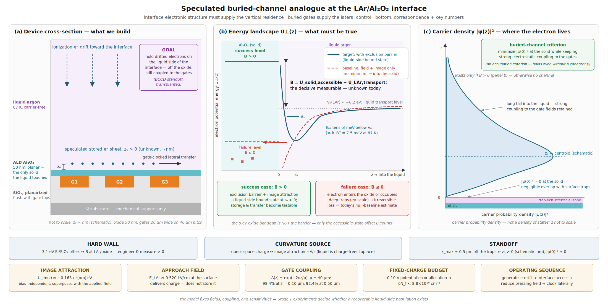

*Figure 12.1. Testable buried-channel analogy at the LAr/Al₂O₃ interface. (a) Planarized three-gate stack beneath a continuous 50 nm ALD Al₂O₃ film, the only solid surface the liquid touches. (b) Electron potential energy normal to the interface: the dashed baseline (applied field plus continuum image attraction) contains no finite-height minimum and drives the electron into the solid, while the solid target curve shows the liquid-side well that exists only if the effective entry barrier $\Phi_B > 0$; the in-band levels mark the success ($\Phi_B > 0$) and failure ($\Phi_B \leq 0$) cases, and the 8 eV oxide band gap is not the relevant barrier. (c) Schematic position-space probability density $|\psi(z)|^2$ for the hypothesized liquid-side state — a probability density, not a density of states, read as a classical occupation profile $P(z)$ if a single bound-state description is not justified; neither $z_0$ nor the state's existence is assumed or measured. Bottom strips: the BCCD functional correspondence and the model's benchmark quantities.*

---

## Objectives

1. **Establish and test a charge-accounting method.** Develop a calibrated injected-charge reference and measure the dependence of prompt collection, delayed recovery, and inferred loss on field, liquid purity, surface preparation, and fill-to-fill reproducibility.
2. **Test directional two-region transfer after Stage 1 qualification.** Use modeled gate sequences and predefined no-charge, drain, reversed-sequence, and feedthrough controls to determine whether charge movement can be distinguished from electrical artifacts.
3. **Relate surface processing to charge behavior.** Compare a bounded set of characterized surface variants and controls to determine whether measured surface properties correlate reproducibly with retention, recovery, or transfer.
4. **Evaluate repeated sensing conditionally.** Only after retention and transfer gates are met, test whether one packet can be stored, sensed, moved away, returned, and sensed again while independently measuring packet conservation.

---

## Methodology

(13) The Stage 0 optical source will follow the implementation demonstrated by Li et al. [18]:

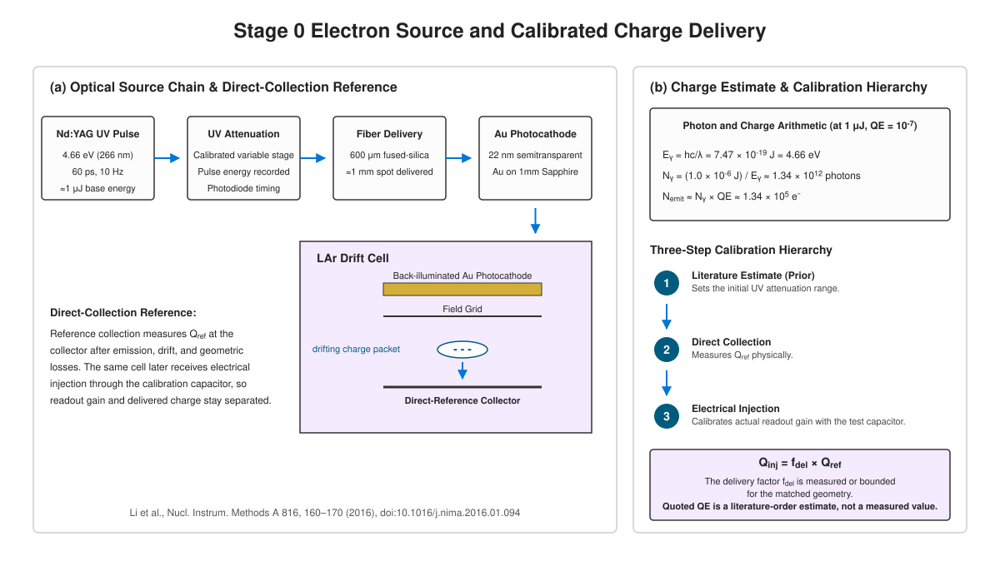

a frequency-quadrupled Nd:YAG laser with photon energy 4.66 eV, corresponding to approximately 266 nm, a 60 ps pulse width, and a 10 Hz repetition rate. The source illuminates a 22 nm semitransparent Au photocathode deposited on a 1 mm-thick, 10 mm-diameter sapphire disk through a 600 µm-diameter UV-grade fused-silica fiber. The delivered pulse energy will be measured for this apparatus rather than inferred from the laser setting. Li et al. reported approximately $10^{5}$ emitted electrons for an approximately 1 µJ pulse and an order-of-magnitude LAr quantum efficiency of approximately $10^{-7}$; these values are used only to select the initial attenuation range and are not treated as a calibration of the present source. The direct-reference configuration measures $Q_{\mathrm{ref}}$ at the reference collector after emission, drift, and geometric losses. The interface-injected charge is defined as $Q_{\mathrm{inj}} = f_{\mathrm{del}}\,Q_{\mathrm{ref}}$, where $f_{\mathrm{del}}$ is a measured or bounded delivery factor for the matched geometry. Electrical injection through the calibration capacitor independently calibrates the readout gain and is not used as a substitute for measuring optical charge delivery. At 266 nm, the photon energy is

$$
E_\gamma = \frac{hc}{\lambda} = 7.47 \times 10^{-19}\ mathrm{J} = 4.66\ mathrm{eV}
$$

For a 1.0 µJ pulse,

$$
N_\gamma = \frac{1.0 \times 10^{-6}\ mathrm{J}}{7.47 \times 10^{-19}\ mathrm{J/photon}} = 1.34 \times 10^{12}\ mathrm{photons}
$$

Using a literature order quantum efficiency of $10^{-7}$ in LAr gives

$$
N_{e,\mathrm{emit}} = N_\gamma\ mathrm{QE} \approx 1.34 \times 10^{5}\ mathrm{electrons},
$$

corresponding to

$$
Q_{\mathrm{emit}} \approx 21.5\ mathrm{fC}
$$

This is an emitted charge estimate before drift inefficiency, attachment, geometric loss, and reference electrode collection efficiency. The source will be operated over a nominal range of $10^{4}$ to $10^{5}$ electrons by optical attenuation. The injected charge used in every interface calculation will be the directly measured reference electrode charge, not a value inferred from the literature quantum efficiency [14,28]. Source calibration will be performed with the interface electrode in a direct collection configuration. The collected waveform will be integrated using the calibrated charge sensitive readout, while a photodiode records optical pulse timing and relative intensity. The charge scale will be established over at least ten optical settings and fitted for linearity. A precision electrical test capacitor will provide an independent electronics calibration. Source acceptance requires a shot-to-shot charge coefficient of variation no greater than 10% at the selected operating point, linear response with $R^{2} \ge 0.99$ over the working range, and agreement between the electrical calibration and integrated reference-collection charge within 10%. No liquid, no drift field, laser disabled, and field reversal measurements will separate optical pickup from drifting charge.

(14) Stage 1 will use a controlled source, drift region, shielding grid, candidate surface, independently biased holding and drain electrodes, and calibrated time-resolved readout to measure charge arrival, prompt collection, delayed release, retention time, and recovery. The charge-accounting analysis will report calibrated uncertainties for the reference-injected charge $Q_{\mathrm{inj}}$, the charge predicted to arrive at the interface $Q_{\mathrm{avail}}$, prompt collected charge $Q_{\mathrm{prompt}}$, intentionally drained charge $Q_{\mathrm{drain}}$, delayed or recovered charge $Q_{\mathrm{rec}}$, and unresolved charge $Q_{\mathrm{loss}}$. For each configuration, $Q_{\mathrm{avail}}$ will be derived from $Q_{\mathrm{inj}}$ using the concurrently measured electron lifetime, drift time, and independently calibrated collection efficiency. The accounting convention will be

$$
Q_{\mathrm{loss}} = Q_{\mathrm{avail}} - Q_{\mathrm{prompt}} - Q_{\mathrm{drain}} - Q_{\mathrm{rec}}
$$

with $Q_{\mathrm{prompt}}$, $Q_{\mathrm{drain}}$, and $Q_{\mathrm{rec}}$ measured in mutually exclusive programmed sequences or otherwise corrected to prevent double counting [19–22]. A delayed transient will be classified as recoverable charge only if it appears under the predicted arrival or commanded-release condition, disappears after intentional packet draining, differs from no-injection and no-liquid templates, and is reproducible across field, surface, and liquid-fill controls. The Stage 1 decision will require $Q_{\mathrm{rec}}/Q_{\mathrm{avail}} \ge 10\%$ after a commanded 1 ms hold, with a one-sided 95% lower confidence bound of at least 10%, charge-accounting closure within 20%, and retention-time sensitivity derived from the source calibration and measured readout noise. Observation of a transient alone is not sufficient.

(15) Stage 0 will compare and release an initial coplanar, multilayer, or overlapping-gate geometry using the documented fabrication limits, dielectric stack, and near-surface boundary assumptions before Stage 1 testing. After Stage 1 supplies measured interface constraints, those constraints will be propagated into the final Stage 2 geometry and clock design before Stage 2 fabrication and testing. The selected two-region geometry will be chosen because its modeled potential landscape provides a measurable distinction between a packet held in region A, a packet transferred to region B, and a packet intentionally drained. Evidence for transfer will require a directional and clock order dependent change in independently calibrated endpoint collection or recovery, agreement with the charge removed from the originating region within uncertainty, reversal under a reversed sequence, disappearance after intentional draining, and subtraction of a no-injection feedthrough template. A clock correlated transient alone will not be interpreted as charge transfer.

(16) Conditional on validated two-region transfer, a three or four gate structure will measure transfer across multiple boundaries. For each transfer step from region A to region B, the transfer efficiency will be defined as

$$
T_{A \to B} = \frac{Q_{B,\mathrm{net}}}{Q_{A,\mathrm{available}}}
$$

where $Q_{B,\mathrm{net}}$ is the template-subtracted, independently calibrated destination charge and $Q_{A,\mathrm{available}}$ is the charge available in region A immediately before the clock sequence. The report will state the uncertainty in each term and will separately report residual origin charge, drain collection, delayed recovery, bulk-loss correction, and unresolved loss. Residual charge at the originating region, drain collection, delayed recovery, bulk-loss corrections, and unresolved loss will be reported separately where measurable. Clock amplitude, edge rate, dwell time, repetition rate, packet size, and pause duration will be scanned over model-informed ranges. Observed trends will be treated as diagnostic evidence rather than unique proof of a mechanism. Possible explanations to test include gate-response bandwidth, insufficient barrier control, lateral mobility, well capacity, and trap-mediated release.

(17) The capstone protocol stores a packet at a gate adjacent to the sense node, performs a non-destructive measurement, clocks the packet away, verifies that the sense node returns to its baseline state, returns the packet, and measures it again. Before this stage begins, the experiment must specify the sensing mechanism, the reset or baseline-restoration sequence, the expected coupling between packet charge and measured signal, and the mechanism by which the measurement avoids collecting, draining, or irreversibly disturbing the packet. Packet conservation will be established by an independent charge measurement before and after the move and by a complete charge budget; it will not be inferred from averaging repeated samples of a static node. Repeated non-destructive readout in the style of the Skipper CCD is an additional objective of this work and is not implied by the electron-on-helium transport precedent [36].

(18) After controlled photoemission measurements establish the interface response, the final detector-generated-charge stage will use a calibrated Bi-207 source. The primary calibration feature will be the 975.655(3) keV K-conversion-electron line of the 1063.656 keV transition, with an evaluated emission probability of 7.11(17) electrons per 100 decays [56]. The source encapsulation, source-to-active-volume geometry, nearby conversion-electron lines, and gamma-induced background will be included in the calibration model. Using $W = 23.6\,\mathrm{eV}$ per electron–ion pair, a fully deposited 975.655 keV electron produces approximately $4.13 \times 10^{4}$ initial electron–ion pairs before recombination and transport losses [24,25,56-58]. The charge reaching the interface will therefore be measured after field, track, drift, purity, and collection-dependent losses rather than assumed from a universal survival factor. The controlled source packet scale will be selected to overlap the expected post recombination and post transport range where practical, but direct carry over without recalibration will not be assumed. This stage is an application test of a previously established interface mechanism, not the first search for that mechanism.

(19) LXe is a conditional extension or redirection path, not a presumed transfer of the LAr architecture. A limited parameter comparison will first identify how temperature, purification and containment requirements, electron energetics, mobility and diffusion, dielectric response, surface chemistry, and modeled gate coupling differ from LAr [2,26,53]. The quasi-free electron energy convention and reference state will be stated explicitly rather than quoting isolated negative values without definition [12,13,53]. For the simple planar dielectric-image term, reducing the permittivity contrast between the liquid and a higher-permittivity dielectric reduces the magnitude of the image attraction. The complete multilayer geometry and applied fields will nevertheless be calculated rather than inferred from this term alone. An LXe experiment will be proposed only if the LAr analysis identifies a plausible liquid-specific limitation that LXe could improve and if the required source, purification, readout, and safety infrastructure are credible.

(20) The first concrete readout baseline uses an OPA657 FET-input operational amplifier in a charge-sensitive configuration with feedback capacitance $C_f = 0.50\,\mathrm{pF}$, total pre-driver input capacitance $C_{\mathrm{in}} = 10\,\mathrm{pF}$, a 10 µs shaping interval, and an ADS9110 18-bit, 2 MS/s SAR digitizer [34,35,51,52,61]. The ADC input will include a settling-capable driver and the datasheet-required fly-wheel RC network [52]. The driver, RC network, their added capacitance, settling behavior, and input-referred noise will be included in the equivalent circuit and assembled-chain ENC qualification [52]. The amplifier is initially operated at room temperature near the cryostat feedthrough; cryogenic operation is not assumed without separate qualification. Readout baseline and measured noise qualification [34,35,51,52,61]:

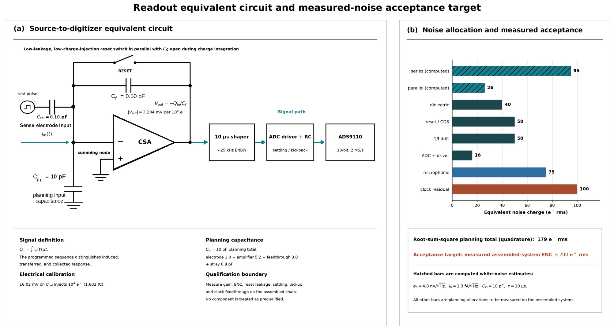

A $10^{4}$-electron packet corresponds to 1.602 fC and produces a nominal charge-sensitive amplifier step of

$$
V_{\mathrm{out}} = \frac{Q}{C_f} = \frac{1.602 \mathrm{fC}}{0.50 \mathrm{pF}} = 3.204 \mathrm{mV}
$$

A 0.10 pF calibration capacitor driven by a 16.02 mV voltage step injects the equivalent of $10^{4}$ electrons:

$$
Q_{\mathrm{cal}} = C_{\mathrm{cal}}\ Delta V = (0.10\ mathrm{pF})(16.02\ mathrm{mV}) = 1.602\ mathrm{fC}
$$

The first-order line-item noise allocation gives a quadrature total of approximately 179 $e^{-}$ rms. The assembled system acceptance requirement is $\mathrm{ENC} \le 200\,e^{-}\,\mathrm{rms}$. This value is a design and measurement requirement, not an achieved performance claim. The final qualification will report the measured sensor, amplifier, cable, feedthrough, and stray capacitances; amplifier voltage and current noise spectra; reset and correlated double-sampling residuals; low frequency drift; digitizer noise; microphonic and electromagnetic pickup; and residual clock feedthrough. Source-disabled clock sequences will define the feedthrough template. Before the first LAr interface measurement, the complete assembled chain must demonstrate $\mathrm{ENC} \le 200\,e^{-}\,\mathrm{rms}$ using a calibrated $1.0 \times 10^{4}$-electron equivalent injection. Before G2 is accepted, the same chain and analysis procedure must demonstrate signal-to-noise ratio $\ge 5$ for a $1.0 \times 10^{3}$-electron recovered-charge equivalent. G2 will be evaluated at an operating point for which the measured $Q_{\mathrm{avail}}$ is sufficient for this readout test to represent the $Q_{\mathrm{rec}}/Q_{\mathrm{avail}} \ge 10\%$ recovery criterion.

Feedback-resistor tolerance requirement for the acquisition:

$$
R_{\mathrm{FLT}} \le 10\ Omega
$$

with resistor tolerance below 1% and a driver that settles to 18-bit accuracy within the acquisition interval [52].

(21) Materials characterization will be selected by measurement role. Ellipsometry, spectroscopic reflectometry, profilometry, or cross-sectional SEM on appropriate witness samples will establish thickness, growth per cycle, and uniformity [41,42,44,49]. AFM will quantify exposed surface roughness and morphology. XPS will compare near surface elemental composition, chemical states, and relative carbon or hydroxyl related signatures subject to stated detection limits. FTIR will be used where its sampling depth and substrate geometry permit testing of hydroxyl or carbon containing groups. Companion MOS capacitors will provide process monitor measurements of leakage, breakdown, hysteresis, and effective fixed charge or interface trap behavior at the silicon/dielectric interface [45,46,50]. These measurements will not be presented as direct measurements of the LAr facing surface. The liquid facing interface will instead be probed through cryogenic charge injection, recovery, relaxation, and transfer measurements. XRD and Raman will be used only when a specific crystallinity or phase question justifies them; they are not primary characterization techniques for a thin amorphous ALD dielectric [41,42,44-47,50].

(22) Every charge result carries its control set, and the controls are acquired in the same run as the data they qualify so that purity or temperature drift cannot masquerade as a surface effect. No liquid and no drift field runs isolate injection artifacts; no-injection runs at identical clock settings supply the feedthrough template; grounded gate runs bound direct capacitive coupling; microphonic and electromagnetic-pickup runs are taken with the clock active and the source disabled; each result is repeated on multiple devices and across separate liquid fills; reversed holding field and reversed clock direction test directionality; draining the packet before transfer tests signal provenance; and the trap rich and metallic reference surfaces anchor the two failure extremes. Electron lifetime is measured concurrently in every run, temperature and high voltage are logged continuously, charging hysteresis is mapped by repeated charge and release cycles on the same coupon, and the readout chain is calibrated against a precision test capacitor before and after each campaign. A control matrix will be specified before data collection. For each artifact hypothesis, including capacitive feedthrough, dielectric polarization, bulk attachment, direct collection, trapped charge, microphonics, and electromagnetic pickup, the matrix will state the control sequence, predicted waveform or endpoint charge outcome, normalization method, and criterion for rejecting or retaining that explanation. The conductive reference will be interpreted as a collection-dominated control, while the trap-rich surface will be interpreted as a strong trapping control only after its behavior is independently characterized.

(23) **Interpretation of numerical criteria.** The following thresholds are engineering decision boundaries, not universal physical constants and not claims of final detector performance. The initial $10^{4}$-electron packet was selected because the calculated $179\,e^{-}$ rms ENC gives an SNR of 5.59 after 10% recovery. A 1 ms hold separates prompt optical and capacitive artifacts from commanded delayed release while remaining short compared with the required bulk-electron lifetime. The 50% two-region threshold is a discovery-level directionality criterion that produces a measurable origin-to-destination contrast; it is not a useful array scale CTE. A 90% per-boundary Stage 3 threshold preserves $0.9^{3} = 72.9\%$ after three boundaries and permits a short-chain loss analysis, but it is not a practical long-array target. A 5% Stage 4 loss criterion establishes reversible movement only. It retains only $0.95^{10} = 59.9\%$ after ten cycles and must not be described as genuinely non-destructive Skipper-like sensing [36]. The later architecture target for useful repeated sensing is a per-cycle loss no greater than 0.1%, with a one-sided 95% upper confidence bound based on 100 cycles of the same packet. This retains $0.999^{100} = 90.5\%$ of the packet. In addition, 100 measurements must reduce the electronic noise by at least a factor of eight relative to one measurement after accounting for correlated noise. The discovery-level repeated-return gate and the later skipper performance target are intentionally distinct.

---

## Preliminary Results

**System-development result and remaining transition.** Two back-to-back 1000-cycle copper oxidation runs demonstrated reproducible execution of the programmed water, purge, air, and purge sequences; synchronized pressure and temperature logging; and the ability to compare run-to-run process variation. XRD and Raman measurements confirmed that the resulting samples contained CuO and Cu₂O and demonstrated the use of complementary characterization methods on products from the in-house reactor. These experiments are evidence of developing competence in gas delivery, thermal operation, hardware/software integration, data logging, repeatability analysis, and materials characterization. They are not evidence of self-limiting ALD, do not qualify the system for Al₂O₃ growth, and do not constitute the dissertation scientific result. The next decisive result is reproducible TMA/H₂O Al₂O₃ on smooth silicon with demonstrated precursor saturation, calibrated growth per cycle, independently measured thickness, within-sample uniformity, and five-run repeatability by October 16, 2026.

---

## Plans and Tasks to Complete the Dissertation Research

(24) **Failure modes and bounded redirection.** If the Al₂O₃ Stage 1 hypothesis fails, the response is a bounded sequence rather than indefinite optimization: one modified ALD condition, one post-deposition thermal or dehydration condition, one passivated condition, one alternative dielectric, and one non-oxide or capped surface, with each condition characterized before charge testing. If all tested LAr surfaces yield no recoverable state at the available sensitivity, the dissertation result will report quantitative upper bounds on recoverable fraction and retention time as functions of field, surface, and liquid condition. LXe will be considered only if the LAr result identifies a liquid-specific limitation that the LXe model credibly improves. If charge is retained but directional transfer fails, the program will perform a bounded geometry and waveform study involving dielectric thickness, gate pitch and overlap, clock amplitude, edge rate, dwell time, and holding field. If directional behavior remains absent after that study, multigate transport will stop. If transfer is demonstrated but repeated sensing fails, the program will distinguish a successful transport result from an unsuccessful sensing architecture and redirect only to a dedicated floating gate, differential, RF, or separated storage/sense design. In every case, a completed, controlled negative result is preserved as scientific evidence. A missed experiment, absent calibration, incomplete controls, or missing analysis is treated separately as execution failure.

(25) If retention, directional transfer, and repeated sensing are demonstrated, the mechanism could motivate later studies of local charge storage, routing before amplification, charge domain multiplexing, sparse readout, and lower threshold architectures for liquid noble gas detectors. These are prospective applications, not outcomes promised by this dissertation. The dissertation objective is to determine whether the enabling interface mechanism exists and can be engineered under controlled conditions.

(26) **Scientific results and execution accountability.** Each decision gate has three possible outcomes: advancement, scientific redirection, or execution review. A scientifically negative result occurs when a correctly designed, calibrated, controlled, and reproducible experiment establishes that a hypothesis is false or places a quantitative upper bound on the proposed mechanism. Such a result is a valid dissertation outcome when it decisively resolves the scientific question and motivates a defined redirection. An execution failure occurs when the required apparatus, measurement, analysis, controls, or deliverable are not completed by the agreed deadline. A missed scientific threshold is not an execution failure if the experiment and analysis are complete; failure to complete the experiment and reach an interpretable result is not a negative scientific result. The core dissertation is complete after G3, either as a positive retention and two-region transfer result or as a controlled null result with quantitative bounds. G4 through G6 are conditional extensions and may not delay completion of the core dissertation. No new experimental branch will begin after March 31, 2028 without written committee approval. The remaining period is reserved for bounded extensions, confirmatory measurements, analysis, writing, and defense preparation. G1 occurs only after the qualified film characterization, fabrication release review, source calibration, and assembled readout measurement are complete.

### Expected timeline for the dissertation-level contributions

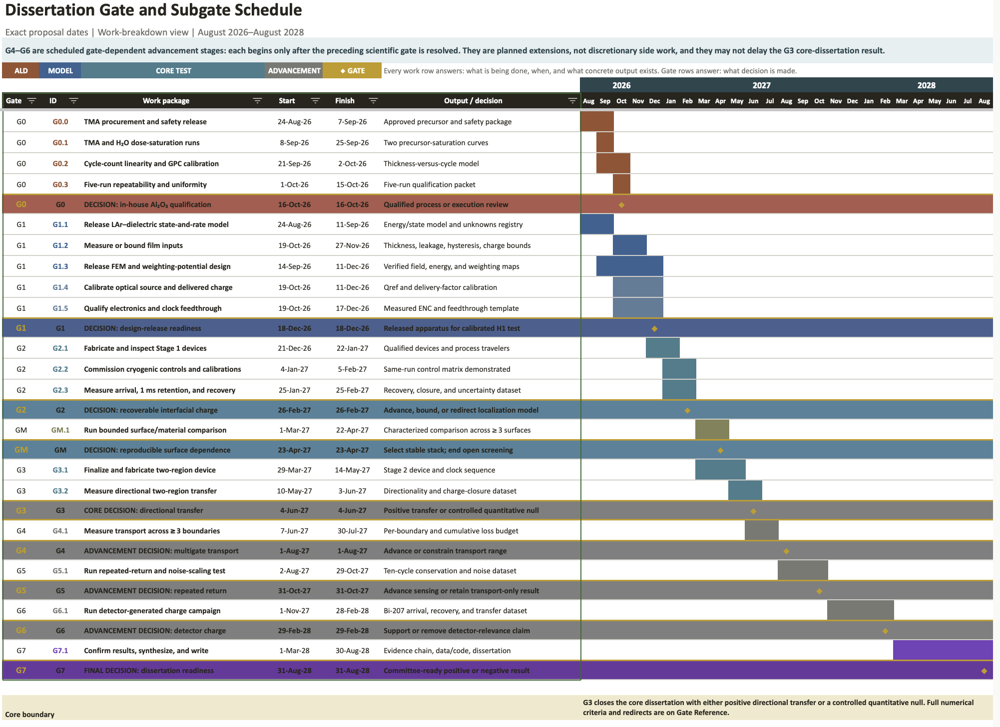

This proposal directly addresses the first dissertation expectation: pushing the boundary of a fundamental sensing mechanism through quantitative tests of charge retention, gated transfer, and repeated sensing at an engineered liquid noble gas interface. The progression from simplified buried-gate structures toward a CMOS-compatible gate and sensing architecture connects the work to the broader materials/CMOS integration scope. The present proposal does not claim that an industrial-quality prototype sensor has already been defined or satisfied. Reliability, packaging, thermal cycling, contamination qualification, integrated CMOS fabrication, and production-level validation would be later engineering requirements beyond the initial mechanism demonstrator.

---

## References

[1] W. M. Bonivento and F. Terranova, "The Science and Technology of Liquid Argon Detectors," *Reviews of Modern Physics* **96**, 045001 (2024): [DOI](https://doi.org/10.1103/RevModPhys.96.045001), [arXiv:2405.01153](https://arxiv.org/abs/2405.01153).

[2] V. Chepel and H. Araújo, "Liquid Noble Gas Detectors for Low Energy Particle Physics," *Journal of Instrumentation* **8**, R04001 (2013): [DOI](https://doi.org/10.1088/1748-0221/8/04/R04001), [arXiv:1207.2292](https://arxiv.org/abs/1207.2292).

[3] G. Sabouret, F. R. Bradbury, S. Shankar, J. A. Bert, S. A. Lyon; Signal and charge transfer efficiency of few electrons clocked on microscopic superfluid helium channels. *Appl. Phys. Lett.* 25 February 2008; 92 (8): 082104. https://doi.org/10.1063/1.2884693  [arXiv:0710.2909](https://arxiv.org/abs/0710.2909)

[4] F. R. Bradbury, M. Takita, T. M. Gurrieri, K. J. Wilkel, K. Eng, M. S. Carroll, and S. A. Lyon, "Efficient Clocked Electron Transfer on Superfluid Helium," *Physical Review Letters* **107**, 266803 (2011). [DOI: 10.1103/PhysRevLett.107.266803](https://doi.org/10.1103/PhysRevLett.107.266803)  [arXiv:1107.4040](https://arxiv.org/abs/1107.4040)

[5] K. E. Castoria, H. Byeon, N. R. Beysengulov, E. O. Glen, M. Sammon, J. Pollanen, D. G. Rees, and S. A. Lyon, "Selective Shuttling of Electrons on Helium Using a CMOS Control Platform," *Physical Review Applied* **26**, 014005 (2026). [DOI: 10.1103/pq6h-679f](https://doi.org/10.1103/pq6h-679f)  [arXiv:2511.15922](https://arxiv.org/abs/2511.15922)

[6] G. Papageorgiou, P. Glasson, K. Harrabi et al., "Counting individual trapped electrons on liquid helium," Appl. Phys. Lett. **86**, 153106 (2005). https://doi.org/10.1063/1.1900301

[7] X. Zhou, G. Koolstra, X. Zhang et al., "Single electrons on solid neon as a solid-state qubit platform," Nature **605**, 46–50 (2022). https://doi.org/10.1038/s41586-022-04539-x

[8] K. Zheng, X. Song, and K. W. Murch, "Surface-Morphology-Assisted Trapping of Strongly Coupled Electron-on-Neon Charge States," Phys. Rev. Lett. **135**, 080601 (2025). https://doi.org/10.1103/8v7d-53x7

[9] K. Kajita, "A new two-dimensional electron system on the surface of solid neon," Surf. Sci. **142**, 86–95 (1984). https://doi.org/10.1016/0039-6028(84)90290-5

[10] B. E. Nieuwenhuys, O. G. van Aardenne, and W. M. H. Sachtler, "Adsorption of xenon on group VIII and Ib metals studied by photoelectric work function measurements," Chem. Phys. **5**, 418–428 (1974). https://doi.org/10.1016/0301-0104(74)85043-3

[11] E. A. Ustinov, D. D. Do, and M. Jaroniec, "Application of density functional theory to equilibrium adsorption of argon and nitrogen on amorphous silica surface," Appl. Surf. Sci. **252**, 548–561 (2005). https://doi.org/10.1016/j.apsusc.2005.02.070

[12] B. Plenkiewicz, J.-P. Jay-Gerin, P. Plenkiewicz, and G. B. Bachelet, "Conduction band energy of excess electrons in liquid argon," Europhys. Lett. **1**, 455–460 (1986). https://doi.org/10.1209/0295-5075/1/9/006

[13] W. Tauchert and W. F. Schmidt, "Energy of the quasi-free electron state in liquid argon, krypton, and xenon," Z. Naturforsch. A **30**, 1085–1086 (1975). https://doi.org/10.1515/zna-1975-0827

[14] U. Sowada, J. M. Warman, and M. P. de Haas, "Hot-electron thermalization in solid and liquid argon, krypton, and xenon," Phys. Rev. B **25**, 3434–3437 (1982). https://doi.org/10.1103/PhysRevB.25.3434

[15] L. S. Miller, S. Howe, and W. E. Spear, "Charge transport in solid and liquid Ar, Kr, and Xe," Phys. Rev. **166**, 871–878 (1968). https://doi.org/10.1103/PhysRev.166.871

[16] W. Walkowiak, "Drift velocity of free electrons in liquid argon," Nucl. Instrum. Methods A **449**, 288–294 (2000). https://doi.org/10.1016/S0168-9002(99)01301-7

[17] E. Shibamura, T. Takahashi, S. Kubota, and T. Doke, "Ratio of diffusion coefficient to mobility for electrons in liquid argon," Phys. Rev. A **20**, 2547–2554 (1979). https://doi.org/10.1103/PhysRevA.20.2547

[18] Y. Li, T. Tsang, C. Thorn et al., "Measurement of longitudinal electron diffusion in liquid argon," Nucl. Instrum. Methods A **816**, 160–170 (2016). https://doi.org/10.1016/j.nima.2016.01.094

[19] D. W. Swan, "Electron attachment processes in liquid argon containing oxygen or nitrogen impurity," Proc. Phys. Soc. **82**, 74–84 (1963). https://doi.org/10.1088/0370-1328/82/1/310

[20] G. Bakale, U. Sowada, and W. F. Schmidt, "Effect of an electric field on electron attachment to sulfur hexafluoride, nitrous oxide, and molecular oxygen in liquid argon and xenon," J. Phys. Chem. **80**, 2556–2559 (1976). https://doi.org/10.1021/j100564a006

[21] A. Bettini, A. Braggiotti, F. Casagrande et al., "A study of the factors affecting the electron lifetime in ultra-pure liquid argon," Nucl. Instrum. Methods A **305**, 177–186 (1991). https://doi.org/10.1016/0168-9002(91)90532-U

[22] R. Andrews, W. Jaskierny, H. Jöstlein et al., "A system to test the effect of materials on electron drift lifetime in liquid argon and the effect of water," Nucl. Instrum. Methods A **608**, 251–258 (2009). https://doi.org/10.1016/j.nima.2009.07.024

[23] N. V. Klassen and W. F. Schmidt, "Ionization of liquid argon by X-rays: W-value," Can. J. Chem. **47**, 4286–4288 (1969). https://doi.org/10.1139/v69-707

[24] J. Thomas and D. A. Imel, "Recombination of electron-ion pairs in liquid argon and liquid xenon," Phys. Rev. A **36**, 614–616 (1987). https://doi.org/10.1103/PhysRevA.36.614

[25] R. Acciarri, C. Adams, J. Asaadi et al., "A study of electron recombination using highly ionizing particles in the ArgoNeuT liquid argon TPC," J. Instrum. **8**, P08005 (2013). https://doi.org/10.1088/1748-0221/8/08/P08005

[26] E. Aprile and T. Doke, "Liquid xenon detectors for particle physics and astrophysics," Rev. Mod. Phys. **82**, 2053–2097 (2010). https://doi.org/10.1103/RevModPhys.82.2053

[27] H. Ichinose, T. Doke, A. Hitachi et al., "Energy resolution for 1 MeV electrons in liquid argon doped with allene," Nucl. Instrum. Methods A **295**, 354–358 (1990). https://doi.org/10.1016/0168-9002(90)90712-F

[28] M. Silver, P. Kumbhare, P. Smejtek, and D. G. Onn, "Hot electron injection into liquid argon from a tunnel cathode," J. Chem. Phys. **52**, 5195–5199 (1970). https://doi.org/10.1063/1.1672761

[29] J. G. Kim, S. M. Dardin, K. H. Jackson et al., "Studies of electron avalanche behavior in liquid argon," IEEE Trans. Nucl. Sci. **49**, 1851–1856 (2002). https://doi.org/10.1109/TNS.2002.801490

[30] K. Arii and W. F. Schmidt, "Current injection and light emission in liquid argon and xenon in a divergent electric field," IEEE Trans. Electr. Insul. **EI-19**, 16–23 (1984). https://doi.org/10.1109/TEI.1984.298728

[31] S. Ramo, "Currents induced by electron motion," Proc. IRE **27**, 584–585 (1939). https://doi.org/10.1109/JRPROC.1939.228757

[32] W. Shockley, "Currents to conductors induced by a moving point charge," J. Appl. Phys. **9**, 635–636 (1938). https://doi.org/10.1063/1.1710367

[33] Z. He, "Review of the Shockley–Ramo theorem and its application in semiconductor gamma-ray detectors," Nucl. Instrum. Methods A **463**, 250–267 (2001). https://doi.org/10.1016/S0168-9002(01)00223-6

[34] V. Radeka, H. Chen, G. Deptuch et al., "Cold electronics for 'Giant' liquid argon time projection chambers," J. Phys. Conf. Ser. **308**, 012021 (2011). https://doi.org/10.1088/1742-6596/308/1/012021

[35] E. Bechetoille, H. Mathez, and Y. Zoccarato, "Charge sensitive amplifier in cold gas of liquid argon time projection chamber," J. Instrum. **6**, C01005 (2011). https://doi.org/10.1088/1748-0221/6/01/C01005

[36] J. Tiffenberg, M. Sofo-Haro, A. Drlica-Wagner et al., "Single-electron and single-photon sensitivity with a silicon Skipper CCD," Phys. Rev. Lett. **119**, 131802 (2017). https://doi.org/10.1103/PhysRevLett.119.131802

[37] S. Palestini and F. Resnati, "Space charge in liquid argon time-projection chambers: a review of analytical and numerical models, and mitigation methods," J. Instrum. **16**, P01028 (2021). https://doi.org/10.1088/1748-0221/16/01/P01028

[38] B. Baibussinov, M. Bettini, F. Fabris et al., "Study of charging-up of PCB planes for neutrino experiment readout," J. Instrum. **19**, P11012 (2024). https://doi.org/10.1088/1748-0221/19/11/P11012

[39] S. Z. Tu, C. Jiang, T. R. Junk, and T. Yang, "A numerical solver for investigating the space charge effect on the electric field in liquid argon time projection chambers," J. Instrum. **18**, P06022 (2023). https://doi.org/10.1088/1748-0221/18/06/P06022

[40] L. Romero, R. Santorelli, and B. Montes, "Dynamics of the ions in liquid argon detectors and electron signal quenching," Astropart. Phys. **92**, 11–20 (2017). https://doi.org/10.1016/j.astropartphys.2017.04.002

[41] R. L. Puurunen, "Surface chemistry of atomic layer deposition: A case study for the trimethylaluminum/water process," J. Appl. Phys. **97**, 121301 (2005). https://doi.org/10.1063/1.1940727

[42] R. L. Puurunen, "Correlation between the growth-per-cycle and the surface hydroxyl group concentration in the atomic layer deposition of aluminum oxide from trimethylaluminum and water," Appl. Surf. Sci. **245**, 6–10 (2005). https://doi.org/10.1016/j.apsusc.2004.10.003

[43] S. M. George, "Atomic layer deposition: An overview," Chem. Rev. **110**, 111–131 (2010). https://doi.org/10.1021/cr900056b

[44] M. D. Groner, F. H. Fabreguette, J. W. Elam, and S. M. George, "Low-temperature Al₂O₃ atomic layer deposition," Chem. Mater. **16**, 639–645 (2004). https://doi.org/10.1021/cm0304546

[45] B. Hoex, S. B. S. Heil, E. Langereis, M. C. M. van de Sanden, and W. M. M. Kessels, "Ultralow surface recombination of c-Si substrates passivated by plasma-assisted atomic layer deposited Al₂O₃," Appl. Phys. Lett. **89**, 042112 (2006). https://doi.org/10.1063/1.2240736

[46] F. Werner and J. Schmidt, "Manipulating the negative fixed charge density at the c-Si/Al₂O₃ interface," Appl. Phys. Lett. **104**, 091604 (2014). https://doi.org/10.1063/1.4867652

[47] D. J. DiMaria and J. W. Stasiak, "Trap creation in silicon dioxide produced by hot electrons," J. Appl. Phys. **65**, 2342–2356 (1989). https://doi.org/10.1063/1.342824

[48] H. Knözinger and P. Ratnasamy, "Catalytic aluminas: Surface models and characterization of surface sites," Catal. Rev. **17**, 31–70 (1978). https://doi.org/10.1080/03602457808080878

[49] C. Barbos, D. Blanc-Pelissier, A. Fave et al., "Al₂O₃ thin films deposited by thermal atomic layer deposition: Characterization for photovoltaic applications," Thin Solid Films **617**, 108–113 (2016). https://doi.org/10.1016/j.tsf.2016.02.049

[50] D. Suh and W. S. Liang, "Electrical properties of atomic layer deposited Al₂O₃ with anneal temperature for surface passivation," Thin Solid Films **539**, 309–316 (2013). https://doi.org/10.1016/j.tsf.2013.05.082

[51] Texas Instruments, "OPA657 1.6-GHz, Low-Noise, FET-Input Operational Amplifier," datasheet SBOS197F, revised August 2015. https://www.ti.com/lit/ds/symlink/opa657.pdf

[52] Texas Instruments, "ADS9110 18-Bit, 2-MSPS, 15-mW, SAR ADC With Enhanced Performance Features," datasheet SBAS629C, revised April 2026. https://www.ti.com/lit/ds/symlink/ads9110.pdf

[53] G. J. Boyle, N. A. Garland, D. L. Muccignat, I. Simonović, D. Bošnjaković, S. Dujko, and R. D. White, "Review of the experimental and theoretical landscape of electron transport in noble liquids," arXiv:2504.16338 (2025), https://doi.org/10.48550/arXiv.2504.16338

[54] M. W. Cole and M. H. Cohen, "Image-Potential-Induced Surface Bands in Insulators," Phys. Rev. Lett. **23**, 1238–1241 (1969). https://doi.org/10.1103/PhysRevLett.23.1238

[55] C. C. Grimes, T. R. Brown, M. L. Burns, and C. L. Zipfel, "Spectroscopy of electrons in image-potential-induced surface states outside liquid helium," Phys. Rev. B **13**, 140–147 (1976). https://doi.org/10.1103/PhysRevB.13.140

[56] M. M. Bé and V. Chisté, "Bi-207 recommended-data table," Laboratoire National Henri Becquerel, Decay Data Evaluation Project, evaluated 1997–2009. http://www.lnhb.fr/nuclides/Bi-207_tables.pdf

[57] M. Miyajima, T. Takahashi, S. Konno, T. Hamada, S. Kubota, H. Shibamura, and T. Doke, "Average energy expended per ion pair in liquid argon," Phys. Rev. A **9**, 1438–1443 (1974). https://doi.org/10.1103/PhysRevA.9.1438

[58] B. Baibussinov et al., "A novel liquid argon purity monitor based on ²⁰⁷Bi," JINST **20**, P02011 (2025). https://doi.org/10.1088/1748-0221/20/02/P02011

[59] R. L. Amey and R. H. Cole, "Dielectric Constants of Liquefied Noble Gases and Methane," J. Chem. Phys. **40**, 146–148 (1964). https://doi.org/10.1063/1.1724850

[60] A. Paghi, S. Battisti, S. Tortorella, G. De Simoni, and F. Giazotto, "Cryogenic behavior of high-permittivity gate dielectrics: The impact of atomic layer deposition temperature and the lithographic patterning method," J. Appl. Phys. **137**, 044103 (2025). https://doi.org/10.1063/5.0250428

[61] P. Mukim et al., "Cryogenic Front-End ASICs for Low-Noise Readout of Charge Signals," IEEE Trans. Circuits Syst. I **72**, 1496–1509 (2025). https://doi.org/10.1109/TCSI.2024.3506828

[62] C. Lage, A. Bradshaw, J. A. Tyson, and the LSST Dark Energy Science Collaboration, "Poisson_CCD: A dedicated simulator for modeling CCDs," J. Appl. Phys. **130**, 164502 (2021). https://doi.org/10.1063/5.0058894

[63] R. H. Walden, R. H. Krambeck, R. J. Strain, J. McKenna, N. L. Schryer, and G. E. Smith, "The Buried Channel Charge Coupled Device," *Bell System Technical Journal* **51**, 1635–1640 (1972). https://doi.org/10.1002/j.1538-7305.1972.tb02674.x

[64] J. R. Janesick, *Scientific Charge-Coupled Devices* (SPIE Press, Bellingham, WA, 2001), Chs. 3–5. https://doi.org/10.1117/3.374903

[65] W. S. Boyle and G. E. Smith, "Charge Coupled Semiconductor Devices," *Bell System Technical Journal* **49**, 587–593 (1970). https://doi.org/10.1002/j.1538-7305.1970.tb01790.x

[66] J. Robertson, "High dielectric constant oxides," *European Physical Journal Applied Physics* **28**, 265–291 (2004). https://doi.org/10.1051/epjap:2004206

[67] J. C. Brewer, R. J. Walters, L. D. Bell, D. B. Farmer, R. G. Gordon, and H. A. Atwater, "Determination of energy barrier profiles for high-k dielectric materials utilizing bias-dependent internal photoemission," *Applied Physics Letters* **85**, 4133–4135 (2004). https://doi.org/10.1063/1.1812831

---

## Appendix

**Reactor-development record (non-ALD).** Two reproducible 1,000-cycle copper-oxidation runs verified recipe execution, process logging, run-to-run comparison, and the XRD/Raman workflow. They do not demonstrate self-limiting growth, do not qualify the TMA/H₂O process, and are not the dissertation scientific result. The difference between the controller setpoint and the in-furnace RTD is recorded as an instrumentation calibration issue and is not interpreted as a material result. This appendix provides a concise evidence summary; raw logs, full diffraction patterns, Raman spectra, peak fits, instrument files, and complete analysis records are retained in the laboratory record. The baseline precursor is Strem 98-4003, trimethylaluminum, minimum 98%, CAS 75-24-1, MFCD00008252, supplied as 10 g in a 50 mL Swagelok cylinder for CVD/ALD. This exact catalog configuration is listed by both Strem and Fisher Scientific. The purchase request will be initiated on August 28, 2026. TMA is pyrophoric and violently water-reactive, so procurement, installation, and use remain subject to institutional EHS approval and the manufacturer's handling requirements.

### Cu Validation

Two back-to-back runs (U and V, August 6, 2026) executed an identical 1000-cycle recipe on rolled copper shim sheet samples: 500 cycles of a 500 ms water-vapour dose with a 5 s purge, followed by 500 cycles of a 500 ms air dose with the same purge. Recomputed from raw logs, mean cycle times agree between runs to 0.1 ms (U = 5707.0 ± 1.3 ms vs V = 5706.9 ± 1.2 ms), mean process temperature to 0.1 °C (398.5 ± 2.4 °C vs 398.4 ± 1.4 °C on the in-furnace RTD, against a 450 °C controller setpoint; the offset reflects the RTD position relative to the heater and is characterized in the Appendix). XRD (Cu Kα, 20–80° 2θ) of the middle coupons identifies both Cu₂O and CuO in all three scans (one of U, two of V including a remounted repeat). Cu₂O is identified by five reflections: 29.35–29.39° (110), 36.19–36.26° (111), 41.84–41.90° (200), 60.85–61.01° (220), and approximately 76.7–76.8° (222). CuO is provisionally assigned by nine: the strongest at 35.53° (−111), 38.79–38.85° (111), and 48.66–48.79° (−202). The XRD data provisionally support formation of Cu₂O and CuO. The strongest oxide features reproduce closely between repeated scans, but several Cu₂O reflections remain shifted from their tabulated reference positions, and the candidate CuO (311) feature shows a larger discrepancy. Because the Cu substrate reflections also exhibit position-dependent offsets, zero shift and specimen displacement must be corrected using an appropriate standard before a corrected lattice parameter or strain interpretation is reported. The absence of candidate Cu₄O₃ reflections near 28.1° and 30.6° limits evidence for that phase but does not, by itself, exclude a minor Cu₄O₃ contribution. The appendix therefore treats the phase assignments as provisional peak-position identifications supported by the complementary Raman measurements. Phase identification rests on peak positions only; relative intensities differ strongly between runs (most visibly Cu₂O(200) — relative peak intensities differ strongly between runs and are not used for phase identification pending correction of zero-shift, specimen-displacement, texture, and roughness effects using an appropriate diffraction standard.

### XRD
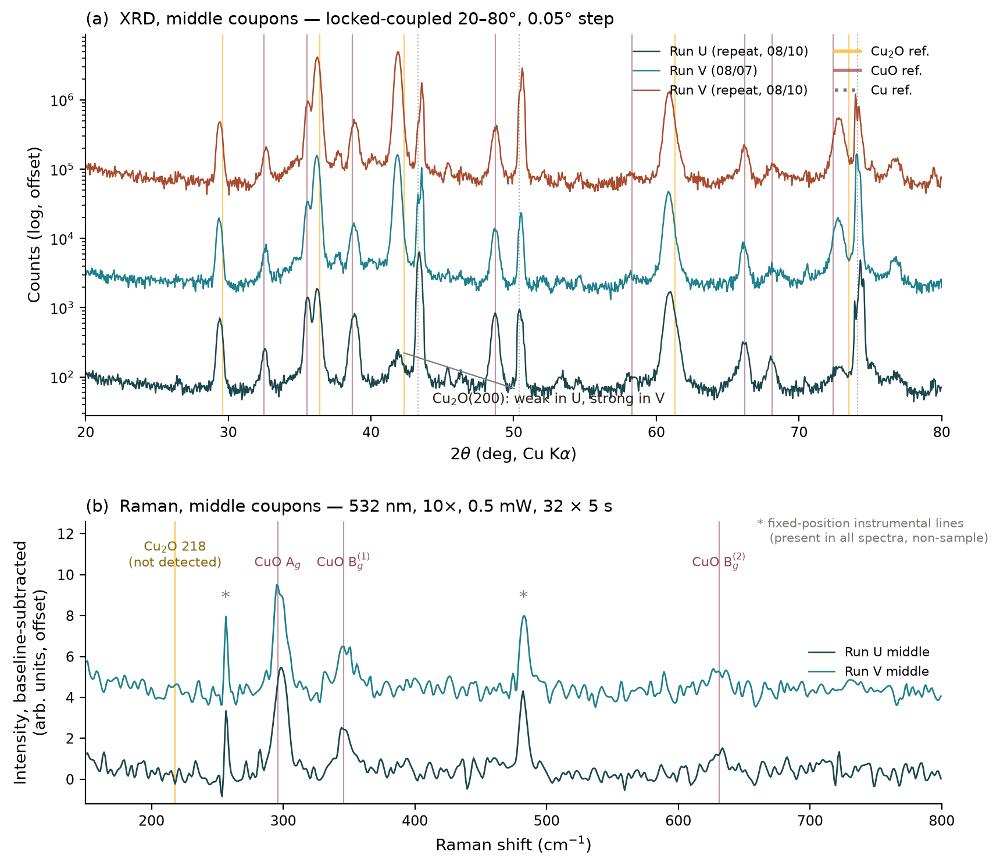

| Phase (hkl) | Ref 2θ | U repeat (8/10) | V (8/7) | V repeat (8/10) | Max spread |
| :--- | :---: | :---: | :---: | :---: | :---: |
| Cu₂O (110) | 29.58 | 29.394 | 29.354 | 29.375 | 0.040° |
| CuO (110) | 32.50 | 32.535 | 32.649 | 32.642 | 0.114° |
| CuO (−111)/(002) | 35.50 | 35.537 | 35.531 | 35.526 | 0.011° |
| Cu₂O (111) | 36.42 | 36.185 | 36.195 | 36.262 | 0.077° |
| CuO (111)/(200) | 38.70 | 38.848 | 38.799 | 38.793 | 0.055° |
| Cu₂O (200) | 42.30 | 41.886 | 41.840 | 41.901 | 0.061° |
| Cu (111) | 43.30 | 43.419 | 43.550 | 43.542 | 0.131° |
| CuO (−202) | 48.72 | 48.694 | 48.657 | 48.789 | 0.133° |
| Cu (200) | 50.43 | 50.391 | 50.478 | 50.594 | 0.203° |
| CuO (020) | 53.50 | 53.458 | 53.445 | 53.404 | 0.054° |
| CuO (202) | 58.30 | 58.025 | 58.208 | 58.148 | 0.183° |
| Cu₂O (220) | 61.35 | 61.008 | 60.851 | 60.952 | 0.158° |
| CuO (−311)/(022) | 66.20 | 66.033 | 66.054 | 66.143 | 0.111° |
| CuO (220) | 68.10 | 67.996 | 68.106 | 68.093 | 0.109° |
| CuO (311) | 72.40 | 73.013 | 72.774 | 72.795 | 0.238° |
| Cu (220) | 74.13 | 74.297 | 74.051 | 73.935 | 0.362° |
| Cu₂O (222) | 77.4  | ~76.7  | ~76.8  | ~76.8  | — |

Reference values: Cu₂O JCPDS 05-0667, CuO JCPDS 48-1548, Cu JCPDS 04-0836 cross-checked against the published CuO and Cu₄O₃ diffraction data cited in the reference list.
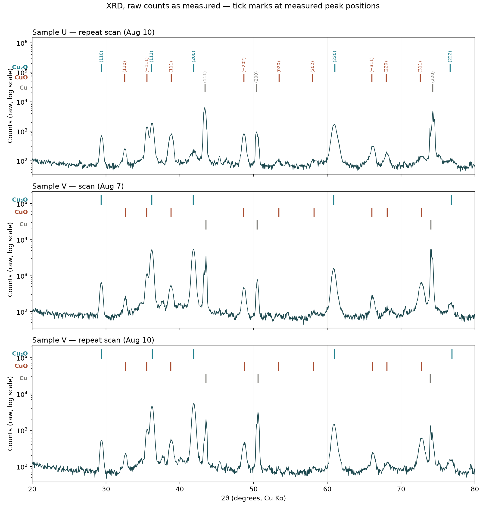

### Raman

| Raman mode (cm⁻¹) | Sample U | Sample V | Literature (cm⁻¹) |
| :--- | :---: | :---: | :---: |
| CuO $A_g$ | 297.6 | 294.7 | 296–298 |
| CuO $B_g^{(1)}$ | 344.0 | 345.1 | 344–346 |
| CuO $B_g^{(2)}$ | 633.6 | 626.9 | 629–636 |
| Cu₂O (strongest, 218) | not detected | not detected | ~218 |

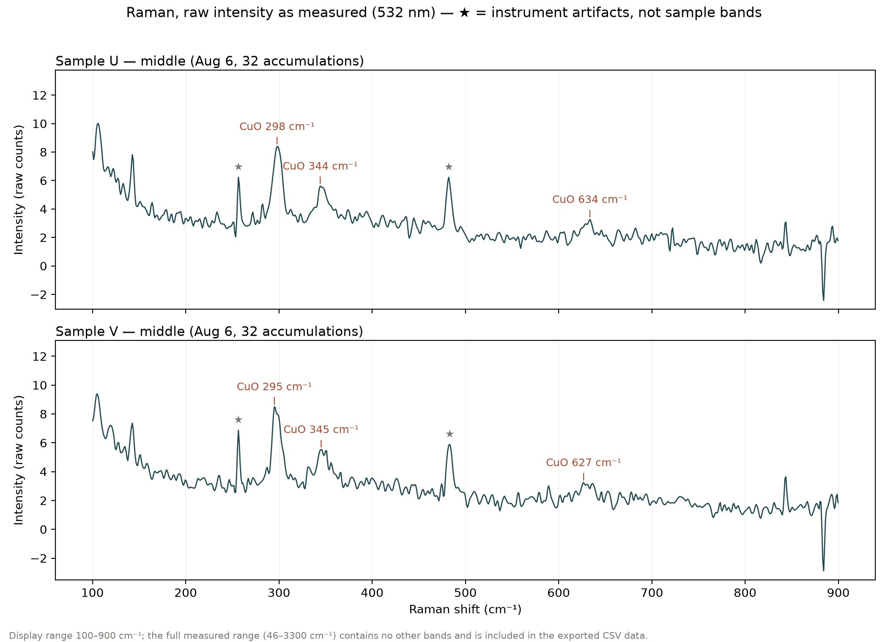

### Timing Diagrams + run logs for samples U and V

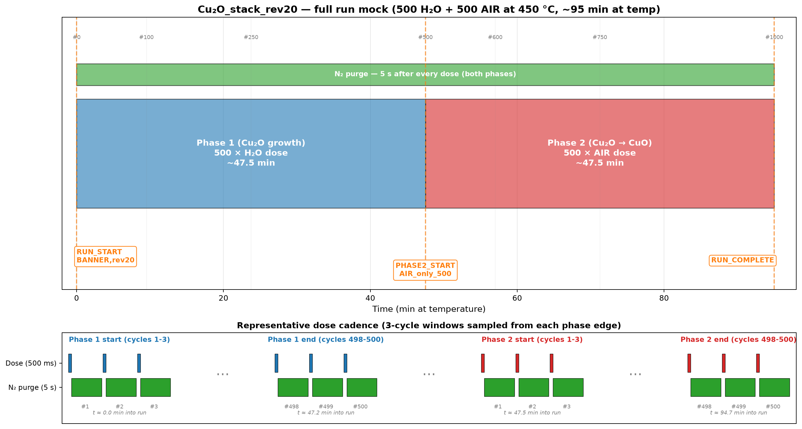

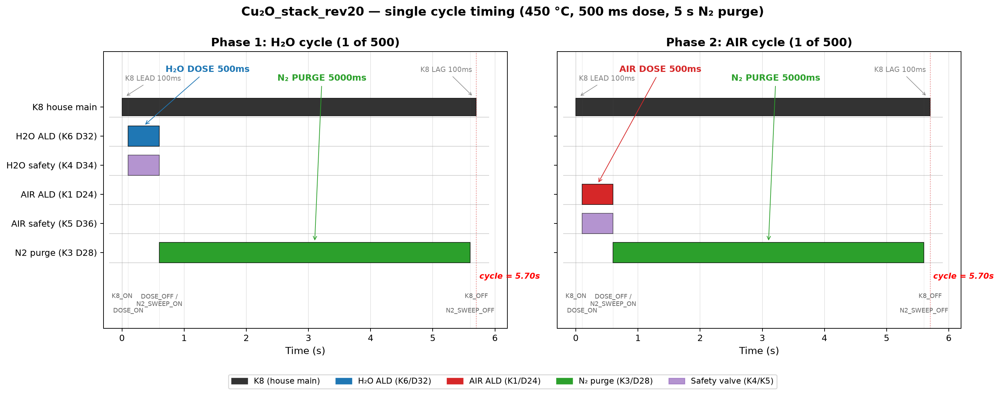

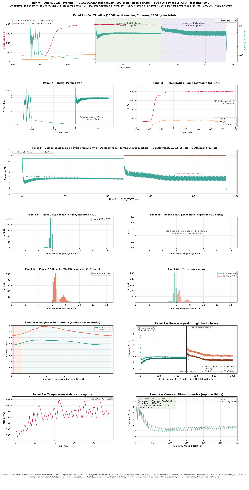

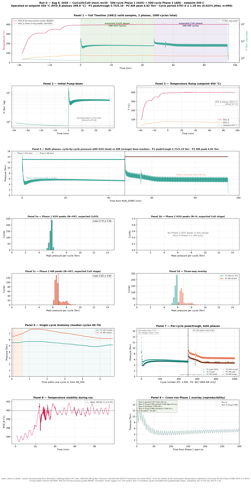
