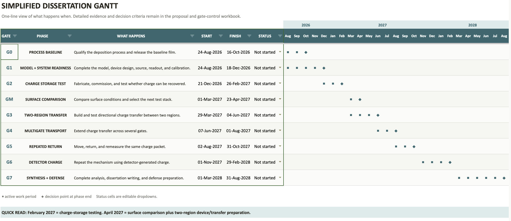
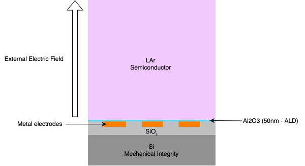
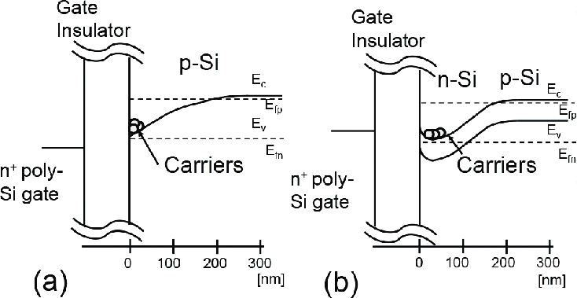
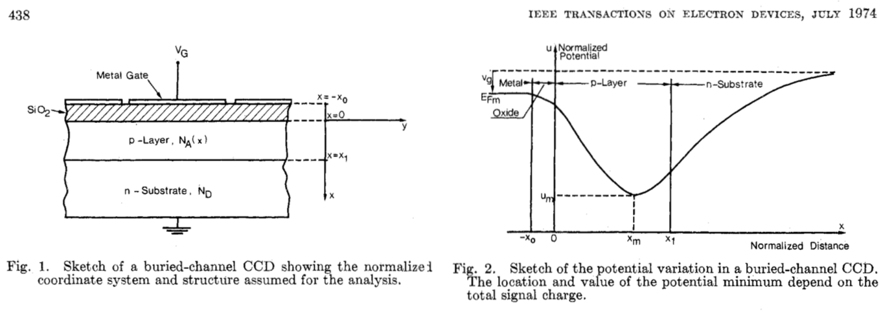
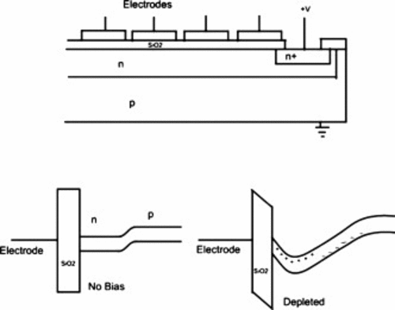

# Comprehensive revisions

## Timeline (v2) 

  Older version:
  
  
  
## LAr dielectric interphase physics 

### BBCD

#### The buried-channel innovation did exactly two things (Walden et al., BSTJ 1972; NASA/Caltech): it moved the potential minimum off the trap-rich boundary into a clean depleted medium, and it kept a hard wall (3.1 eV) between the stored charge and the trap region. 

A true liquid-phase buried channel cannot be produced by buried static gates alone. Something in addition to the gate electrostatics must provide vertical confinement:

| Function in the BCCD               | BCCD implementation                                  | LAr-stack counterpart                                                           | Status                                           |
| ---------------------------------- | ---------------------------------------------------- | ------------------------------------------------------------------------------- | ------------------------------------------------ |
| Carrier-free transport medium      | Depleted n-Si (engineered by reverse bias)           | The liquid itself — LAr has no free carriers at 87 K                            | given by nature                                  |
| Hard wall against the trap region  | 3.1 eV Si/SiO₂ offset                                | Entry barrier ΔE_C at the LAr/oxide surface                                     | must be engineered; current estimate unfavorable |
| Curvature that creates the minimum | Donor space charge (Poisson term)                    | Image attraction + barrier — Laplace forbids a space-charge route in the liquid | the speculative core                             |
| Standoff from interface states     | x_max ≈ 0.5 µm below the interface                   | z₀ ~ 1 nm above the oxide (image-bound state)                                   | speculative; roughness-sensitive                 |
| Signal-dependent well              | Minimum moves toward the interface as the well fills | Stored sheet screens the holding field; well shallows as it fills               | quantitative prediction                          |
| Full-well capacity                 | ~10⁵–10⁶ e⁻                                          | N_max ≈ ε₀εr·E/e ≈ 4×10⁸ cm⁻² → ~2×10⁴ e⁻ per 20×200 µm gate                    | prediction                                       |
| Clocking                           | Gate phases translate the minimum                    | Gate phases translate the surface pocket (your panel c)                         | modeled                                          |

After an ionizing event, LAr produces electrons and Ar ions. Some recombine. The surviving electrons thermalize and enter the quasi-free electron transport state of the liquid. The energy of the quasi-free conduction state of excess electrons in LAr has been experimentally studied; Tauchert and Schmidt reported roughly

V0 ≈−0.21 eV

relative to vacuum near 87.5 K. Modern treatments describe transport as an electron moving through a dense, disordered medium with coherent scattering, polarization screening and liquid-structure effects rather than ordinary Bloch transport in a crystal.

| Interfacial outcome                                                          | Physics                             | CCD value                         |
| ---------------------------------------------------------------------------- | ----------------------------------- | --------------------------------- |
| Electron enters deep Al₂O₃ trap                                              | localized oxide charge              | **bad** — irreversible trapping   |
| Electron remains liquid-side but immobilized by a surface defect             | shallow/localized interfacial state | possibly useful if reversible     |
| Electron occupies a liquid-side bound/quasi-free state with lateral mobility | separated electron channel          | **ideal buried-channel analogue** |

The third case is the one trying to make
∣ψ(z=0)∣ 2
 
or, more classically, the near-surface carrier probability density as small as practical while maintaining strong electrostatic coupling to the gates.
That suppresses interaction with surface traps just as moving the electron packet away from Si/SiO₂ did in the silicon BCCD.

Right now, the ∼0.52 kV/cm external field is doing two things simultaneously:
it transports electrons through the LAr, and then continues pressing them against the Al₂O₃.

Those do not necessarily have to be the same operating condition.
A more sophisticated sequence would be:

generate → drift → capture → reduce pressing field → clock laterally
​	
During bulk transport you want a substantial drift field. After the electron enters a verified interfacial bound state, you may want to reduce the vertical pressing field dramatically so that the wavefunction/carrier distribution moves farther from the oxide and oxide-injection probability falls. That's analogous in spirit to what the buried-channel CCD does continuously: electrostatics should control the packet without unnecessarily forcing it into the defective interface.

Two critical things needed: 
1. a high-quality gate dielectric, and
2. the ideal electron-facing LAr interface.
Those are completely different materials requirements. Al₂O₃ could remain the 50 nm gate insulator, while an ultrathin surface cap could ultimately be selected specifically for large electron entry barrier + low trap density + stable cryogenic termination.
In other words:

metal/Al2O3/electron-blocking surface layer/LAr.

That would be very analogous to semiconductor heterostructure engineering: use one layer for electrostatics and another layer for electronic confinement.

- keep the carrier density out of the defect-rich solid while retaining gate control.
  
- **Can interface electronic structure provide the missing vertical confinement required to form a liquid-side electron channel, spatially separated from an oxide surface, while buried electrodes provide the lateral potential modulation required for CCD-like storage and transfer?**

(buried-channel analogy substantially more rigorous: Poisson equation in the silicon BCCD → Laplace limitation in LAr → microscopic interface barrier as the missing confinement mechanism → liquid-side carrier-density centroid → lateral three-phase clocking.)

In a solid-state BCCD, a static potential maximum is established in the semiconductor bulk by creating a metallurgical p-n junction (e.g., doping the silicon to create a space-charge region). Because LAr cannot be doped with fixed ionic charge to create a static depletion zone, we cannot artificially push the potential minimum away from the interface using bulk dopants.

Because the relative permittivity of the ALD Al2O3 (≈8.0) is higher than that of LAr (ε r ≈1.50), the image charge is attractive. Both the external drift field (ELAr) and the image potential force the quasi-free electrons directly against the LAr/Al2O3 interface (z→0). They are not suspended in the bulk liquid.

Hypothesis 1: Interfacial State and the unique capabilities of upcoming TMA/H2O ALD campaigns. While the electrons are at the surface, the chemical and structural engineering of that surface prevents irreversible trapping.

Electron Arrival & The Conduction Band Barrier: Ionization in the LAr yields quasi-free electrons that thermalize and drift under the applied field (ELAr≈0.520 kV/cm). When they arrive at the 50 nm Al2O3 barrier, they encounter a material with a high bandgap and an electron affinity that likely presents a physical barrier to entry, preventing them from immediately discharging into the metal electrodes.  

Overcoming the Helium Precedent: You must proactively distinguish this from the electrons-on-helium precedent. In helium devices, the image charge is repulsive, keeping electrons hovering in a vacuum. In your LAr system, the electrons are in a dense liquid, driven aggressively into the solid by both applied and image fields. You are testing whether a dense liquid can support lateral mobility immediately adjacent to a solid—a genuine physics gap.  

The Role of the Engineered Surface: Because this is a surface-channel regime, surface states (Dit) will dictate success or failure. Native oxides or trap-rich surfaces will capture the electrons irreversibly. Your defense is that a highly controlled, tightly packed ALD Al2O3 film—potentially modified by specific dehydration, hydroxylation, or passivation steps—can minimize these deep traps.  

Gate-Controlled Transfer: If the ALD surface allows the electrons to enter a "reversibly localized" state (where they stick but can be recovered), the 40 µm-pitch electrodes provide a massive 3.70 eV peak-to-trough lateral energy modulation. This lateral fringing field is more than enough to strip the electrons from shallow interface states and sweep them to the next gate, enabling directional two-region transfer.  

In short, your working mechanism replaces the electrostatic bulk protection of a Buried Channel CCD with the chemical surface protection of a highly engineered ALD interface.

LAr arrives already in the condition the CCD must engineer — permanently depleted, carrier-free, band-like electron transport — but it lacks the donor layer's curvature source. The material boundary may provide vertical residence or reversible localization, while the patterned gates provide lateral addressing and transfer of whatever recoverable population the boundary supports.

Generation and delivery: Ionization produces excess electrons in bulk LAr. These electrons remain quasi-free and undergo field-directed transport through the liquid rather than behaving as semiconductor minority carriers (NIST liquid-argon review).

Interface access: The external normal field brings electrons into the region adjacent to the flat LAr/Al₂O₃ boundary. This field provides drift and establishes the arrival condition. It does not, by itself, provide stable vertical levitation.

The buried-channel analogy is therefore a comparison of required functions. The CCD uses donor space charge to create a true subsurface minimum and spatially suppress trap interaction. The proposed LAr device tests whether interface electronic structure and surface processing can instead create a recoverable residence window in which irreversible capture is slow enough for gate-controlled manipulation. Patterned gates then perform the lateral addressing function shared with CCD and electron-on-helium devices, while the LAr/solid boundary determines whether the required vertical storage function exists.

Liquid Argon: The quasi-free ionization electrons in LAr reside at a conduction band minimum energy (V0≈−0.21 eV) relative to the vacuum level. Aluminum Oxide: ALD Al2O3 is a wide-bandgap insulator (Eg≈8 eV) with a completely different electron affinity.
The Physical Barrier: The conduction band edge of the Al2O3 sits at a much higher energy state than the quasi-free electron energy in the LAr. When an electron hits this interface, it faces a massive potential wall. Because your film is 50 nm thick, it is far too wide for quantum tunneling, and the cryogenic temperature (87 K) eliminates any chance of thermal emission over the barrier. The electron has nowhere to go; it is halted at the surface.

### 12. Liquid-argon/dielectric interface physics and testable model

The central unresolved physics is the fate of an excess electron after bulk transport brings it into the near-interface region of liquid argon adjacent to a dielectric. Established LAr transport measurements constrain drift, diffusion, recombination, and impurity attachment in the bulk [12–25,53], but they do not determine whether an electron approaching a real oxide surface is reflected, reversibly localized, trapped, injected into the solid, collected by a conductor, or returned to the liquid. The interface must therefore be represented by a model that separates established bulk transport from electrostatic inputs, microscopic interface unknowns, state-transition rates, and measured charge observables.

The model used here has four coupled parts:

1. a bulk-LAr delivery model that predicts the charge available at the interface;
2. a multilayer electrostatic model that determines the applied potential and field;
3. an interfacial energy and state-transition model that represents localization, trapping, escape, and collection; and
4. a signal-formation model that relates charge motion and collection to the measured electrode waveform.

The purpose of the model is not to assume that a recoverable state exists. Its purpose is to determine which observations would be consistent with such a state and which measurements are required to distinguish it from direct collection, deep trapping, bulk attachment, dielectric charging, and capacitive feedthrough.

#### 12.1 Bulk delivery and interface boundary conditions

For an injected charge packet $Q_{\mathrm{inj}}$, the charge predicted to reach the interface region is

$$Q_{\mathrm{avail}} = Q_{\mathrm{inj}}\,\eta_{\mathrm{geom}}\,\eta_{\mathrm{coll}}\,\exp\left(-\frac{t_d}{\tau_e}\right)$$

where $t_d$ is the measured drift time, $\tau_e$ is the concurrently measured electron lifetime, and $\eta_{\mathrm{geom}}$ and $\eta_{\mathrm{coll}}$ represent calibrated geometrical and collection efficiencies. This definition separates losses occurring before arrival from the interfacial processes being tested. Consequently, the Stage 1 recovery metric is $Q_{\mathrm{rec}}/Q_{\mathrm{avail}}$, not $Q_{\mathrm{rec}}/Q_{\mathrm{inj}}$.

Within the liquid and dielectric domains, the electrostatic potential satisfies

$$\nabla\cdot\left[\epsilon_0\epsilon_r(\mathbf{r},T)\nabla\phi(\mathbf{r},t)\right] = -\rho(\mathbf{r},t)$$

At the liquid–dielectric boundary, the model permits both an interfacial potential step and a discontinuity in normal electric displacement:

$$\left[\phi\right]_{\mathrm{int}} = \Delta\phi_{\mathrm{dip}}$$

$$\hat{\mathbf{n}}\cdot\left(\mathbf{D}_{\mathrm{ox}} - \mathbf{D}_{\mathrm{LAr}}\right) = \sigma_f(\mathbf{r}) + \sigma_t(\mathbf{r},t)$$

Here, $\Delta\phi_{\mathrm{dip}}$ is an effective surface-dipole contribution, $\sigma_f$ is process-dependent fixed charge, and $\sigma_t$ is dynamically accumulated trapped charge. The distinction is important: fixed charge is an input established by fabrication and surface history, whereas trapped charge evolves during injection and clocking.

In the charge-free planar limit, displacement continuity gives

$$\epsilon_{\mathrm{LAr}}E_{\mathrm{LAr}} = \epsilon_{\mathrm{ox}}E_{\mathrm{ox}}$$

and therefore

$$E_{\mathrm{LAr}} = \frac{V_g - V_t}{H + \left(\epsilon_{\mathrm{LAr}}/\epsilon_{\mathrm{ox}}\right)t_{\mathrm{ox}}}$$

For the baseline planning values $H = 1.00\ \mathrm{mm}$, $t_{\mathrm{ox}} = 50\ \mathrm{nm}$, $V_g = +2\ \mathrm{V}$, $V_t = -50\ \mathrm{V}$, $\epsilon_{\mathrm{LAr}} = 1.505$, and $\epsilon_{\mathrm{ox}} = 8.0$, this benchmark gives $E_{\mathrm{LAr}} \approx 0.520\ \mathrm{kV/cm}$. The calculation is used to verify the finite-element implementation; the released device model will use the measured film thickness and bounded cryogenic dielectric properties [39,44,59,60,62].

#### 12.2 Interfacial electron-energy landscape

The energy of an electron in the near-interface region is represented as

$$U_e(\mathbf{r},t) = -e\phi(\mathbf{r},t) + U_{\mathrm{im}}(z) + U_{\mathrm{sr}}(z) + U_{\mathrm{dip}}(z) + U_{\mathrm{dis}}(\mathbf{r}) + U_{\mathrm{trap}}(\mathbf{r},t)$$

The terms have distinct physical meanings:

- $-e\phi$ is the energy associated with the applied electrostatic potential.
- $U_{\mathrm{im}}$ is the continuum dielectric image interaction.
- $U_{\mathrm{sr}}$ represents short-range repulsion, dielectric entry, and atomic-scale surface structure.
- $U_{\mathrm{dip}}$ represents an effective interfacial dipole or electron-affinity contribution.
- $U_{\mathrm{dis}}$ represents spatial disorder caused by roughness, adsorbates, hydroxylation, defects, and nonuniform surface chemistry.
- $U_{\mathrm{trap}}$ represents discrete or distributed trapping states and their occupation-dependent contribution.

For an electron in LAr at distance $z$ from a planar dielectric,

$$U_{\mathrm{im}}(z) = \frac{e^2}{16\pi\epsilon_0\epsilon_{\mathrm{LAr}}z}\left(\frac{\epsilon_{\mathrm{LAr}} - \epsilon_{\mathrm{ox}}}{\epsilon_{\mathrm{LAr}} + \epsilon_{\mathrm{ox}}}\right)$$

Using the baseline dielectric values gives the continuum estimate

$$U_{\mathrm{im}}(z) \approx -\frac{0.163}{z(\mathrm{nm})}\ \mathrm{eV}$$

This expression is valid only outside a microscopic cutoff region. It cannot be extrapolated to $z = 0$, where a continuum dielectric description no longer represents the atomic surface.

For the baseline field direction, the planar applied-field plus image model can be written as

$$U_e(z) = U_0 + eE_{\mathrm{LAr}}z - \frac{0.163}{z(\mathrm{nm})}\ \mathrm{eV}$$

Its derivative is positive for $z > 0$:

$$\frac{dU_e}{dz} = eE_{\mathrm{LAr}} + \frac{0.163}{z^2} > 0$$

The ideal planar model therefore does not produce a finite-height electrostatic minimum. It predicts decreasing energy as the electron approaches the solid. This result does not rule out a physical interfacial state because the model omits the short-range barrier, surface dipole, electronic states, disorder, adsorbates, and trap spectrum that become important near the real surface. Electron-on-helium and electron-on-neon systems remain useful functional analogies, but their microscopic barriers and bound-state parameters are not transferred to the LAr/oxide interface [3–9,54,55].

The corresponding effective barrier,

$$\Phi_B = U_{\mathrm{solid,accessible}} - U_{\mathrm{LAr,transport}}$$

is therefore treated as an unknown or bounded model parameter rather than as an assumed material constant. It includes the relevant liquid energy reference, dielectric electronic structure, surface dipole, local disorder, and field-induced barrier modification.

#### 12.3 Interfacial states and transition rates

The experiment is interpreted using six operational electron populations:

| State | Symbol | Physical interpretation |
|---|---:|---|
| Bulk transport | $B$ | Electron remains in the LAr drift volume. |
| Interface-access region | $I$ | Electron has entered the field-defined region adjacent to the dielectric. |
| Reversibly localized state | $R$ | Electron remains recoverable or laterally addressable on the experimental timescale. |
| Deep or effectively irreversible trap | $T$ | Electron is captured without commanded recovery within the measurement window. |
| Collected or drained state | $C$ | Electron reaches a calibrated conductor or readout endpoint. |
| Unresolved loss state | $L$ | Electron is not recovered or collected and cannot be assigned uniquely with the available measurements. |

The population vector

$$\mathbf{N} = \begin{bmatrix} N_B & N_I & N_R & N_T & N_C & N_L \end{bmatrix}^{\mathsf{T}}$$

is governed by

$$\frac{d\mathbf{N}}{dt} = \mathbf{K}\left(E, T_e, \Phi_B, \sigma_f, \sigma_t, \mathrm{surface}, t\right)\mathbf{N} + \mathbf{G}(t)$$

where $\mathbf{G}(t)$ describes charge injection and $\mathbf{K}$ contains field-, surface-, and time-dependent transition rates. Relevant transitions include

$$B \rightleftarrows I, \qquad I \rightleftarrows R, \qquad I \rightarrow T, \qquad I \rightarrow C, \qquad R \rightarrow C, \qquad R \rightarrow T$$

together with return to the bulk or unresolved loss where required by the data.

A candidate activated transition rate is

$$k_{i \rightarrow j} = \nu_{ij}\exp\left[-\frac{\Delta U_{ij} - \Delta U_{ij}^{\mathrm{field}}}{k_B T_e}\right]$$

where $\nu_{ij}$ is an attempt rate, $\Delta U_{ij}$ is an effective barrier, $\Delta U_{ij}^{\mathrm{field}}$ is the field-dependent barrier modification, and $T_e$ is an effective electron temperature. $T_e$ is not assumed to equal the 87-K bath temperature; it must be calculated, bounded, or inferred under the applicable field conditions.

This rate model is intentionally phenomenological. The data may support a single dominant release rate, a distribution of trap depths, dispersive relaxation, or a combination of reversible and irreversible populations. The microscopic interpretation will be selected only after field, hold-time, temperature, surface, and waveform scans distinguish among those possibilities.

#### 12.4 Lateral transport and gate modulation

For a periodic boundary potential with pitch $p$, the lowest spatial Fourier component in the liquid has the form

$$\phi(x,z) = \bar{\phi} - E_{\mathrm{LAr}}z + \widetilde{V}_0 e^{-2\pi z/p}\cos\left(\frac{2\pi x}{p}\right)$$

The lateral modulation therefore decreases with height as

$$A(z) = e^{-2\pi z/p}$$

This relationship provides an analytical check on the finite-element solution and shows why the physical location of the electron population is a critical unknown. A large calculated modulation at an assumed height does not establish that electrons actually occupy that plane, remain mobile there, or cross a gate boundary with high efficiency.

If the near-interface population behaves as a mobile continuum, its number flux may be modeled as

$$\boldsymbol{\Gamma} = -\mu_{\parallel}n\frac{\nabla_{\parallel}U_e}{e} - D_{\parallel}\nabla_{\parallel}n$$

$$\frac{\partial n}{\partial t} = -\nabla_{\parallel}\cdot\boldsymbol{\Gamma} - k_{\mathrm{loss}}n + S$$

Here, $\mu_{\parallel}$ and $D_{\parallel}$ are effective lateral mobility and diffusion coefficients. If transport instead occurs by hopping between localized sites, the relevant description is a network of field-dependent transition rates $k_{i \rightarrow j}$. Clock-amplitude, dwell-time, temperature, pitch, and transfer-distance scans will distinguish continuous drift–diffusion from activated or dispersive hopping.

#### 12.5 Fixed charge and dynamic dielectric charging

For a film with oxide capacitance per area

$$\frac{C_{\mathrm{ox}}}{A} = \frac{\epsilon_0\epsilon_{\mathrm{ox}}}{t_{\mathrm{ox}}}$$

an effective fixed sheet density $N_f$ produces the approximate voltage shift

$$\left|\Delta V_s\right| \simeq \frac{e|N_f|}{C_{\mathrm{ox}}/A}$$

For $t_{\mathrm{ox}} = 50\ \mathrm{nm}$ and $\epsilon_{\mathrm{ox}} = 8$,

$$\frac{C_{\mathrm{ox}}}{A} = 1.4166 \times 10^{-3}\ \mathrm{F/m^2}$$

so an allocated local potential uncertainty of $0.10\ \mathrm{V}$ corresponds to

$$\delta N_f < \frac{(0.10)(1.4166 \times 10^{-3})}{1.602 \times 10^{-19}} = 8.84 \times 10^{10}\ \mathrm{cm^{-2}}$$

The $8.8 \times 10^{10}\ \mathrm{cm^{-2}}$ value is an engineering sensitivity target, not a universal material acceptance threshold. A nearly uniform fixed-charge offset may be partly compensated by gate-bias adjustment. Spatial variation on the scale of the gate pitch is more consequential because it can distort barrier heights, displace potential wells, or create unintended local minima. The model will therefore propagate measured or bounded mean charge, hysteresis, and spatial-variation scenarios through the finite-geometry solution [41,42,45,46,50].

Dynamic charging is represented separately by $\sigma_t(\mathbf{r},t)$. Bias-history scans, repeated injection, dark relaxation, and clock-only sequences will test whether the potential landscape changes during operation.

#### 12.6 Signal formation and charge accounting

The real electrostatic field determines electron motion, whereas the weighting field determines the signal induced on a selected electrode. For sensing electrode $k$,

$$\mathbf{E}_{w,k} = -\nabla\phi_{w,k}$$

where $\phi_{w,k}$ is obtained by setting electrode $k$ to unit potential, grounding the other conductors, and omitting the moving charge. The induced current is

$$i_k = q\mathbf{v}\cdot\mathbf{E}_{w,k}$$

and the induced charge for motion from $\mathbf{r}_i$ to $\mathbf{r}_f$ is

$$\Delta Q_k = -q\left[\phi_{w,k}(\mathbf{r}_f) - \phi_{w,k}(\mathbf{r}_i)\right]$$

under the stated sign convention [31–33].

A waveform on the sensing electrode therefore does not by itself prove collection or transfer. It may result from motion within the weighting field, direct clock feedthrough, dielectric polarization, or actual endpoint collection. The interpretation requires calibrated weighting-potential maps, no-injection clock templates, drain controls, sequence reversal, and charge closure.

For Stage 1, the accounting convention is

$$Q_{\mathrm{loss}} = Q_{\mathrm{avail}} - Q_{\mathrm{prompt}} - Q_{\mathrm{drain}} - Q_{\mathrm{rec}}$$

The prompt, drain, and recovery terms must be obtained from mutually exclusive programmed sequences or corrected so that the same physical charge is not counted twice. For transfer from region A to region B,

$$T_{A \rightarrow B} = \frac{Q_{B,\mathrm{net}}}{Q_{A,\mathrm{available}}}$$

where $Q_{B,\mathrm{net}}$ is the calibrated, template-subtracted destination signal and $Q_{A,\mathrm{available}}$ is the charge demonstrated to be available in the origin immediately before clocking.

#### 12.7 Unknowns and discriminating measurements

The model separates inputs that can be measured before cryogenic operation from quantities that must be inferred from interface experiments.

| Parameter or mechanism | Present status | Required measurement or constraint |
|---|---|---|
| Film thickness and roughness | Measurable | Independent thickness map and surface metrology |
| Cryogenic dielectric response | Bounded or measured | Cryogenic capacitance or justified sensitivity range |
| Mean fixed charge and hysteresis | Process-monitor proxy | MOS-capacitor or equivalent electrical characterization |
| Local fixed-charge variation | Unknown | Bounded spatial scenarios propagated through FEM |
| Effective interface barrier $\Phi_B$ | Unknown | Field-, polarity-, and temperature-dependent arrival/recovery scans |
| Reversible localization rate | Unknown | Hold-time and commanded-release measurements |
| Deep-trap spectrum | Unknown | Long-time relaxation, hysteresis, and thermal/field release scans |
| Lateral mobility or hopping rate | Unknown | Clock-amplitude, dwell-time, distance, pitch, and temperature scans |
| Dynamic dielectric charging | Unknown | Repeated-injection and bias-history sequences |
| Bulk survival and delivery | Measured concurrently | Lifetime, drift-time, reference collection, and delivery calibration |
| Weighting response and feedthrough | Calculated and measured | Weighting FEM, electrical injection, and no-injection clock templates |
| Microscopic identity of a state | Initially unknown | Joint comparison of field, time, temperature, surface, and transport signatures |

The principal discriminating observations are:

1. **Field and polarity dependence:** tests whether arrival and recovery follow the predicted interface barrier rather than an optical or electrical artifact.
2. **Hold-time dependence:** distinguishes prompt collection, reversible localization, distributed trapping, and effectively irreversible loss.
3. **Surface and process dependence:** tests whether changes in chemistry, roughness, fixed charge, or trap population produce reproducible changes.
4. **Bias-history and repeated-injection dependence:** identifies polarization or dynamic dielectric charging.
5. **Drain and sequence-reversal controls:** test charge provenance and directional response.
6. **Pitch, distance, and clock-time scaling:** distinguish mobile drift–diffusion from localized hopping.
7. **Concurrent lifetime and reference measurements:** prevent bulk attachment or source drift from being interpreted as interface physics.
8. **Weighting-potential and feedthrough tests:** distinguish induced motion signals from endpoint collection.

#### 12.8 Model boundary and scientific interpretation

Before interface data are acquired, the model can establish the applied field, finite-geometry potential landscape, capacitances, weighting potentials, corner-field margins, expected sensitivity to measured film properties, and the observations required to identify candidate transition rates. It cannot establish that a mobile layer, finite-height bound state, recoverable trapped population, or directional transfer mechanism exists.

A positive interface result will require calibrated recovery, charge closure, predicted control behavior, reproducibility across samples and fills, and parameter dependence consistent with the model. A negative result will remain scientifically interpretable if the bulk charge delivery, electronics sensitivity, surface condition, and artifact controls are complete. The resulting measurements will determine whether the tested LAr/dielectric interface supports recoverable charge, what rates and loss channels govern that charge, and whether the measured state can be manipulated laterally by patterned electrodes.
