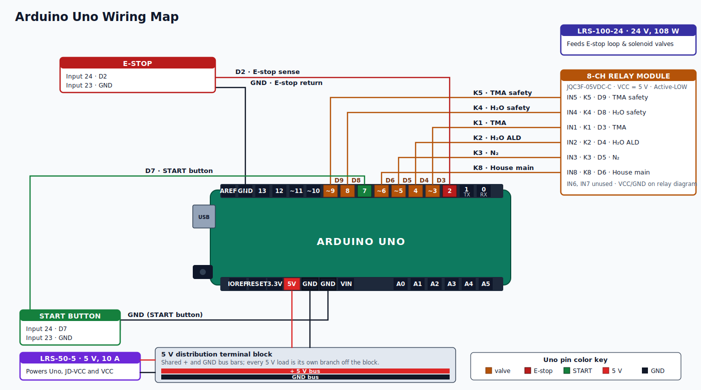

# Cu/Cu2O/CuO phase selectivity trial 

## 7/10/26
## Firmware changes

**Replace:**
```
IGC100 log-P convention (verify at MENU -> Setup -> Analog Output -> Ch1):
  +10V = 1e0  Torr    (top of scale)
   0V  = 1e-10 Torr   (bottom of scale)
  V_igc -> P = 10^(V_igc - 10) Torr
```

**with:**
```
IGC100 AN1 configured as DAC output, source = PG2 (Pirani/Convectron).
Per SRS IGC100 manual p. 2-24:
  P (Torr) = 10^(V - 5)   for 1e-4 Torr <= P <= 1e+4 Torr
  0 V = gauge off, 12 V = gauge fault
Per SRS manual p. 2-7: AN1-4 DAC hardware update rate = 2 Hz.
Migration improved pressure sample rate from ~1 Hz (GDAT? polling) to
2 Hz (IGC100 DAC ceiling). Does NOT eliminate staircase entirely.
True continuous pressure requires a capacitance manometer (MKS Baratron).
```

**Also replace:**
```
Firmware conversion: V_shield = (ADC×10/65535) − 5 → V_igc = V_shield / 0.3197 → P_torr = 10^(V_igc − 10)
````

**with:**
```
Firmware conversion: V_shield = (ADC×10/65535) − 5 → V_igc = V_shield / 0.3197 → P_torr = 10^(V_igc − 5)
```


## 7/9/26
## Hardware changes 
Arduino Mega 2560 R3 + Digilent Analog Shield (16-bit ADS8343 ADC, wespo/analogShield library), IGC100 rear BNC #1 → 10 kΩ/4.7 kΩ divider → shield A0. (Arduino Uno, IGC100 via RS-232 GDAT? polling at 20 Hz)
  - Eliminate the pressure staircase artifact in GDAT?-polled IGC100 data by moving pressure acquisition from serial-polled software readout to hardware-synchronous ADC readout on the same microcontroller running the valve state machine.
  - The IGC100's digital GDAT? interface refreshes at 0.67–1.0 Hz internally, independent of the polling rate (SRS IGC100 manual, "Data Commands"). The dual logger polled at 20 Hz. Consecutive samples returned identical values until the instrument's internal refresh advanced, producing visible flat-then-jump quantization in P(t) — the staircase. This is a display-rate quantization, not an ADC quantization, and cannot be removed by faster serial polling (Granville-Phillips 375 Convectron App Note on log-linear analog outputs — same behavior in the SRS analog-output family: the analog rear-panel BNC is refreshed at the ADC's native rate, not the display rate).
The fix is well-known in the vacuum/ALD instrumentation community: acquire pressure via the ion gauge's rear-panel analog output (0–10 V log-P, 1 V/decade) instead of the digital display command (SRS IGC100 rear panel, "Analog I/O"; Aisenberg & Chabot 1971, J. Appl. Phys. — foundational analog log-P readout method). This gives continuous voltage at the sensor's true response rate (>>1 kHz for ion gauge electrometer). 

| Function                    | Uno pin (old) | Mega pin (new)                   |
| --------------------------- | ------------- | -------------------------------- |
| E-STOP sense                | D2            | D48                              |
| START button                | D7            | D46                              |
| K1 = AIR ALD (was TMA line) | D3            | D24                              |
| K2 = H2O ALD3               | D4            | D26                              |
| K3 = N2 purge               | D5            | D28                              |
| K8 = House main             | D6            | D30                              |
| K4 = H2O Schlenk safety     | D8            | D34                              |
| K5 = AIR pilot safety       | D9            | D36                              |
| Pressure sense (NEW)        | —             | Shield A0 (via 10kohm/4.7kohm divider) and GND (x2) on ADC block (via 4.7kohm/braid divider) - cable connects back to analog i/o #1 on the IGC100SRS |

- Reserved on Mega, do not use for user I/O: D50–D53 (hardware SPI, driven by Analog Shield via ICSP header).
- Analog Shield configuration
    - I/O Voltage Select jumper: IOREF (= 5V on Mega Rev 3)
    - Divider ratio: 4.7 / (10 + 4.7) = 0.3197
    - Firmware conversion: V_shield = (ADC×10/65535) − 5 → V_igc = V_shield / 0.3197 → P_torr = 10^(V_igc − 10) (IGC100 convention: 1 V/decade, −10 V ≡ 1×10⁻¹⁰ Torr)

### Shield configuration
- I/O Voltage Select jumper: IOREF (= 5 V on Mega Rev 3).
- ADC used: A0 on the shield silkscreen (routes internally to ADS8343 CH0 via the LM837/OPA4322 buffer with SDM40E20LS input clamping diodes).
- SPI: driven via the ICSP header (MISO/MOSI/SCK). This mirrors Mega D50/D51/D52 electrically, and the hardware SS is D53. Do not repurpose D50–D53 for user I/O.

### Voltage divider — 10 kΩ / 4.7 kΩ
- IGC100 rear-panel analog output is 0 to 10 V. Analog Shield input is ±5 V. Passive divider scales the range.

IGC BNC center ──┬── 10 kΩ ──┬── (junction → Shield A0)
                             │
                            4.7 kΩ
                             │
IGC BNC shield ──── GND ─────┴── (→ Shield AGND, outer row of ADC header)

### IGC100 rear panel setup
- Configure BNC #1 (ANALOG I/O) for log-pressure output, 1 V/decade, -10 V = 1E-10 Torr convention. Verify with DMM before wiring permanently: at 1E-4 Torr you should read ~6.0 V at the BNC center.

### Firmware conversion
```
const float DIVIDER_RATIO = 0.3197f;
const float ADC_VREF_SPAN = 10.0f;   // ±5 V = 10 V span
const uint8_t IGC_CHANNEL = 0;       // Shield A0

float readPressureTorr() {
  unsigned int adc = analog.read(IGC_CHANNEL);
  float v_shield = (adc * ADC_VREF_SPAN / 65535.0f) - 5.0f;
  float v_igc    = v_shield / DIVIDER_RATIO;
  return powf(10.0f, v_igc - 10.0f);
}

```
**Requires #include <SPI.h> before #include <analogShield.h>.**

### Grounding
- Single-point tie from Mega GND to Shield AGND on the ADC header. Verify with DMM (< 1 Ω): IGC chassis → BNC shell → coax braid → divider GND → Shield AGND → Mega GND → LRS-5-5 GND.

### Library
- Firmware uses wespo/analogShield (not Digilent — Digilent's docs redirect to Wespo's fork). Install into the PlatformIO project's lib/analogShield/ directory:

```
curl -L -o /tmp/analogShield.zip \
  https://github.com/wespo/analogShield/archive/refs/heads/master.zip
unzip -o /tmp/analogShield.zip -d lib/
mv lib/analogShield-master lib/analogShield
```
### platformio.ini
```
[env:megaatmega2560]
platform = atmelavr
board = megaatmega2560
framework = arduino
monitor_speed = 115200
upload_port = /dev/cu.usbmodem11101
monitor_port = /dev/cu.usbmodem11101
```
---

- bash: (for future upload commands (cd into the project)):
```
cd ~/Documents/PlatformIO/Projects/Cu_Cu2O_CuO_phase_selectivity/
```

**Project in platformio renamed to Cu_Cu2O_CuO_phase_selectivity**

**Line 126 in code = StackRecipe R - for making quick changes to # of cycles, dwell, purge, evac, and pulse.** 

```
//                    ---- PHASE 1: Cu2O (H2O) ----   ---- PHASE 2: CuO (AIR) ----
//                    pulse dwell purge evac  cyc      pulse dwell purge evac  cyc
StackRecipe R = {       500, 3000, 5000, 3000, 400,      500, 3000, 5000, 3000, 400 };
//  Per cycle: ~11.7 s.   800 cycles = ~156 min total.
```


## 7/8/26
## New wiring


## Procedure 
Authoring in the .ino file on Desktop, then cp it into src/main.cpp before each upload.

### Terminal 1 — dual logger (start FIRST, pump-down takes time)
- bash
```
cd ~/Desktop/Cu2O && python3 dual_logger_v5_ald.py \
  --ls-port /dev/cu.usbserial-AX59M1OT \
  --igc-port /dev/cu.usbserial-FTG4OTA2 \
  --setpoint 250 --interval 0.05 \
  --output Cu2O_CuO_stack_$(date +%Y%m%d_%H%M%S)
```

**You should see the boot banner:**

```
text
========================================================================
  High-Speed ALD Pulse Logger  —  v5.0 (Stable 5 Hz)
========================================================================
Starting Background RTD Thread...
Benchmarking IGC100 optimized read speed...
  Pressure read: ~33 ms
  Max theoretical pressure rate: ~30 Hz
  Baseline — A: <ambient>   B: <ambient>   P: ~7e+02 Torr
```

### Terminal 2 — upload firmware to Uno (in one separate terminal)

- bash
```
cd ~/Documents/PlatformIO/Projects/Cu_Cu2O_CuO_phase_selectivity/ && \
cp ~/Desktop/Cu2O/Cu2O_CuO_stack_selective_phase.ino src/main.cpp && \
~/.platformio/penv/bin/pio run -t upload --upload-port /dev/cu.usbmodem11101
```

**You'll see PlatformIO compile, then upload. Successful output ends with something like [SUCCESS] Took X seconds.**

- bash
```
~/.platformio/penv/bin/pio device monitor -p /dev/cu.usbmodem11101 -b 115200 \
  | tee ~/Desktop/Cu2O/arduino_Cu2O_CuO_stack_$(date +%Y%m%d_%H%M%S).log
```

**When it connects, you should see the boot banner (this replaces the Run J banner):** 

```
text
=== Cu/Cu2O/CuO STACK -- READY ===
Phase1 = Cu2O (H2O, D4+D8, Run J timing). Phase2 = CuO (AIR, D3+D9).
Dwell != Evac (same valves, different gas composition, both kept).
D8 water safety CLOSED during dwell/purge/evac AND all of Phase2.
NO TMA. D3/D9 carry AIR. Dynamic mode (no pump isolation).
--- COMMANDS (all valve toggles IDLE-only, safety-checked) ---
  RUN CONTROL:
    s = START stack run   e = E-STOP   r = RESET -> IDLE
  MANUAL VALVE TOGGLES (K8 auto-managed for D3/D4/D8/D9):
    3/# = D3 (AIR ALD)     ON/OFF
    4/$ = D4 (H2O ALD3)    ON/OFF
    5/% = D5 (N2 purge)    ON/OFF
    6/^ = D6 (K8 house)    ON/OFF
    8/* = D8 (H2O Schlenk) ON/OFF
    9/( = D9 (AIR safety)  ON/OFF
  PAIRED TOGGLES:
    a/A = AIR pair D3+D9   ON/OFF
    w/W = H2O pair D4+D8   ON/OFF
    n/o = N2 sweep (D5 + K8) ON/OFF  [legacy Run J behavior]
  SAFETY:
    x = PANIC ALL OFF (safeAll)
    ? = reprint this menu
  INTERLOCKS: p0/p1 = PRESSURE_OK,  t0/t1 = TEMP_OK
--------------------------------------------------------------
```

**append a datestamp to the .ino filename each session (Cu2O_CuO_stack_selective_phase_20260709.ino) and never overwrite old ones.**

## Code full cycle (most recent is in platformio/visual studio code)

```
#include <Arduino.h>

/* === Cu / Cu2O / CuO SELECTIVE-PHASE STACK — AIR OXIDANT =====================
   BASED ON: Cu2O_runJ_250C_doubledose_evac.ino (same hardware, pin map,
             active-LOW relay logic, D8-mirrors-D4 safety, command set,
             E-stop/debounce). Restructured into a TWO-PHASE STACK for
             Gumaro's selective-phase-growth objective.

   OBJECTIVE:
     Prove SELECTIVE PHASE GROWTH as a staged stack:
       PHASE 1: grow Cu2O on Cu   via H2O pulsing (proven Run J/K chemistry).
       PHASE 2: grow CuO  on the PRE-GROWN Cu2O via AIR/O2 oxidation.
     Discrete Cu2O layer, THEN discrete CuO layer -- NOT interleaved. Cu2O and
     CuO occupy different pO2 regimes (Cu2O forms at moderate O2; Cu2O->CuO
     conversion needs pO2 ~1 Torr, DOE Cu(100) surface study OSTI 1489350).

   *** THERE IS NO TMA. NONE WILL BE INTRODUCED. ***********************
   The line historically called the "TMA line" carries AIR in this experiment.
   D3 is the AIR DOSE valve; D9 is the AIR-LINE SAFETY valve. The "TMA" naming
   is retained ONLY as a hardware reference to that line's eventual purpose.

   *** DWELL vs EVAC -- IMPORTANT DISTINCTION (professor's question) *****
   Both dwell and evac hold all valves OFF with pump running. Same valve states,
   same pump action -- BUT the GAS COMPOSITION inside the chamber is different,
   because of WHAT WAS INJECTED IMMEDIATELY BEFORE each period:

     - DWELL (3s, post-H2O-pulse): chamber contains freshly injected H2O vapor
       reacting with the Cu surface. Pump removes water SLOWLY (viscous flow +
       adsorption/desorption), extending effective residence time vs. immediate
       purge. This is the reaction-time window. Functions as a WEAK, imperfect
       exposure step (proper static exposure would require a pump-isolation
       stop valve, which this system does NOT yet have).

     - EVAC (3s, post-N2-purge): chamber contains residual N2 + reaction
       byproducts. Pump removes these to restore a clean LOW-PRESSURE FLOOR
       before the next H2O dose lands. This is a measurement/reproducibility
       function -- Run I (evac REMOVED) drifted +1.34 Torr upward across the run
       and per-pulse rise anti-correlated with the rising floor (r = -0.90 in
       raw-CSV analysis). Restoring evac in Run J fixed this.

     Empirical evidence: prior run with dwell shortened/removed produced WORSE
     film quality. Trust the data. KEEP BOTH periods.

     Future upgrade: adding a pump-isolation (stop) valve in the foreline would
     convert dwell into a TRUE static soak, disambiguating this permanently.

   *** DYNAMIC MODE (no pump isolation) ***********************************
   The current foreline (chamber -> quartz QC -> 4" bellows -> conical reducer
   -> foreline trap -> ~36" bellows hose -> pump) has NO isolation valve. Pump
   pulls continuously. In dynamic mode AIR is a WEAK oxidant, so CuO-growth
   knobs are AIR PULSE WIDTH and NUMBER OF AIR CYCLES.

   *** LITERATURE-INFORMED CYCLE COUNTS *********************************
   CuO ALD growth rates from literature (validation baselines):
     - H2O oxidant:   0.045-0.12 Angstrom/cycle (AIP JVA 2020; Wiley CVD 2012)
     - Ozone oxidant: 0.19-0.40 Angstrom/cycle  (4x faster than H2O)
     - Air/O2 alone:  weaker still than water   (USPTO copper oxide ALD)
   So air-based Phase 2 is INTENTIONALLY conservative. Phase 2 first run is a
   first-look for ANY CuO signal, not a thickness target. Scale later if Raman
   shows no CuO.

   *** D8 (SS-3J-24VDC SCHLENK WATER SAFETY) ****************************
   D8 mirrors D4 (H2O ALD3) ONLY during the H2O pulse in Phase 1. During DWELL,
   PURGE, EVAC, and THE ENTIRE AIR PHASE, D8 is CLOSED (NC, de-energized).
   Air/O2 can NEVER migrate back into the H2O reservoir.

   *** D3 + D9 AIR PAIR **************************************************
   Air line mirrors water line's safety architecture. D3 (air dose) and D9
   (air-line safety) open together and close together, exactly as D4/D8 do.
   Both driven OFF at boot / IDLE / E-stop / between cycles / run end.

   PIN MAP + RELAY CHANNEL MAP (Hong-Wei 8-ch JQC3F-05VDC-C, active-LOW):
     Arduino D2 -> E-STOP sense       (INPUT_PULLUP; NO -> GND, active LOW)
     Arduino D3 -> IN1 / K1 = AIR ALD valve   (aka "TMA ALD3", carrying AIR)
     Arduino D4 -> IN2 / K2 = H2O ALD3 valve  (6LVV-ALD3MR4-P-CV)
     Arduino D5 -> IN3 / K3 = N2 PURGE valve
     Arduino D6 -> IN8 / K8 = K8 house main
     Arduino D7 -> START button       (INPUT_PULLUP; NO -> GND)
     Arduino D8 -> IN4 / K4 = H2O SCHLENK safety (SS-3J-24VDC)
     Arduino D9 -> IN5 / K5 = TMA (AIR) SAFETY valve (NVZ110-piloted 6LVV-DPFR4)

   Active-LOW relays: LOW=ON, HIGH=OFF.
   Default at boot / IDLE / E-stop / between cycles / run end:
     D3, D4, D5, D8, D9 = HIGH (closed);  D6 = HIGH (K8 OFF).  Fail-safe.
============================================================================= */

#define VALVE_AIR_DOSE    3   // K1 -- "TMA line" carrying AIR
#define VALVE_H2O_ALD     4   // K2
#define VALVE_N2_PURGE    5   // K3
#define PIN_HOUSE_MAIN    6   // K8
#define PIN_START_BTN     7
#define PIN_ESTOP_SENSE   2
#define VALVE_H2O_SCHLENK 8   // K4 -- SS-3J-24VDC water safety
#define VALVE_AIR_SAFETY  9   // K5 -- NVZ110 pilot -> 6LVV-DPFR4 air-line safety

inline void relayOn (uint8_t p){ digitalWrite(p, LOW);  }
inline void relayOff(uint8_t p){ digitalWrite(p, HIGH); }

// Paired helpers -- both halves fire and clear together, always.
inline void h2oPairOn (){ relayOn (VALVE_H2O_ALD); relayOn (VALVE_H2O_SCHLENK); }
inline void h2oPairOff(){ relayOff(VALVE_H2O_ALD); relayOff(VALVE_H2O_SCHLENK); }
inline void airPairOn (){ relayOn (VALVE_AIR_DOSE); relayOn (VALVE_AIR_SAFETY); }
inline void airPairOff(){ relayOff(VALVE_AIR_DOSE); relayOff(VALVE_AIR_SAFETY); }

// ---- Recipe ---------------------------------------------------------------
// Phase 1 (Cu2O): Run J timing verbatim (500 ms H2O / 3s dwell / 5s purge /
//                 3s evac). 200 cycles = ~39 min. Directly comparable to Run J/K.
// Phase 2 (CuO):  Same structure with AIR (D3+D9). D8 forced CLOSED throughout.
//                 200 cycles as first-look for CuO (see literature note above).
typedef struct {
  uint32_t h2o_pulse_ms;
  uint32_t h2o_dwell_ms;
  uint32_t h2o_purge_ms;
  uint32_t h2o_evac_ms;
  uint16_t cu2o_cycles;

  uint32_t air_pulse_ms;
  uint32_t air_dwell_ms;
  uint32_t air_purge_ms;
  uint32_t air_evac_ms;
  uint16_t cuo_cycles;
} StackRecipe;

//                    ---- PHASE 1: Cu2O (H2O) ----   ---- PHASE 2: CuO (AIR) ----
//                    pulse dwell purge evac  cyc      pulse dwell purge evac  cyc
StackRecipe R = {       500, 3000, 5000, 3000, 200,      500, 3000, 5000, 3000, 200 };
//  Per cycle: ~11.7 s.   200 + 200 = 400 cycles = ~78 min total.

const uint16_t main_lead_ms = 100;
const uint16_t main_lag_ms  = 100;

// ---- Debounce -------------------------------------------------------------
struct Debounced { uint8_t pin; bool last, stable; unsigned long t; };
const unsigned long DEBOUNCE_MS = 20;
Debounced startBtn{PIN_START_BTN, HIGH, HIGH, 0};
bool updateDebounce(Debounced &b){
  bool r = digitalRead(b.pin);
  if (r != b.last){ b.last = r; b.t = millis(); }
  if ((millis() - b.t) > DEBOUNCE_MS && r != b.stable){ b.stable = r; return true; }
  return false;
}

// ---- Group OFF helpers ----------------------------------------------------
inline void allValvesOff(){
  airPairOff();                // D3 + D9 OFF (air line safe)
  h2oPairOff();                // D4 + D8 OFF (water line safe)
  relayOff(VALVE_N2_PURGE);    // D5 OFF
}
inline void safeAll(){ allValvesOff(); relayOff(PIN_HOUSE_MAIN); }

bool pressure_ok = true, temp_ok = true;

// ---- Phase / state machine ------------------------------------------------
enum Phase_t { PH_CU2O, PH_CUO };
Phase_t phase = PH_CU2O;

enum S_t { IDLE, MAIN_LEAD,
           PULSE_ON, PULSE_OFF_DWELL,
           PURGE_ON, PURGE_OFF_EVAC,
           MAIN_LAG, DONE,
           ESTOPPED, WAIT_RESET };
S_t S = IDLE;

unsigned long t0 = 0, runStartMs = 0;
uint16_t cyclesLeft = 0;
uint16_t cycleNum   = 0;
bool estopPrev = HIGH;
bool manualN2 = false;

// Active-phase timing accessors
inline uint32_t curPulse(){ return phase==PH_CU2O ? R.h2o_pulse_ms : R.air_pulse_ms; }
inline uint32_t curDwell(){ return phase==PH_CU2O ? R.h2o_dwell_ms : R.air_dwell_ms; }
inline uint32_t curPurge(){ return phase==PH_CU2O ? R.h2o_purge_ms : R.air_purge_ms; }
inline uint32_t curEvac (){ return phase==PH_CU2O ? R.h2o_evac_ms  : R.air_evac_ms;  }

void logEvent(const __FlashStringHelper* msg){
  unsigned long now = millis();
  Serial.print(F("t=")); Serial.print(now - runStartMs);
  Serial.print(F("ms ph=")); Serial.print(phase==PH_CU2O ? F("Cu2O") : F("CuO"));
  Serial.print(F(" cyc=")); Serial.print(cycleNum);
  Serial.print(F(" : ")); Serial.println(msg);
}

void handleEstop(){
  safeAll(); manualN2 = false; S = ESTOPPED; cyclesLeft = 0;
  Serial.println(F("*** E-STOP *** All outputs safe (D3/D4/D5/D8/D9 CLOSED, K8 OFF)."));
}

void startPhase(Phase_t p){
  phase = p;
  cycleNum = 1;
  if (p == PH_CU2O){
    cyclesLeft = R.cu2o_cycles;
    Serial.print(F("=== PHASE 1: Cu2O on Cu (H2O pulsing), cycles=")); Serial.println(R.cu2o_cycles);
  } else {
    cyclesLeft = R.cuo_cycles;
    Serial.print(F("=== PHASE 2: CuO on Cu2O (AIR pulsing), cycles=")); Serial.println(R.cuo_cycles);
    Serial.println(F("AIR phase: D3+D9 paired. D8 water safety CLOSED throughout."));
  }
  if (cyclesLeft == 0){
    Serial.println(F("(phase cycle count = 0 -> phase skipped)"));
    S = DONE;
  } else {
    S = MAIN_LEAD;
  }
}

void handleStartRun(){
  manualN2 = false;
  runStartMs = millis(); t0 = runStartMs;
  Serial.println(F("=== Cu/Cu2O/CuO SELECTIVE-PHASE STACK RUN ==="));
  Serial.print(F("Phase1 Cu2O cycles: ")); Serial.println(R.cu2o_cycles);
  Serial.print(F("Phase2 CuO  cycles: ")); Serial.println(R.cuo_cycles);
  Serial.println(F("NO TMA. D3/D9 = AIR line. Dynamic mode (no pump isolation)."));
  startPhase(PH_CU2O);
  logEvent(F("K8 lead begin"));
}

// ---- Print manual command menu -------------------------------------------
void printMenu(){
  Serial.println(F("--- COMMANDS (all valve toggles IDLE-only, safety-checked) ---"));
  Serial.println(F("  RUN CONTROL:"));
  Serial.println(F("    s = START stack run   e = E-STOP   r = RESET -> IDLE"));
  Serial.println(F("  MANUAL VALVE TOGGLES (single valves; active-LOW):"));
  Serial.println(F("    3/# = D3 (AIR ALD)     ON/OFF"));
  Serial.println(F("    4/$ = D4 (H2O ALD3)    ON/OFF"));
  Serial.println(F("    5/% = D5 (N2 purge)    ON/OFF"));
  Serial.println(F("    6/^ = D6 (K8 house)    ON/OFF"));
  Serial.println(F("    8/* = D8 (H2O Schlenk) ON/OFF"));
  Serial.println(F("    9/( = D9 (AIR safety)  ON/OFF"));
  Serial.println(F("  PAIRED TOGGLES:"));
  Serial.println(F("    a/A = AIR pair D3+D9   ON/OFF"));
  Serial.println(F("    w/W = H2O pair D4+D8   ON/OFF"));
  Serial.println(F("    n/o = N2 sweep (D5 + K8) ON/OFF  [legacy Run J behavior]"));
  Serial.println(F("  SAFETY:"));
  Serial.println(F("    x = PANIC ALL OFF (safeAll)"));
  Serial.println(F("    ? = reprint this menu"));
  Serial.println(F("  INTERLOCKS: p0/p1 = PRESSURE_OK,  t0/t1 = TEMP_OK"));
  Serial.println(F("--------------------------------------------------------------"));
}

void setup(){
  pinMode(VALVE_AIR_DOSE,    OUTPUT);
  pinMode(VALVE_H2O_ALD,     OUTPUT);
  pinMode(VALVE_H2O_SCHLENK, OUTPUT);
  pinMode(VALVE_AIR_SAFETY,  OUTPUT);
  pinMode(VALVE_N2_PURGE,    OUTPUT);
  pinMode(PIN_HOUSE_MAIN,    OUTPUT);
  pinMode(PIN_START_BTN,     INPUT_PULLUP);
  pinMode(PIN_ESTOP_SENSE,   INPUT_PULLUP);
  safeAll();
  estopPrev = digitalRead(PIN_ESTOP_SENSE);
  Serial.begin(115200);
  Serial.println(F("=== Cu/Cu2O/CuO STACK -- READY ==="));
  Serial.println(F("Phase1 = Cu2O (H2O, D4+D8, Run J timing). Phase2 = CuO (AIR, D3+D9)."));
  Serial.println(F("Dwell != Evac (same valves, different gas composition, both kept)."));
  Serial.println(F("D8 water safety CLOSED during dwell/purge/evac AND all of Phase2."));
  Serial.println(F("NO TMA. D3/D9 carry AIR. Dynamic mode (no pump isolation)."));
  printMenu();
  if (estopPrev == LOW){
    S = ESTOPPED;
    Serial.println(F("Boot: E-STOP pressed -> ESTOPPED."));
  }
}

// Helper: only allow manual valve toggles in IDLE with no E-stop.
inline bool manualAllowed(){
  if (S != IDLE){ Serial.println(F("Ignored: not in IDLE.")); return false; }
  if (digitalRead(PIN_ESTOP_SENSE) == LOW){ Serial.println(F("Ignored: E-stop down.")); return false; }
  return true;
}

void checkInputs(){
  bool estop = digitalRead(PIN_ESTOP_SENSE);
  if (estop == LOW && estopPrev == HIGH) handleEstop();
  if (S == ESTOPPED && estop == HIGH && estopPrev == LOW){
    safeAll(); manualN2 = false; S = WAIT_RESET;
    Serial.println(F("E-stop released. START to RESET -> IDLE."));
  }
  estopPrev = estop;

  if (updateDebounce(startBtn) && startBtn.stable == LOW){
    if (digitalRead(PIN_ESTOP_SENSE) == LOW) Serial.println(F("START ignored: E-stop down."));
    else if (S == IDLE && pressure_ok && temp_ok){ Serial.println(F("START -> STACK RUN")); handleStartRun(); }
    else if (S == WAIT_RESET){ Serial.println(F("RESET -> IDLE")); safeAll(); manualN2 = false; S = IDLE; }
  }

  if (Serial.available()){
    char c = Serial.read();

    // --- Run control ---
    if      (c == 's' && S == IDLE && digitalRead(PIN_ESTOP_SENSE) == HIGH
                      && pressure_ok && temp_ok) handleStartRun();
    else if (c == 'e') handleEstop();
    else if (c == 'r'){
      if (digitalRead(PIN_ESTOP_SENSE) == HIGH){ safeAll(); manualN2 = false; S = IDLE; Serial.println(F("RESET -> IDLE")); }
      else Serial.println(F("RESET ignored: E-stop down."));
    }
    else if (c == '?') printMenu();
    else if (c == 'x'){ safeAll(); manualN2 = false; Serial.println(F("PANIC: all outputs OFF")); }

    // --- N2 sweep (legacy Run J behavior: K8 + D5 together) ---
    else if (c == 'n'){ if (manualAllowed()){
        relayOn(PIN_HOUSE_MAIN); relayOn(VALVE_N2_PURGE); manualN2 = true;
        Serial.println(F("MANUAL N2 sweep ON (K8 + D5).")); } }
    else if (c == 'o'){ if (manualAllowed()){
        relayOff(VALVE_N2_PURGE); relayOff(PIN_HOUSE_MAIN); manualN2 = false;
        Serial.println(F("MANUAL N2 sweep OFF.")); } }

    // --- Individual single-valve toggles ---
    else if (c == '3'){ if (manualAllowed()){ relayOn (VALVE_AIR_DOSE);    Serial.println(F("D3 (AIR ALD) ON")); } }
    else if (c == '#'){ if (manualAllowed()){ relayOff(VALVE_AIR_DOSE);    Serial.println(F("D3 (AIR ALD) OFF")); } }
    else if (c == '4'){ if (manualAllowed()){ relayOn (VALVE_H2O_ALD);     Serial.println(F("D4 (H2O ALD3) ON")); } }
    else if (c == '$'){ if (manualAllowed()){ relayOff(VALVE_H2O_ALD);     Serial.println(F("D4 (H2O ALD3) OFF")); } }
    else if (c == '5'){ if (manualAllowed()){ relayOn (VALVE_N2_PURGE);    Serial.println(F("D5 (N2 purge) ON")); } }
    else if (c == '%'){ if (manualAllowed()){ relayOff(VALVE_N2_PURGE);    Serial.println(F("D5 (N2 purge) OFF")); } }
    else if (c == '6'){ if (manualAllowed()){ relayOn (PIN_HOUSE_MAIN);    Serial.println(F("D6 (K8 house) ON")); } }
    else if (c == '^'){ if (manualAllowed()){ relayOff(PIN_HOUSE_MAIN);    Serial.println(F("D6 (K8 house) OFF")); } }
    else if (c == '8'){ if (manualAllowed()){ relayOn (VALVE_H2O_SCHLENK); Serial.println(F("D8 (H2O Schlenk) ON")); } }
    else if (c == '*'){ if (manualAllowed()){ relayOff(VALVE_H2O_SCHLENK); Serial.println(F("D8 (H2O Schlenk) OFF")); } }
    else if (c == '9'){ if (manualAllowed()){ relayOn (VALVE_AIR_SAFETY);  Serial.println(F("D9 (AIR safety) ON")); } }
    else if (c == '('){ if (manualAllowed()){ relayOff(VALVE_AIR_SAFETY);  Serial.println(F("D9 (AIR safety) OFF")); } }

    // --- Paired toggles ---
    else if (c == 'a'){ if (manualAllowed()){ airPairOn();  Serial.println(F("AIR pair D3+D9 ON")); } }
    else if (c == 'A'){ if (manualAllowed()){ airPairOff(); Serial.println(F("AIR pair D3+D9 OFF")); } }
    else if (c == 'w'){ if (manualAllowed()){ h2oPairOn();  Serial.println(F("H2O pair D4+D8 ON")); } }
    else if (c == 'W'){ if (manualAllowed()){ h2oPairOff(); Serial.println(F("H2O pair D4+D8 OFF")); } }

    // --- Interlock inputs ---
    else if (c == 'p'){ while(!Serial.available()){} pressure_ok = (Serial.read() == '1');
                        Serial.print(F("PRESSURE_OK=")); Serial.println(pressure_ok); }
    else if (c == 't'){ while(!Serial.available()){} temp_ok = (Serial.read() == '1');
                        Serial.print(F("TEMP_OK=")); Serial.println(temp_ok); }
  }
}

void loop(){
  checkInputs();
  unsigned long now = millis();

  switch (S){
    case IDLE: case ESTOPPED: case WAIT_RESET: break;

    case MAIN_LEAD:
      relayOn(PIN_HOUSE_MAIN);
      logEvent(F("K8 ON (cycle lead)"));
      t0 = now; S = PULSE_ON;
      break;

    // ----- PRECURSOR PULSE: H2O pair (Phase1) OR AIR pair (Phase2) --------
    case PULSE_ON:
      if (now - t0 >= main_lead_ms){
        if (phase == PH_CU2O){ h2oPairOn(); logEvent(F("H2O ALD3 + D8 ON")); }
        else                 { airPairOn(); logEvent(F("AIR D3 + D9 ON (D8 stays CLOSED)")); }
        t0 = now; S = PULSE_OFF_DWELL;
      } break;

    case PULSE_OFF_DWELL:
      if (now - t0 >= curPulse()){
        if (phase == PH_CU2O){ h2oPairOff(); logEvent(F("H2O + D8 OFF -> DWELL (precursor residence)")); }
        else                 { airPairOff(); logEvent(F("AIR D3 + D9 OFF -> DWELL (precursor residence)")); }
        t0 = now; S = PURGE_ON;
      } break;

    // ----- Dwell -> N2 PURGE ---------------------------------------------
    case PURGE_ON:
      if (now - t0 >= curDwell()){
        relayOn(VALVE_N2_PURGE);
        logEvent(F("N2 PURGE ON (D8+D9 CLOSED)"));
        t0 = now; S = PURGE_OFF_EVAC;
      } break;

    case PURGE_OFF_EVAC:
      if (now - t0 >= curPurge()){
        relayOff(VALVE_N2_PURGE);
        logEvent(F("N2 PURGE OFF -> EVAC (clear floor for next dose)"));
        t0 = now; S = MAIN_LAG;
      } break;

    // ----- EVAC + K8 lag --------------------------------------------------
    case MAIN_LAG:
      if (now - t0 >= curEvac() + main_lag_ms){
        relayOff(PIN_HOUSE_MAIN);
        logEvent(F("K8 OFF (cycle end)"));
        t0 = now; S = DONE;
      } break;

    case DONE:
      if (cyclesLeft > 0 && --cyclesLeft > 0){
        cycleNum++;
        if (cycleNum % 50 == 1){
          Serial.print(F("Remaining in phase: ")); Serial.println(cyclesLeft);
        }
        t0 = now; S = MAIN_LEAD;
      } else {
        if (phase == PH_CU2O){
          Serial.println(F("--- PHASE 1 (Cu2O) complete -> switching to PHASE 2 (CuO/AIR) ---"));
          safeAll();
          startPhase(PH_CUO);
          if (S == MAIN_LEAD){ t0 = millis(); logEvent(F("K8 lead begin (Phase 2)")); }
        } else {
          logEvent(F("STACK complete -> IDLE"));
          safeAll(); S = IDLE;
        }
      }
      break;
  }
}
```


