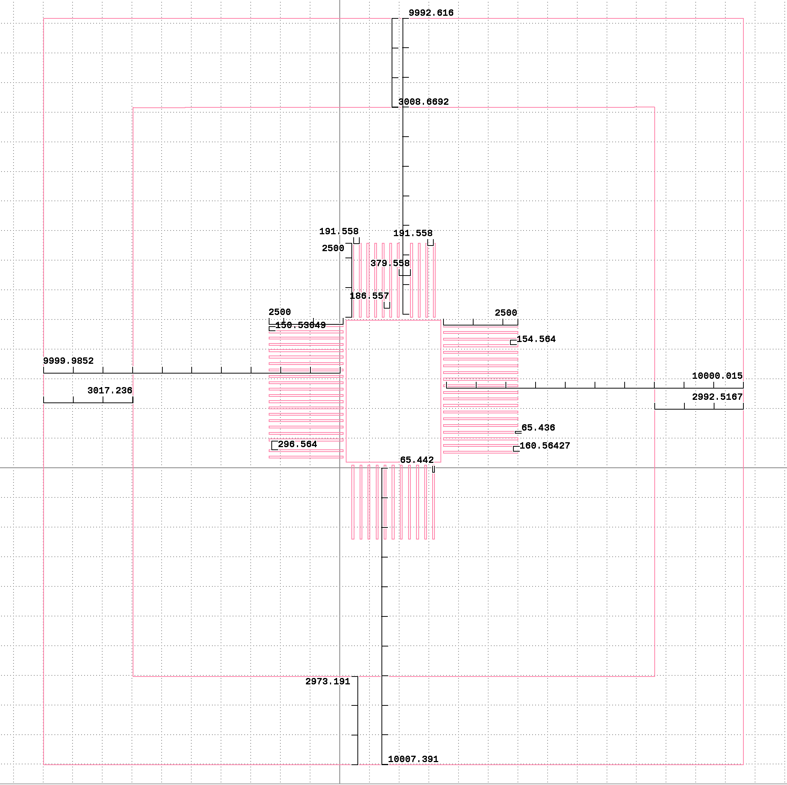

# Project Plans for Interposer Photomask

## Create a photomask for interposer

# Interposer Photomask Considerations

## Window
* Optimal ledge distance (materials property calculation vs literature review search)
* How will the window size affect the integrity of the glass interposer?
* Should the window dimensions be determined by CSA region (cover region with no CSA) or are there benefits in explosing the whole chip surface.

## Interconnects
* Pitch for interconnect pads
* Shape and size of inner interconnect pads: rectangular, slightly larger than bonding pad, same size...
* The distance between interconnects and chip edge and between Au ball bumping region and interconnects
    * [High-Speed PCB
Design Guide](https://s3vi.ndc.nasa.gov/ssri-kb/static/resources/High-Speed%20PCB%20Design%20Guide.pdf)
    * 3mm edge exclusion zone range (pg 18 Fundamental Principles of Optical Lithography : The Science of Microfabrication, John Wiley & Sons, Incorporated, 2008) 
        *  Outer bonding pad dimensions for interconnects? should they be slightly bigger or same size (what size solder will be applied)?
        *  Still searching for optimal key components for the electrical pathways
            * Signal integrity - attenuation/distortion
            * Bandwidth
            * Crosstalk
            * Impedance Control
            * Capacitance (zero current flowing through device)

              
## Transmission (Trace) Lines 
* Width: 75-200um
* Length: under 2500um 
* Thickenss: 
* Line spacing and design: 200-300um 
  
## Zebra Connectors
* Pitch (150 micron)

## Materials
* Glass Interposer
    * Rich SiO2
        * Electrical isolation
        * Low dielectric loss
* Positive Resist?
* Au: Bumbs, traces and pads
          
## Mask Provider
* [Front Range PhotoMask](https://www.frontrangephotomask.com)

## Glass Interposers
* [CORNING](https://www.corning.com/worldwide/en/products/advanced-optics/product-materials/semiconductor-laser-optic-components/semiconductor-glass-wafers.html)
* [PLANOPTIK AG](https://planoptik.com/products/interposer/)
  
## Laser Glass Cutting
* [WORKSHOP OF PHOTONICS](https://wophotonics.com/applications/laser-micro-cutting-dicing/)

## Bumping
* (Need more information on the bonding pads(metals on pad)) 
*  [HB16 Wire Bonder](https://www.tpt-wirebonder.com/hb16/)
    * [AmTECH](https://amtechmicro.com/processes/wire-bonding/)      
