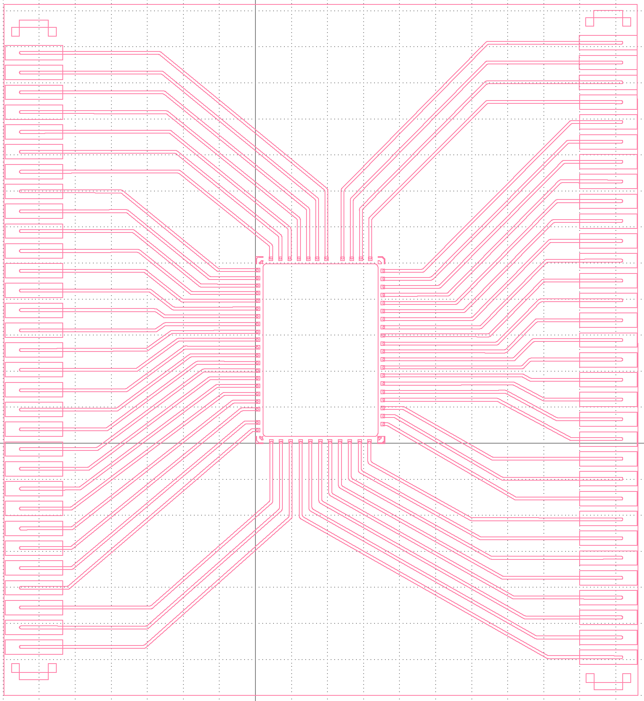

# Update (241224) on Glass Interposer Photomask

## Local Fiducial Marks and Tooling Holes
* Tooling hole sizes are 1mm in diameter 
  * **Ideally tool holes should be closer to the corners...**   
* Fiducial mark size of the inner diameter is 1mm and outer diameter is 2mm
* More than 0.25mm of clearance between traces, fids and tooling holes
  
* Triangular shape of fids for position identification

* [The Importance Of Fiducial Markers On PCB](https://morepcb.com/fiducial-markers/)
* [PCB Tooling Holes Design Tips](https://resources.pcb.cadence.com/blog/2021-pcb-tooling-holes-design-tips)  
* [IMPORTANCE OF TOOL HOLES IN PCBS](https://rushpcb.com/importance-of-tool-holes-in-pcbs/)
* [BUILD A CIRCUIT BOARD ASSEMBLY JIG](https://www.nutsvolts.com/magazine/article/september2011_Collier)
  
* [Ensuring Proper Alignment of Layers and Components on a Printed Circuit Board](https://resources.pcb.cadence.com/blog/jbj-ensuring-proper-alignment-of-layers-and-components-on-a-printed-circuit-board)
  
# Update (241220) on Glass Interposer Photomask

## Zebra Connector Alignment Marks
* Alignment marks for ZCs extend 500um beyond contact pads
* Size? Needs to be visible for quick and realiable alignment
* Interposer to PCB? - Round alignment markers? 3mm? Near to ZCs?
* Interposer to chip - Are corners fine or do we need more (i.e in the centers? - in case of resist issues), size?
  

# Update (241219) on Glass Interposer Photomask

## Transmission Line Design 
* 80 micron wide round traces
* Traces have min. of 2-3 times the width of trace space between traces (160-240um)
  * Exception: pads on the 5mm sides have ~135um spacing until rerouted to zebra contact pads
* Gold bump pads are 100x100um
* Zebra contact pads are 1600um (Width) x 400um (Heigth)

## Alignment Marks
* Chip features (diced)
* PCB 

## Previous Questions 

1) Last we spoke you mentioned to keep the 2500um trace lines and then to connect/extend those to the zebra connectors contact pads. Should we keep the same width regarding the trace lines going from the already existing trace lines to the zebra connectors contact pads

2) For material, should we keep everything Au?

3) Still unsure about the width of the zebra connectors. You had mentioned 150um and according to Fujipoly it is an available standard size. Was there a reason for this width?

4) Plain type vs support zebra connectors? Do we need to consider supports for the zebra connectors?

