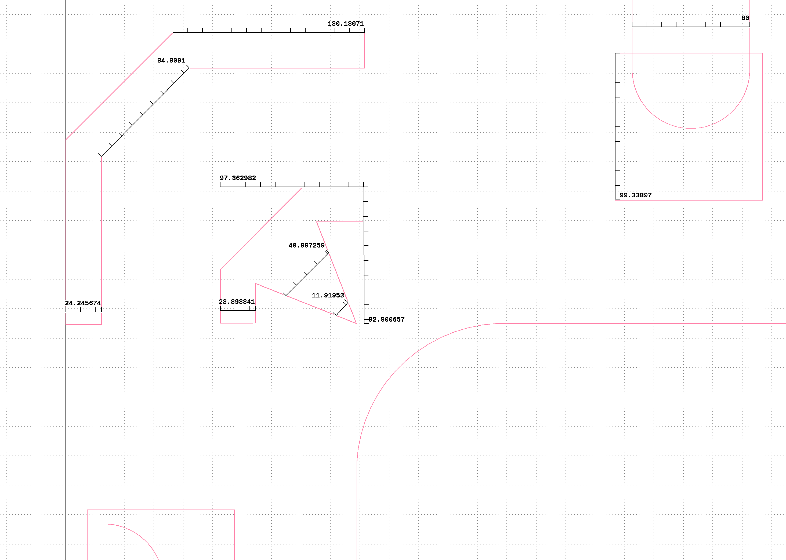

# Interposer Photomask Fabrication Plan

## Fabricating a photomask using a laser printer and transparancies 
* [Soft photolithography mask](https://www.elveflow.com/microfluidic-reviews/soft-lithography-microfabrication/su-8-photolithography-photomask/)
* This is a possibility since most of the feature sizes are quite large (i.e 80um - second smallest feature size)
  * ## **Alignment markers at the corners of the window, that match chip features, have concerning dimensions**
 

* The alignment markers may need to be modified since they are very near to resolution limitations   
* Material selection of transparencies needs to be robust (i.e adhesion, warping, etc...)
  * 3M CG3300 Transparency Film - **toner sprays may be necessary**
  * Premium Transparency Film 5 Mil - **not fully transparent**
  
* Ink selection?

* ## Fabricating a photomask using a laser printer and transparancies with a twist
  * Print an enlarged version (e.g 8x bigger) (if 1:1 ratio does not work) and use optical projector/lens reduction system to make the image smaller
  * Concerns:
    * Alignment or precise projection of image
    * Avoiding distortions or loss of detail
    * Optical setup
         

