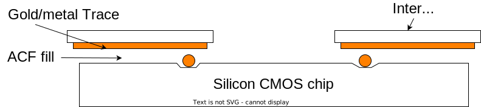

# Project Plans

## Create a quartz or sapphire-based interposer for IC packaging



## Manufacture several individual FETs in silicon

***

# Work Plan

## 1. Meeting to Discuss PhD Collaboration and Roles
## 2. Interposer and Transistor Project 
* ### Interposer and ACF (top priority)
  * Au solder spheres - separation distance, application (ball bonder: [this is a link](https://shimadzuinstitute.org/centers/nanotechnology-research-center/nanotechnology-research-center-dicing-and-bonding-platforms/) ) and creating a level height platform between all Au spheres and interposer/gold trace metal contact (thermal sonicator press instrument)
  * Incorporating ACF (tape/press vs instrument)
  * Sapphire or quartz interposer
  * The 1st chip to be considered is manufactured in sky130 process through efabless.  Chip GDS can be found [here](https://github.com/AustinMcDonald/Q-Pix-Sky130-Caravel/blob/main/gds/caravel_fullchip_transplanted.oas).
    * Layer definition:
```
m1     68/20
m1fill 36/28
m2     69/20
m2fill 41/28
m3     70/20
m3fill 34/28
m4     71/20
m4fill 51/28
m5     72/20
m5fill 59/28
glass  76/20 pad.drawing
hvi    75/20
```
* ### Individual Field Effect Transistors (not a priority)
  * Mask designs (size and separation distance of transistors)
  * Metals, insulators and doping  
  * Exposed gate oxide 

## 3. Cleanroom Access 
* ### Currently trained and have access for the following tools:
  * OAI Model806 manual Front/Backside Contact Mask Aligner [this is a link](https://shimadzuinstitute.org/centers/nanotechnology-research-center/nanotechnology-research-center-photolithography-platforms/) 
  * AJA ATC ORION Series Evaporation System [this is a link](https://shimadzuinstitute.org/centers/nanotechnology-research-center/nrc-deposition/) 
  * AJA ATC ORION Series UHV Sputtering System
  * Technics Macro-RIE Series 8800 Plasma System [this is a link](https://shimadzuinstitute.org/centers/nanotechnology-research-center/nanotechnology-research-center-etching-and-ashing-platforms/) 
  * AXIC JetFirst 150 Rapid Thermal Anneal [this is a link](https://shimadzuinstitute.org/centers/nanotechnology-research-center/nanotechnology-research-center-furnace-platforms/) 
  * Zeiss Supra 55VP Field Emission Scanning Electron Microscope [this is a link](https://shimadzuinstitute.org/centers/nanotechnology-research-center/nanotechnology-research-center-characterization-platforms/)
  * Gaertner L116S300 Stokes Ellipsometer
  * KLA-Tencor P-6 Profilometer

## 4. Projects:
  1) (Pending) Optical Lens Reduction System:
     Assemble a table top optical reducer, print an enlarged verison of the photomask (e.g. 8x bigger) and use the optical projector/lens reduction system to make the image smaller to obtain completely opaque negative mask features. We will need to play around with this to determine any distortions, and if so, include them into the Klayout negative mask dimensions to produce better resolution.
     * [DIY Photolithography using 1980s Carl Zeiss S-Planar Lens (405nm)](https://www.youtube.com/watch?v=Lf-ev2Fop_k)
  2) Mini Electron Gun: Using a 235nm LED light source, a thin gold film (photocathode), along with a controlled electromagnetic field to hopefully direct single electrons at a time (perhaps by pulsing the photon source we can achieve this) to create a mini photon source. The construction of this will require the possible use of machinining and 3D printing. It will be crucial that the device operate under vacuum.
     * [MTE2350F-UV UV emitter](https://www.mouser.com/datasheet/2/1094/MTE2350F_UV_v101223_prelim-3446666.pdf)
     * [MTE2350D-UV UV emitter](https://specs.marktechopto.com/pdf/products/datasheet/MTE2350D-UV%20v101223%20prelim.pdf)
     * [Light-Emitting Diode (LED) Mounts](https://www.thorlabs.com/newgrouppage9.cfm?objectgroup_ID=7843)

**Using the given LEDs, measure the photocurrent generated as the LED photoionizes the air between two plates using a source measurement unit (SMU). Look into powering up an LED** 


  3) Explore Micropen Exxelia for creating trace lines. Seek info regarding the system/appartatus/tips etc - see if they can sell the entire package - They do not sell - Track down needle dispenser tip that is used or similar needles tips (32 gauge etc...). We can modify the setup ourselves. 

  4) Conductive Epoxy: research if its possible to spin coat and achieve an epoxy thickness less than 1 micron and if we can have it tailored to have different resistances (rs << rp-p). Recall, resistiviy of epoxy needs to match the resistiviy of intrinsic Si (highly conductive epoxy can damage the device). The epoxy needs to be conductive, have very low viscosity and be able to be spin coated to achieve very low thicknesses, preferably less than a micron (we can press the epoxy to achieve lower thicknesses and use displacement to determine the thickness of final epoxy - uniformity during pressing?). 

  5) Create a system that mimics the chips surface. We can mimic the chip surface using a PCB board and create small arrays like the pixel rays in chip. This way we can use the PCB and practice with the epoxy before we move on to the actual chip device itself. 

## 5. Pushing the boundary of fundamental sensing mechanism
  1) Explore the use of Te nanowires for p-transistor use in state of the art single photon detection (lateral gate - no diaelectric)
     * [Evaporated tellurium thin films for p-type field-effect transistors and circuits](https://nano.eecs.berkeley.edu/publications/NatureNano_2020_Te.pdf)
     * [Tellurium Single-Crystal Arrays by Low-Temperature Evaporation and Crystallization](https://yonsei.elsevierpure.com/en/publications/tellurium-single-crystal-arrays-by-low-temperature-evaporation-an)

## 6. Producing industrial-quality prototype sensors
  1) Research into the following paper regarding characterization, cmos conversion material interface, x-ray used and efficiency:
     * [Dynamic X-ray imaging with screen-printed perovskite CMOS array](https://www.nature.com/articles/s41467-024-45871-2)
     * Consider researching different materials or perovskites, like a single crystal perovskite that shows potential to be fused to the epoxy (if we can get the epoxy idea to work). 
    
## Materials List

## LEDs (DigiKey):
* MTE2350F-UV. -  $220.00 
* MTE2350F-UV2 - $305.17

## LEDs Mounts (Thorlabs):
* Light-Emitting Diode (LED) Mounts  


## CRT TV (eBay): 
* Vintage SONY Trinitron CRT Tv Retro Gaming Games KV-13M42 13" W Remote VIDEO Condition (preferred option) - ApproximatelyC $286.19 Feb 10-14

    * Toshiba 13" CRT TV Retro Gaming Color Television 13A25 Front AV Jacks - $75 obo and $140 shipping  

    * Toshiba 13A23 TV CRT 13" Color Retro Gaming Analog w/ Remote AV Front Works READ - $59.99 (approx C $84.33) Feb 10-14 

    * TOSHIBA CRT TV / DVD Combo 9” Retro Gaming Television No Remote TESTED! MD9DL1  

## Epoxy 
* Master Bond EP4G-80Med
* Low Viscosity, Electrically Conductive Epoxy Meets ISO 10993-5 Cytotoxicity Standards

* How to Purchase Our Products

    * EPO-TEK® 301-2: Nonconductive but suitable for semiconductor purposes and has good handling regarding viscosity considerations
Requires adding a graphite filler

    * MG Chemicals 9410 - Paste like (viscous)

## Perovskite Paper
* PbBr2 (lead bromide, 99%, Aladdin)
* CsBr (cesium bromide, 99.5%, Aladdin)
* Dimethyl formamide (DMF, AR, 99%)
* Dimethyl sulfoxide (DMSO, AR, 99%)
* Colloidal SnO2 aqueous dispersion (15 wt%)
* Carbon paste

* Acetone
* IPA
* DI

## Thermal Evaporator
* Vacuum Chamber - Refurbished options are available at Idealvac.com
* Vacuum Pump - Storage

* Thermal Evaporation Source/Tungsten Boat- Kurt J. Lesker
* Heating System/Power Supply - Kurt J. Lesker Company 
* Substrate Holder/Cooling Stage
* Temperature Control System 
* Thickness Monitoring: MBraun Thermal Evaporator at Idealvac.com 
* Shutter


  
