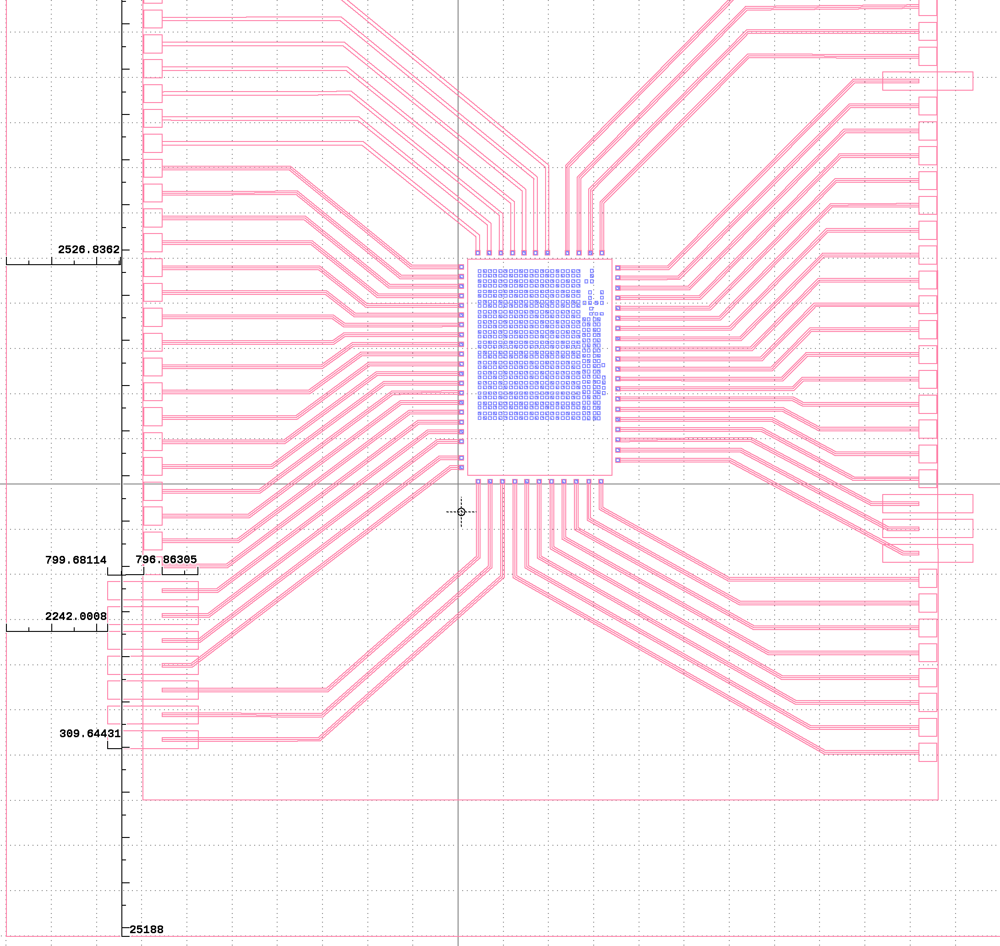

# Trace Design, Zebra Connectors and PCB (FR-4)

## Trace Design

## Connections
* Chip to Interposer: Fine-pitch to larger-pitch 
* Interposer to Zebra: signal rerouting, low cost and reliable electrial contact; [Design Guide](http://youeal.hk/en/products/conductive-silicone-zebra-elastomeric-connectors/design-guide/)
  * **For connector width > 1.3 mm, the more conductive material a connector contains, the more expensive it is.
Standard core width = 0.6 mm**
  * **Compression set for inter-connector is ~ 10 - 15%**
  * Guideline for reference
    * H < 6 mm, ~ 15% compression of connector's height
    * 6 mm < H < 10 mm, ~ 13% compression of connector's height
    * ≥10 mm, ~ 10% compression of connector's height
      
    * X = n / 1 - p Formula to determine the uncompressed height of the connector
 
* Zebra to PCB: Alignment
  * [Zebra can fail](https://www.youtube.com/watch?v=c0U394GGofY) 
  * OSCO - quote submitted for the following:
    * 8000C Gold Connector 1.524mm W x 2.54mm H x 24.99mm L
    * 2005 Carbon Connector with Sponge Supports Both Sides 2.5 W x 5.0 H x 21.5 L mm
      
    * 2004 Plain Carbon Connector 3 W 4 H x 28L mm
      * [OSCO](https://www.osco.uk.com/shop/quote-basket?action=sent)  

## Zebra to PCB
* Ordered Zebra Connectors to PCB
  * PCB
    * 10mil: pad width: 254um ; pad gap: 254um
    * 8mil: pad width: 203um ; pad gap: 203um
      
    * Contact pad:
    * Design Considerations: [PCB Traces 101](https://www.youtube.com/watch?v=xEVntmYLARw); [How To Improve Your PCB Designs (Common Mistakes)](https://www.youtube.com/watch?v=IclJ9nbtYgI);
      
    * Design Tool: [easyeda](https://www.youtube.com/watch?v=MsdJgEinb34&t=279s) ; KiCad       

## Zebra Supplier Common Questions
* Difficult project for Z-Axis to support based on the dimensions
* Electrical requirement ie what is max mA/ per pad contact?
* Will connector be used for testing? or for permanent mounting connecting LCD to PCB?
* 8 or 10 mil PCB ... (0.20mm ~ 0.254mm) > this is thickness of your PCB? Is this contact pad size?
* How many connectors are used in 1 assembly/ device? 
* How many will you need to build samples/trials?
  
* If proven successful, how many will be used in production level?

## PCB
* 8 or 10 mil (203um vs 254um)
* 2 layers
* FR4
* Copper thickness: 1oz/ft^2 (~35um)
* ENIG finish?
  
* Design template?
  
## Zebra GOLD 8000 C Connectors - Fujipoly
## Specifications:
* 100-166 pitch options

* Series 8000 C
  * 0.025mm x 0.076mm flat wire on 0. 15mm center-to-center spacing (Min. 166 wires/inch.)
    * Conductive Width: 25 um
    * Insulative Width: 125 um
    * Pitch (Center-to-Center): 150 um
    * High Density
      
* Solid self-supporting connectors - better stability???

 ## Design Considerations
* [Design Guidelines - Connectors](https://www.fujipoly.com/usa/resources/design-guidelines/design-guidelines-connectors.html)
* Must be readily available to purchase and quick delivery
  
* Pitch Matching: 150um Type C to 80um gold trace lines (glass interposer)
  * 80um gold trace lines and 25um conductive width
*  Contact Pad Width (glass interposer)
  * larger than 25um conductive width (80um - matching trace?) 
  * Pad Pitch: Center-to-center spacing of pads matches the 150 um (Center-to-Center) pitch

    

