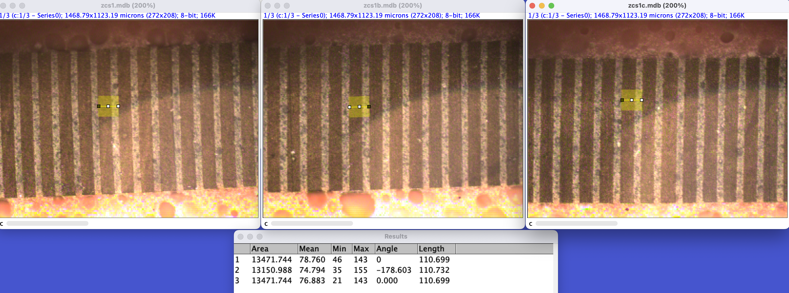
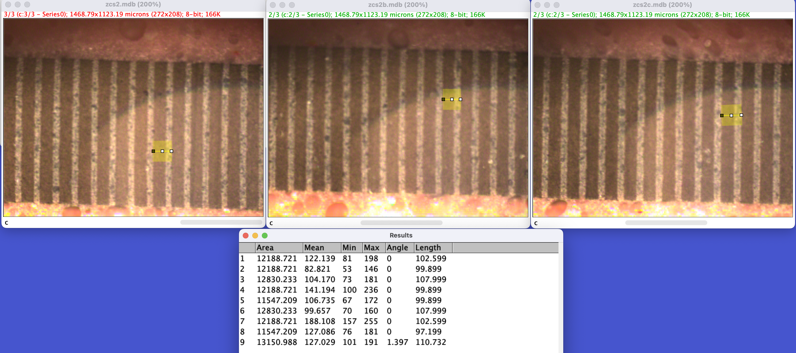
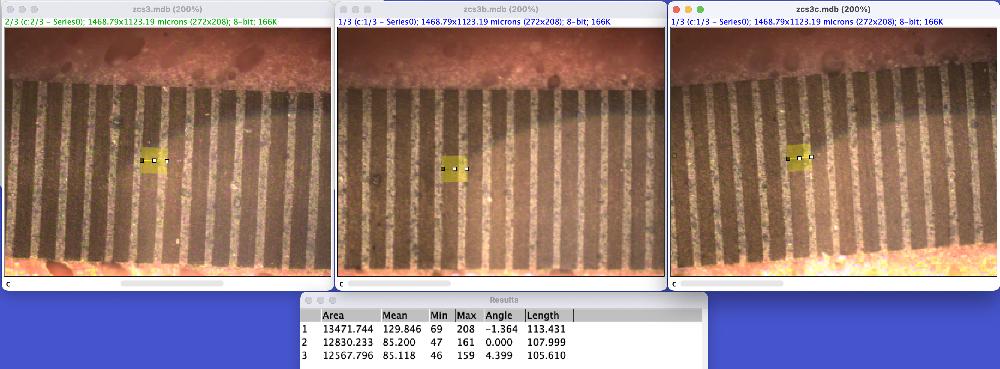
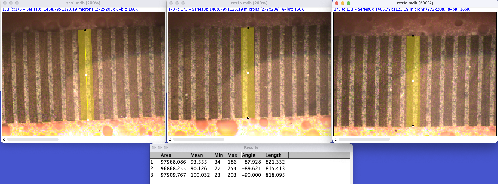
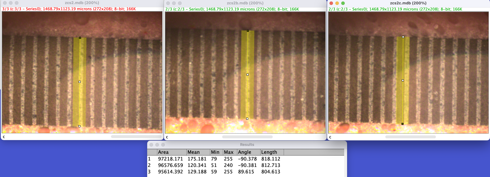
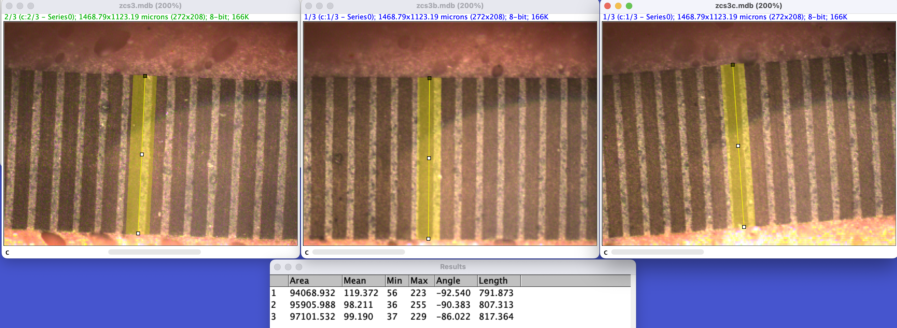
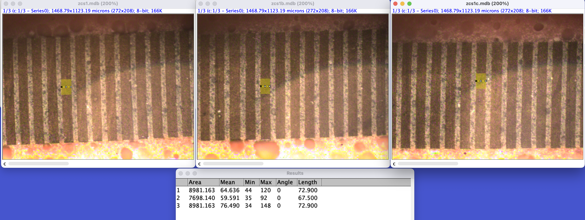
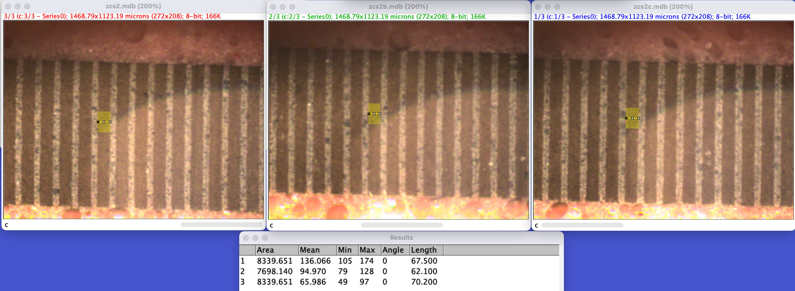
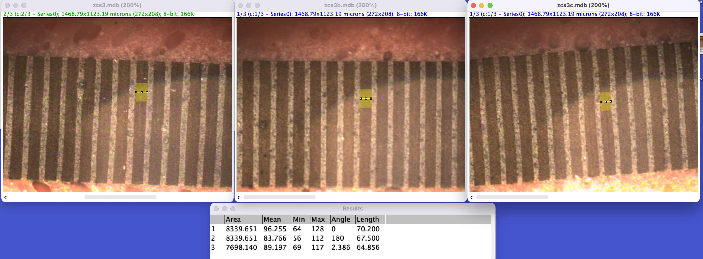

# Inspection of Zebra Carbon Connectors with Sponge Supports

## 3mm W x 6mm H x 59mm L (x3 - identical) 

# Pitch 
### Sample 1 

* Avg pitch: 110.69um = **0.110mm**

### Sample 2 

* Avg pitch: 103.2um = **0.103mm**
### Sample 3 

* Avg pitch: 109.0um = 0.109mm

* Batch avg: 0.107mm
# **0.100mm pitch** 

# Width of Zebra Connector w/o Sponge Supports
### Sample 1

* Avg: 818.2um = **0.818mm**
  
### Sample 2 

* Avg: 811.8um = **0.811mm**

### Sample 3 

* Avg: 805.5um = 0.805mm

# Batch avg: **0.811mm Width**

# Conductive Width of Carbon Strip
### Sample 1

* Avg: 71.1um = **0.071mm**

### Sample 2 

* Avg: 66.6um = **0.066mm**

### Sample 3 

* Avg: 67.5um = 0.067mm

# Batch avg: **0.068mm Carbon Strip Width**

